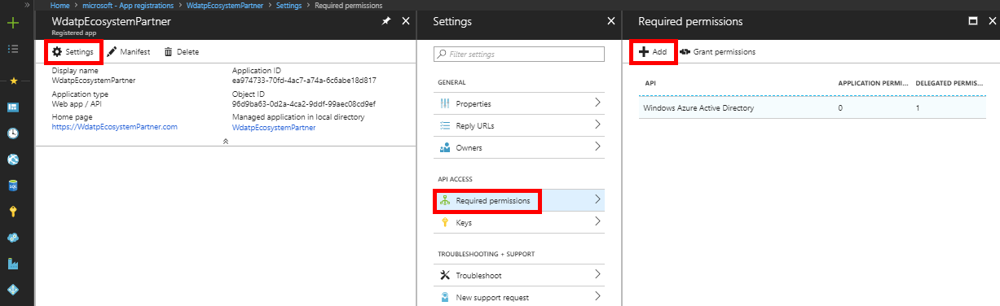
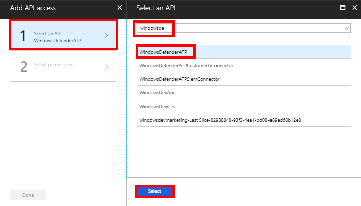
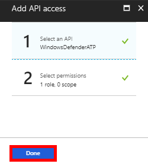
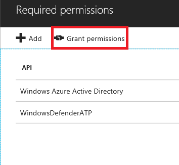
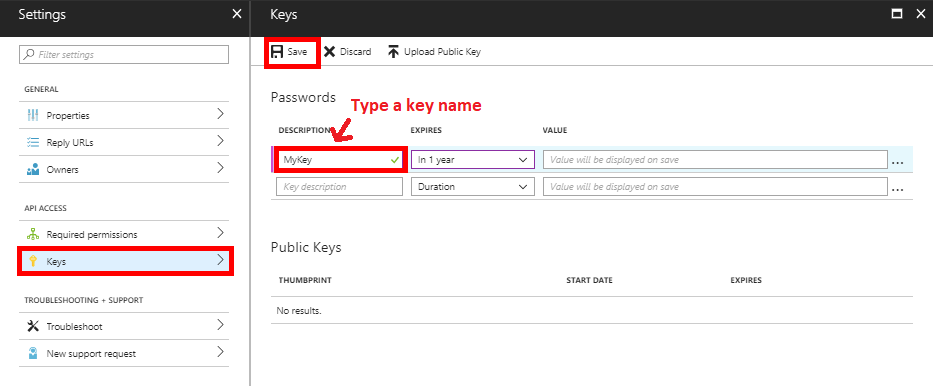

---
title: Advanced Hunting API
description: Use this API to run advanced queries
keywords: apis, supported apis, advanced hunting, query
search.product: eADQiWindows 10XVcnh
ms.prod: w10
ms.mktglfcycl: deploy
ms.sitesec: library
ms.pagetype: security
ms.author: macapara
author: mjcaparas
ms.localizationpriority: medium
manager: dansimp
audience: ITPro
ms.collection: M365-security-compliance 
ms.topic: article
ms.date: 09/24/2018
---

# Windows Defender ATP API - Hello Word 
**Applies to:**
- Windows Defender Advanced Threat Protection (Windows Defender ATP)

## Get Alerts using a simple PowerShell script

### How long it takes to go through this example?
It only takes 5 minutes done in two steps:
- Application registration
- Use examples: only requires copy/paste of a short PowerShell script

### Do I need a permission to connect?
For the App registration stage, you must have a Global administrator role in your Azure Active Directory (Azure AD) tenant.

### Step 1 - Create an App in Azure Active Directory

1.	Log on to [Azure](https://portal.azure.com) With your Global administrator user.

2.	Navigate to **Azure Active Directory** > **App registrations** > **New application registration**. 

    

3.	In the registration form, enter the following information then click **Create**.

    - **Name:** Choose your own name. 
    - **Application type:** Web app / API
    - **Redirect URI:** `https://127.0.0.1`

	

4. Allow to App to access Windows Defender ATP and assign it 'Read all alerts' permission:

	- Click **Settings** > **Required permissions** > **Add**.

	

	- Click **Select an API** > **WindowsDefenderATP**, then click **Select**.

	**Note**: WindowsDefenderATP does not appear in the original list. You need to start writing its name in the text box to see it appear.

	

	- Click **Select permissions** > **Read all alerts** > **Select**.

	

	- Click **Done**

	

	- Click **Grant permissions**

	**Note**: Every time you add permission you must click on **Grant permissions**.

	

5. Create a key for your App:

	- Click **Keys**, type a key name and click **Save**.

	

6. Write down your App ID and your Tenant ID:

	- App ID: 

	

	- Tenant ID: Navigate to **Azure Active Directory** > **Properties**

	

Done! You have successfully registered an application! 

### Step 2 - Get a token using the App and use this token to access the API.

- 

## Related topic
- [Windows Defender ATP APIs](exposed-apis-list.md)
- [Access Windows Defender ATP with application context](exposed-apis-create-app-webapp.md)
- [Access Windows Defender ATP with user context](exposed-apis-create-app-nativeapp.md)