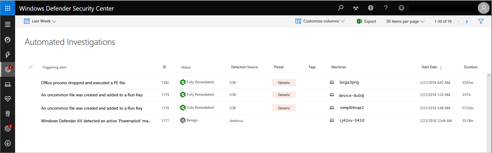

# Automated investigations in Windows Defender ATP

**Applies to:**

- Windows 10 Enterprise
- Windows 10 Education
- Windows 10 Pro
- Windows 10 Pro Education
- Windows Defender Advanced Threat Protection (Windows Defender ATP)

[!include[Prerelease information](prerelease.md)]

>Want to experience Windows Defender ATP? [Sign up for a free trial.](https://www.microsoft.com/en-us/WindowsForBusiness/windows-atp?ocid=docs-wdatp-automated-investigations-abovefoldlink)

The Windows Defender ATP service has a wide breadth of visibility on multiple machines. With this kind of optics, the service generates a multitude of alerts. The volume of alerts generated can be challenging for a typical security operations team to individually address.

To address this challenge, Windows Defender ATP uses Automated investigations to dramatically reduce the volume of alerts that need to be investigated individually. The Automated investigation feature leverages various inspection algorithms, and processes used by analysts (such as playbooks) to examine alerts and take immediate remediation action to resolve breaches. This significantly reduces alert volume, allowing security operations experts to focus on more sophisticated threats and other high value initiatives. 

The Automated investigations list shows all the investigations that have been initiated automatically and shows other details such as its status, detection source, and the date for when the investigation was initiated. 

## Understand the Automated investigation flow
Alerts are typically generated from a machine and all automated investigations start from an alert. Any alert that contains an entity (that Windows Defender ATP supports an investigation for) can undergo automated investigation. 

When an alert that contains a supported entity is seen, the automated investigation then proceeds and analyzes each entity within the alert. It determines whether an entity can be incriminated or exonerated. The outcome from the analysis of each entity is categorized in the **Entities** tab and you'll be able to see the determination for each entity type, such as whether it was determined to be malicious, suspicious, or clean.
 [BENNY I'M NOT SURE IF WE WANT TO GO INTO THE DETAILS OF SENDING THE FILE INTO DETONATION ETC.]  

Depending on how you set up the machine groups and the level of automation to apply on the group, the automated investigation can remediate the alert. For more information, see [Create and manage machine groups](machine-groups-windows-defender-advanced-threat-protection.md). 

The default machine group is configured for semi-automatic remediation. This means that any malicious entity that needs to be remediated requires an approval and the investigation is added to the **Pending actions** section. You also have the option to configure the automation for full remediation. 

When a pending action is approved, the entity is then remediated and is reflected in the **Entities** tab of the investigation.

While an investigation is running, any other alert generated from the machine will be added to an ongoing automated investigation until that investigation is completed. In addition, if the same threat is seen on other machines, those machines are added to the investigation.You'll be able to see up to nine machines in the **Machines** tab. If the threat is seen on more than nine machines, you have the option to expand the view from the **Pending actions** view.

When the automated investigation completes its analysis, and all pending actions are resolved, an investigation is considered complete. It's important to understand that an investigation is only considered complete if there are no pending actions on it. That's also the only time that the **Pending actions history** tab is displayed.

## Manage Automated investigations
By default, the automated investigations list displays investigations initiated in the last week. You can also choose to select other time ranges from the drop-down menu or specify a custom range. 

>[!NOTE]
>If your organization has implemented role-based access to manage portal access, only authorized users or user groups who have permission to view the machine or machine group will be able to view the entire investigation. 

Use the **Customize columns** drop-down menu to select columns that you'd like to show or hide. 

From this view, you can also download the entire list in CSV format using the **Export** button, specify the number of items to show per page, and navigate between pages. You also have the flexibility to filter the list based on your preferred criteria.

 
**Filters** 
You can use the following operations to customize the list of Automated investigations displayed:

**Triggering alert** 
The alert the initiated the Automated investigation.

**Status** 
An Automated investigation can be in one of the following status:

Status | Description
:---|:---
| No threats found                                          | No malicious entities found during the investigation.
| Failed                                                    | A problem has interrupted the investigation, preventing it from completing.                                                         |
| Partially remediated                                      | A problem prevented the remediation of some malicious entities.                                                                     |
| Action required                                           | Remediation actions require review and approval.                                                                                    |
| Waiting for machine                                       | Investigation paused. The investigation will resume as soon as the machine is available.                                            |
| Queued                                                    | Investigation has been queued and will resume as soon as other remediation activities are completed.                                |
| Running                                                   | Investigation ongoing. Malicious entities found will be remediated.                                                                 |
| Remediated                                                | Malicious entities found were successfully remediated.                                                                              |
| Terminated by system                                      | Investigation was stopped due to <reason>.                                                                                          |
| Terminated by user                                        | A user stopped the investigation before it could complete.                                                                          |
| Not applicable                                            | Automated investigations do not apply to this alert type.                                                                           |
| Partially investigated                                    | Entities directly related to the alert have been investigated. However, a problem stopped the investigation of collateral entities. |
| Automated investigation not applicable to alert type      | Automated investigation does not apply to this alert type.                                                                          |
| Automated investigation does not support OS               | Machine is running an OS that is not supported by automated investigation.                                                          |
| Automated investigation unavailable for preexisting alert | Automated investigation does not apply to alerts that were generated before it was deployed.                                        |
| Automated investigation unavailable for suppressed alert  | Automated investigation does not apply to suppressed alerts.                                                                        |

**Detection source** 
Source of the alert that initiated the Automated investigation. 

**Threat** 
The category of threat detected during the Automated investigation.

**Tags** 
Filter using manually added tags that capture the context of an Automated investigation.

**Machines** 
You can filter the Automated investigations list to zone in a specific machine to see other investigations related to the machine.

**Machine groups** 
Apply this filter to see specific machine groups that you might have created.

**Comments** 
Select between filtering the list between Automated investigations that have comments and those that don't.

## Analyze Automated investigations 
You can view the details of an Automated investigation to see details such as the investigation graph, alerts associated with the investigation, the machine that was investigated, and other information.

In this view, you'll see the name of the investigation, when it started and ended. The pending time is the elapsed time since the investigation started and waited for a user to approve a pending action or for a machine to come back online. 

The comments and tags allow you to add and review tags and comments that were added about the investigation.

### Investigation page
The investigation page gives you a quick summary on the status, alert severity, category, and detection source.

You'll also have access to the following sections that help you see details of the investigation with finer granularity:

- Investigation graph
- Alerts
- Machines
- Threats
- Entities
- Log
- Pending actions
  >[!NOTE]
  >The Pending actions tab is only displayed if there are actual pending actions.
- Pending actions history
  >[!NOTE]
  >The Pending actions history tab is only displayed when an investigation is complete.

In any of the sections, you can customize columns to further expand to limit the details you see in a section.

### Investigation graph
The investigation graph provides a graphical representation of an Automated investigation. All investigation related information is simplified and arranged in specific sections. Clicking on any of the icons brings you the relevant section where you can view more information.

### Alerts
Shows details such as a short description of the alert that initiated the Automated investigation, severity, category, the machine associated with the alert, user, time in queue, status, investigation state, and who the investigation is assigned to. 

Additional alerts seen on a machine can be added to an automated investigation as long as the investigation is ongoing. 

Selecting an alert using the check box brings up the alerts details pane where you have the option of opening the alert page, manage the alert by changing its status, see alert details, automated investigation details, related machine, logged-on users, and comments and history. 

Clicking on an alert title brings you the alert page.

### Machines
Shows details the machine name, IP address, group, users, operating system, remediation level, investigation count, and when it was last investigated.

Machines that show the same threat can be added to an ongoing investigation and will be displayed in this tab. If the same threat is seen on more than nine machines, you have the option to expand the view from the **Pending actions** view.

Selecting a machine using the checkbox brings up the machine details pane where you can see more information such as machine details and logged-on users.

Clicking on an machine name brings you the machine page.

### Threats
Shows details related to threats associated with this investigation. 

### Entities
Shows details about entities such as files, process, services, drives, and IP addresses. The table details such as the number of entities that were analyzed. You'll gain insight into details such as how many are remediated, suspicious, or determined to be clean.

### Log
Gives a chronological detailed view of all the investigation actions taken on the alert. You'll see the action type, action, status, machine name, description of the action, comments entered by analysts who may have worked on the investigation, execution start time, duration, pending duration.

As with other sections, you can customize columns, select the number of items to show per page, and filter the log.

Available filters include action type, action, status, machine name, and description.

You can also click on an action to bring up the details pane where you'll see information such as the summary of the action and input data. 

### Pending actions history
This tab is only displayed when an investigation is complete and shows all pending actions taken during the investigation.

## Pending actions 
This view aggregates all investigations that require an action for an investigation to proceed or be completed.

Use the Customize columns drop-down menu to select columns that you'd like to show or hide. 

From this view, you can also download the entire list in CSV format using the **Export** feature, specify the number of items to show per page, and navigate between pages.

Pending actions are grouped together in the following tabs:
-  Quarantine file
-  Remove persistence
-  Stop process
-  Expand pivot
-  Quarantine service

>[!NOTE]
>The tab will only appear if there are pending actions for that category.

### Approve or reject an action
You'll need to manually approve or reject pending actions on each of these categories for the automated actions to proceed.

Selecting an investigation from any of the categories opens a panel where you can approve or reject the remediation. Other details such as file or service details, investigation details, and alert details are displayed.

From the panel, you can click on the Open investigation page link to see the investigation details.

You also have the option of selecting multiple investigations to approve or reject actions on multiple investigations. 

## Related topic
- [Investigate Windows Defender ATP alerts](investigate-alerts-windows-defender-advanced-threat-protection.md)

