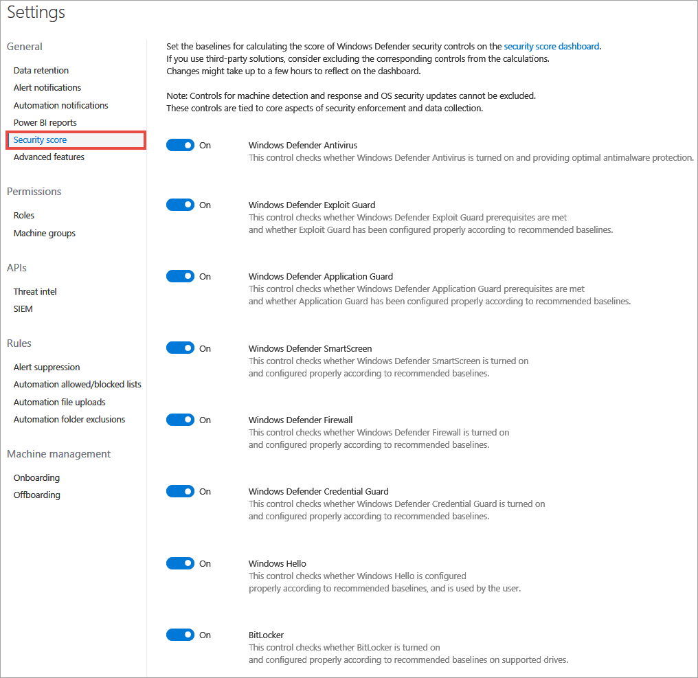

# Enable Secure score security controls

**Applies to:**

- Windows 10 Enterprise
- Windows 10 Education
- Windows 10 Pro
- Windows 10 Pro Education
- Windows Defender Advanced Threat Protection (Windows Defender ATP)

Set the baselines for calculating the score of Windows Defender security controls on the Secure score dashboard. If you use third-party solutions, consider excluding the corresponding controls from the calculations.

  >[!NOTE]
  >Changes might take up to a few hours to reflect on the dashboard. 

1. In the navigation pane, select **Preferences setup** > **Secure score**.

    

2. Select the security control, then toggle the setting between **On** and **Off**.

3. Click **Save preferences**.

## Related topics
- [View the Secure score dashboard](security-analytics-dashboard-windows-defender-advanced-threat-protection.md)
- [Update general settings in Windows Defender ATP](general-settings-windows-defender-advanced-threat-protection.md)
- [Turn on advanced features in Windows Defender ATP](advanced-features-windows-defender-advanced-threat-protection.md)
- [Turn on the preview experience in Windows Defender ATP](preview-settings-windows-defender-advanced-threat-protection.md)
- [Configure email notifications in Windows Defender ATP](configure-email-notifications-windows-defender-advanced-threat-protection.md)
- [Enable SIEM integration in Windows Defender ATP](enable-siem-integration-windows-defender-advanced-threat-protection.md)
- [Enable the custom threat intelligence API in Windows Defender ATP](enable-custom-ti-windows-defender-advanced-threat-protection.md)
- [Create and build Power BI reports](powerbi-reports-windows-defender-advanced-threat-protection.md)