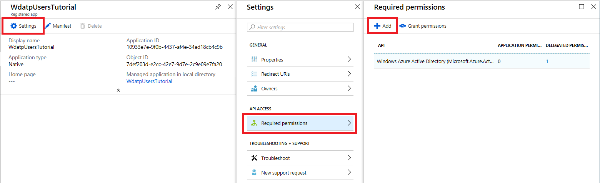
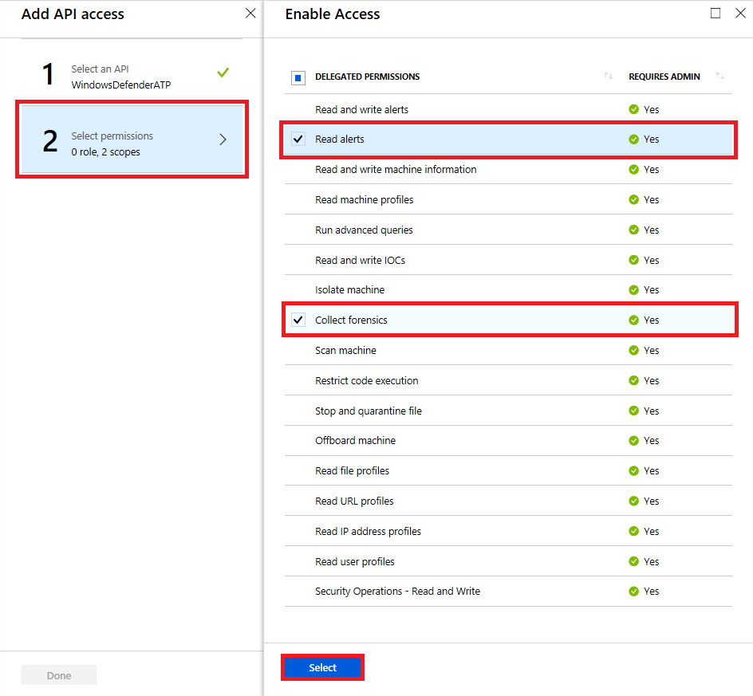
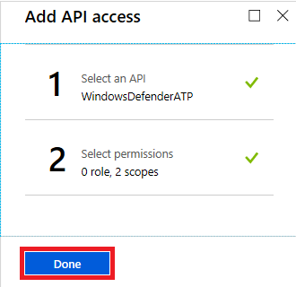
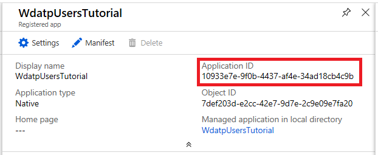
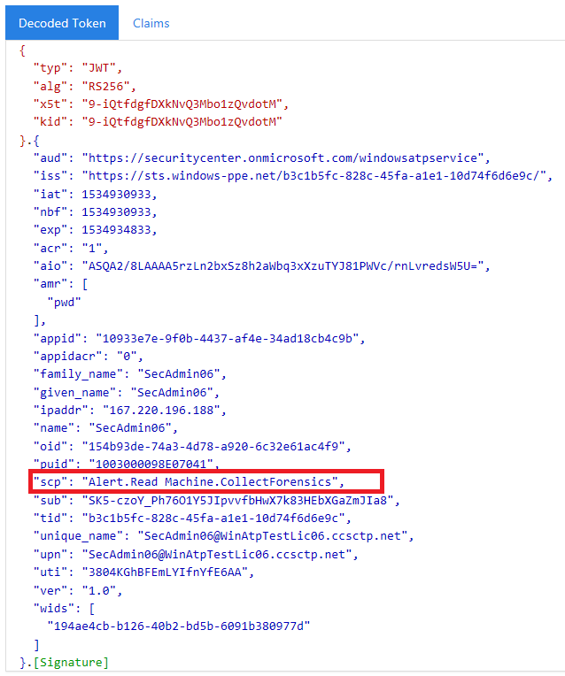

# Use Windows Defender ATP APIs

**Applies to:**

- Windows 10 Enterprise
- Windows 10 Education
- Windows 10 Pro
- Windows 10 Pro Education
- Windows Defender Advanced Threat Protection (Windows Defender ATP)


>Want to experience Windows Defender ATP? [Sign up for a free trial.](https://www.microsoft.com/en-us/WindowsForBusiness/windows-atp?ocid=docs-wdatp-exposedapis-abovefoldlink) 

This pages describes how to create an application to get programmatical access to Windows Defender ATP on behalf of a user.

If you need programmatical access Windows Defender ATP without a user, please refer to [Access Windows Defender ATP without a user](exposed-apis-create-app-webapp.md)

If you are not sure which access you need, you'd better read the [Introduction page](exposed-apis-intro.md)

Windows Defender ATP exposes much of its data and actions through a set of programmatic APIs. Those APIs will enable you to automate workflows and innovate based on Windows Defender ATP capabilities. The API access requires OAuth2.0 authentication. For more information, see [OAuth 2.0 Authorization Code Flow](https://docs.microsoft.com/en-us/azure/active-directory/develop/active-directory-v2-protocols-oauth-code).

In general, you’ll need to take the following steps to use the APIs:
- Create an app
- Get an access token
- Use the token to access Windows Defender ATP API

This page explains how to create an app, get an access token to Windows Defender ATP and validate the token includes the required permission.

**Note**: When accessing WDATP API on behalf of a user, you will need the correct app permission and user permission.
If you are not familiar with user permissions on WDATP, please refer to [Manage portal access using role-based access control](rbac-windows-defender-advanced-threat-protection.md)

**Rule of thumb for user permissions:** If you have the permission to perform an action in the portal, you have the permission to perform the action in the API. 

## Create an app

1.	Log on to [Azure](https://portal.azure.com).

2.	Navigate to **Azure Active Directory** > **App registrations** > **New application registration**. 

    

3.	In the Create window, enter the following information then click **Create**.

    

    - **Name:** -Your app name-
    - **Application type:** Native
    - **Redirect URI:** `https://127.0.0.1`


4.	Click **Settings** > **Required permissions** > **Add**.

    

5.	Click **Select an API** > **WindowsDefenderATP**, then click **Select**.
	
	**Note**: WindowsDefenderATP does not appear in the original list. You need to start writing its name in the text box to see it appear.

    

6. Click **Select permissions** > check **Read alerts** & **Collect forensics** > **Select**.
	
	**Important note**: You need to select the relevant permissions. 'Read alerts' and 'Collect forensics' are only an examples!

    

	- In order to send TI events to WDATP, check 'Read and write IOCs belonging to the app' permission
	- In order to run advanced queries in WDATP, check 'Run advanced queries' permission

7. Click **Done**

    

8. Click **Grant permissions**

	In order to add the new selected permissions to the app, the Admin's tenant must press on the **Grant permissions** button.

	If in the future you will want to add more permission to the app, you will need to press on the **Grant permissions** button again so the changes will take effect.

	

9. Write down your application ID.
    
	


## Get an access token

For more details on AAD token, refer to [AAD tutorial](https://docs.microsoft.com/en-us/azure/active-directory/develop/active-directory-v2-protocols-oauth-client-creds)

### Using C#

>The below code was tested with nuget Microsoft.IdentityModel.Clients.ActiveDirectory 3.19.8

- Create a new Console Application
- Install Nuget [Microsoft.IdentityModel.Clients.ActiveDirectory](https://www.nuget.org/packages/Microsoft.IdentityModel.Clients.ActiveDirectory/)
- Add the below using

	```
	using Microsoft.IdentityModel.Clients.ActiveDirectory;
	```

- Copy/Paste the below code in your application (pay attention to the comments in the code)

	```
	const string authority = "https://login.windows.net";
	const string wdatpResourceId = "https://api.securitycenter.windows.com/";

	string tenantId = "00000000-0000-0000-0000-000000000000"; // Paste your own tenant ID here
	string appId = "11111111-1111-1111-1111-111111111111"; // Paste your own app ID here

	string username = "SecurityAdmin123@microsoft.com"; // Paste your username here
	string password = GetPasswordFromSafePlace(); // Paste your own password here for a test, and then store it in a safe place! 

	UserPasswordCredential userCreds = new UserPasswordCredential(username, password);

	AuthenticationContext auth = new AuthenticationContext($"{authority}/{tenantId}");
	AuthenticationResult authenticationResult = auth.AcquireTokenAsync(wdatpResourceId, appId, userCreds).GetAwaiter().GetResult();
	string token = authenticationResult.AccessToken;
	```

## Validate the token

Sanity check to make sure you got a correct token:
- Copy/paste into [JWT](https://jwt.ms) the token you get in the previous step in order to decode it
- Validate you get a 'scp' claim with the desired app permissions
- In the screenshot below you can see a decoded token acquired from the app in the tutorial:



## Use the token to access Windows Defender ATP API

- Choose the API you want to use - [Supported Windows Defender ATP APIs](exposed-apis-list.md)
- Set the Authorization header in the Http request you send to "Bearer {token}" (Bearer is the Authorization scheme)
- The Expiration time of the token is 1 hour (you can send more then one request with the same token)

- Example of sending a request to get a list of alerts **using C#** 
	```
	var httpClient = new HttpClient();

	var request = new HttpRequestMessage(HttpMethod.Get, "https://api.securitycenter.windows.com/api/alerts");

	request.Headers.Authorization = new AuthenticationHeaderValue("Bearer", token);

	var response = await httpClient.SendAsync(request).ConfigureAwait(false);

	// Do something useful with the response
	```

## Related topics
- [Windows Defender ATP APIs](exposed-apis-intro.md)
- [Supported Windows Defender ATP APIs](exposed-apis-list.md)
- [Access Windows Defender ATP without a user](exposed-apis-create-app-webapp.md)