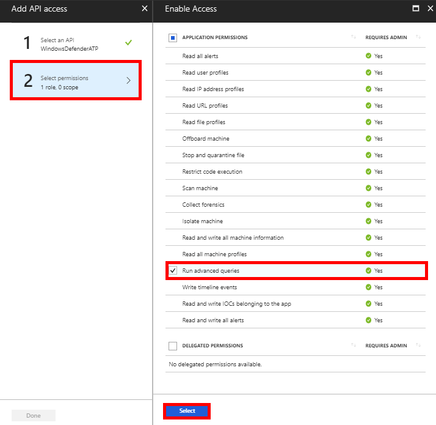
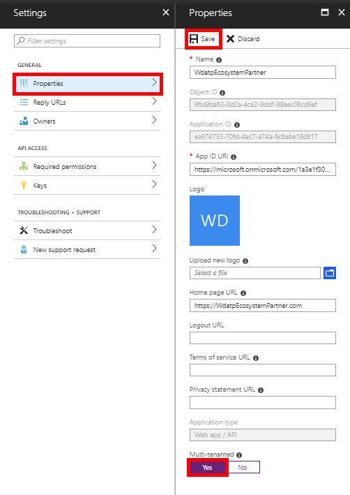

# Use Windows Defender ATP APIs

**Applies to:**

- Windows 10 Enterprise
- Windows 10 Education
- Windows 10 Pro
- Windows 10 Pro Education
- Windows Defender Advanced Threat Protection (Windows Defender ATP)


>Want to experience Windows Defender ATP? [Sign up for a free trial.](https://www.microsoft.com/en-us/WindowsForBusiness/windows-atp?ocid=docs-wdatp-exposedapis-abovefoldlink) 

This pages describes how to create an application to get programmatical access to Windows Defender ATP on behalf of a user.

If you need programmatical access Windows Defender ATP without a user, please refer to [Access Windows Defender ATP without a user](exposed-apis-create-app-webapp.md)

If you are not sure which access you need, you'd better read the [Introduction page](exposed-apis-intro.md)

Windows Defender ATP exposes much of its data and actions through a set of programmatic APIs. Those APIs will enable you to automate workflows and innovate based on Windows Defender ATP capabilities. The API access requires OAuth2.0 authentication. For more information, see [OAuth 2.0 Authorization Code Flow](https://docs.microsoft.com/en-us/azure/active-directory/develop/active-directory-v2-protocols-oauth-code).

In general, you’ll need to take the following steps to use the APIs:
- Create an app
- Get an access token
- Use the token to access Windows Defender ATP API

This page explains how to create an app, get an access token to Windows Defender ATP and validate the token includes the required permission.

## Create an app

1.	Log on to [Azure](https://portal.azure.com).

2.	Navigate to **Azure Active Directory** > **App registrations** > **New application registration**. 

    

3.	In the Create window, enter the following information then click **Create**.

    

    - **Name:** WdatpEcosystemPartner
    - **Application type:** Web app / API
    - **Redirect URI:** `https://WdatpEcosystemPartner.com` (The URL where user can sign in and use your app. You can change this URL later.)


4.	Click **Settings** > **Required permissions** > **Add**.

    

5.	Click **Select an API** > **WindowsDefenderATP**, then click **Select**.
	
	**Note**: WindowsDefenderATP does not appear in the original list. You need to start writing its name in the text box to see it appear.

    

6. Click **Select permissions** > **Run advanced queries** > **Select**.
	
	**Important note**: You need to select the relevant permission. 'Run advanced queries' is only an example!

    

	- In order to send telemetry events to WDATP, check 'Write timeline events' permission
	- In order to send TI events to WDATP, check 'Read and write IOCs belonging to the app' permission
	- In order to run advanced queries in WDATP, check 'Run advanced queries' permission

7. Click **Done**

    

8. Click **Keys** and type a key name and click **Save**.

	**Important**: After you save, **copy the key value**. You won't be able to retrieve after you leave!

    

9. Write down your application ID.
    
	

9. Set your application to be multi-tenanted
	
	This is **required** for 3rd party apps (i.e., if you create an application that is intended to run in multiple customers tenant).

	This is **not required** if you create a service that you want to run in your tenant only (i.e., if you create an application for your own usage that will only interact with your own data)​

	Click **Properties** > **Yes** > **Save**.

	


## Application consent

You need your application to be approved in each tenant where you intend to use it. This is because your application interacts with WDATP application on behalf of your customer.

You (or your customer if you are writing a 3rd party application) need to click the consent link and approve your application. The consent should be done with a user who has admin privileges in the active directory.

Consent link is of the form: 

```
https://login.microsoftonline.com/common/oauth2/authorize?prompt=consent&client_id=00000000-0000-0000-0000-000000000000&response_type=code&sso_reload=true​
```

where 00000000-0000-0000-0000-000000000000​ should be replaced with your Azure application ID


## Get an access token

For more details on AAD token, refer to [AAD tutorial](https://docs.microsoft.com/en-us/azure/active-directory/develop/active-directory-v2-protocols-oauth-client-creds)

### Using C#

>The below code was tested with nuget Microsoft.IdentityModel.Clients.ActiveDirectory 3.19.8

- Create a new Console Application
- Install Nuget [Microsoft.IdentityModel.Clients.ActiveDirectory](https://www.nuget.org/packages/Microsoft.IdentityModel.Clients.ActiveDirectory/)
- Add the below using

	```
	using Microsoft.IdentityModel.Clients.ActiveDirectory;
	```

- Copy/Paste the below code in your application (do not forget to update the 3 variables: ```tenantId, appId, appSecret```)

	```
	string tenantId = "00000000-0000-0000-0000-000000000000"; // Paste your own tenant ID here
	string appId = "11111111-1111-1111-1111-111111111111"; // Paste your own app ID here
	string appSecret = "22222222-2222-2222-2222-222222222222"; // Paste your own app secret here

	const string aadUri = "https://login.windows.net";
	const string wdatpResourceId = "https://securitycenter.onmicrosoft.com/windowsatpservice";

	AuthenticationContext auth = new AuthenticationContext($"{aadUri}/{tenantId}/");
	ClientCredential clientCredential = new ClientCredential(appId, appSecret);
	AuthenticationResult authenticationResult = auth.AcquireTokenAsync(wdatpResourceId, clientCredential).GetAwaiter().GetResult();
	string token = authenticationResult.AccessToken;
	```

### Using PowerShell 

Refer to [Get token using PowerShell](run-advanced-query-sample-powershell.md#get-token)

### Using Python

Refer to [Get token using Python](run-advanced-query-sample-python.md#get-token)

### Using Curl

> [!NOTE]
> The below procedure supposed Curl for Windows is already installed on your computer

- Open a command window
- ​Set CLIENT_ID to your Azure application ID
- Set CLIENT_SECRET to your Azure application secret
- Set TENANT_ID to the Azure tenant ID of the customer that wants to use your application to access WDATP application
- Run the below command:

```
curl -i -X POST -H "Content-Type:application/x-www-form-urlencoded" -d "grant_type=client_credentials" -d "client_id=%CLIENT_ID%" -d "scope=https://securitycenter.onmicrosoft.com/windowsatpservice​/.default" -d "client_secret=%CLIENT_SECRET%" "https://login.microsoftonline.com/%TENANT_ID​%/oauth2/v2.0/token" -k​
```

You will get an answer of the form:

```
{"token_type":"Bearer","expires_in":3599,"ext_expires_in":0,"access_token":"eyJ0eXAiOiJKV1QiLCJhbGciOiJSUzI1NiIsIn <truncated> aWReH7P0s0tjTBX8wGWqJUdDA"}
```

## Validate the token

- Copy/paste into [JWT](https://jwt.io/) the token you get in the previous step 
- Validate you get a 'roles' claim with the desired permission, as shown in the below screenshot


## Related topics
- [Windows Defender ATP APIs](exposed-apis-intro.md)
- [Supported Windows Defender ATP APIs](exposed-apis-list.md)
- [Access Windows Defender ATP without a user](exposed-apis-create-app-webapp.md)