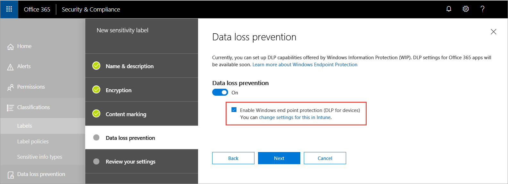

# Information protection in Windows overview
**Applies to:**
- [Windows Defender Advanced Threat Protection (Windows Defender ATP)](https://go.microsoft.com/fwlink/p/?linkid=2069559)

[!include[Prerelease information](prerelease.md)]

Information protection is an integral part of Microsoft 365 Enterprise suite, providing intelligent protection to keep sensitive data secure while enabling productivity in the workplace.


Windows Defender ATP is seamlessly integrated in Microsoft Threat Protection to provide a complete and comprehensive data loss prevention (DLP) solution for Windows devices. This solution is delivered and managed as part of the unified Microsoft 365 information protection suite. 

>[!TIP]
> Read our blog post about how [Windows Defender ATP integrates with Microsoft Information Protection to discover, protect, and monitor sensitive data on Windows devices](https://cloudblogs.microsoft.com/microsoftsecure/2019/01/17/windows-defender-atp-integrates-with-microsoft-information-protection-to-discover-protect-and-monitor-sensitive-data-on-windows-devices/).


Windows Defender ATP applies the following methods to discover, classify, and protect data:
- **Data discovery** - Identify sensitive data on Windows devices at risk
- **Data classification** - Automatically classify data based on common Microsoft Information Protection (MIP) policies managed in Office 365 Security & Compliance Center. Auto-classification allows you to protect sensitive data even if the end user hasn’t manually classified it.
- **Data protection** - Windows Information Protection (WIP) as outcome of Azure Information Protection label


## Data discovery and data classification
Windows Defender ATP automatically discovers files with sensitivity labels and files that contain sensitive information types. 

Sensitivity labels classify and help protect sensitive content. 


Sensitive information types in the Office 365 data loss prevention (DLP) implementation fall under two categories:
-	Default
-	Custom

Default sensitive information types include information such as bank account numbers, social security numbers, or national IDs. For more information, see [What the sensitive information type look for](https://docs.microsoft.com/office365/securitycompliance/what-the-sensitive-information-types-look-for). 

Custom types are ones that you define and is designed to protect a different type of sensitive information (for example, employee IDs or project numbers). For more information see, [Create a custom sensitive information type](https://docs.microsoft.com/en-us/office365/securitycompliance/create-a-custom-sensitive-information-type).


When a file is created or edited on a  Windows device, Windows Defender ATP scans the content to evaluate if it contains sensitive information. 

Turn on the Azure Information Protection integration so that when a file that contains sensitive information is discovered by Windows Defender ATP though labels or information types, it is automatically forwarded to Azure Information Protection from the device.


The reported signals can be viewed on the Azure Information Protection – Data discovery dashboard. 

### Azure Information Protection - Data discovery dashboard 
This dashboard presents a summarized discovery information of data discovered by both Windows Defender ATP and Azure Information Protection. Data from Windows Defender ATP is marked with Location Type - Endpoint. 


Notice the Device Risk column on the right, this device risk is derived directly from Windows Defender ATP, indicating the risk level of the security device where the file was discovered, based on the active security threats detected by Windows Defender ATP.

Clicking the device risk level will redirect you to the device page in Windows Defender ATP, where you can get a comprehensive view of the device security status and its active alerts. 


>[!NOTE]
>Windows Defender ATP does not currently report the Information Types. 

### Log Analytics 
Data discovery based on Windows Defender ATP is also available in [Azure Log Analytics](https://docs.microsoft.com/azure/log-analytics/log-analytics-overview), where you can perform complex queries over the raw data.

For more information on Azure Information Protection analytics, see [Central reporting for Azure Information Protection](https://docs.microsoft.com/azure/information-protection/reports-aip). 

Open Azure Log Analytics in Azure Portal and open a query builder (standard or classic). 

To view Windows Defender ATP data, perform a query that contains: 


```
InformationProtectionLogs_CL 
| where Workload_s == "Windows Defender" 
```

**Prerequisites:**
- Customers must have a subscription for Azure Information Protection.
- Enable Azure Information Protection integration in Windows Defender Security Center: 
    - Go to **Settings** in Windows Defender Security Center, click on **Advanced Settings** under **General**.


## Data protection 

### Endpoint data loss prevention
For data to be protected, they must first be identified through labels. 

Sensitivity labels are created in Office 365 Security & Compliance Center. Windows Defender ATP then uses the labels to identify endpoints that need Windows Information Protection (WIP) applied on them.

When you create sensitivity labels, you can set the information protection functionalities that will be applied on the file. The setting that applies to Windows Defender ATP is the Endpoint data loss prevention. 

For the endpoint data loss prevention, you'll need to turn on the Endpoint Data loss prevention and select Enable Windows end point protection (DLP for devices). 




Once, the policy is set and published, Windows Defender ATP automatically enables WIP for labeled files. When a labeled file is created or modified on a Windows device, Windows Defender ATP automatically detects it and enables WIP on that file if its label corresponds with Office Security and Compliance (SCC) policy. 

This functionality expands the coverage of WIP to protect files based on their label, regardless of their origin. 

For more information, see [Configure information protection in Windows](information-protection-in-windows-config.md).

## Auto labeling

Auto labeling is another way to protect data and can also be configured in Office 365 Security & Compliance Center. When Windows Defender ATP scans the content of a file in a Windows device and finds that it contains sensitive information, it will automatically apply a label to it even if the user hasn't manually classified it.

> [!NOTE]
> Auto-labeling is supported in Office apps only when the Azure Information Protection unified labeling client is installed. When sensitive content is detected in email or documents matching the conditions you choose, a label can automatically be applied or a message can be shown to users recommending they apply it themselves.


For more information, see [Configure information protection in Windows](information-protection-in-windows-config.md).


## Related topics
- [How Windows Information Protection protects files with a sensitivity label](https://docs.microsoft.com/windows/security/information-protection/windows-information-protection/how-wip-works-with-labels)