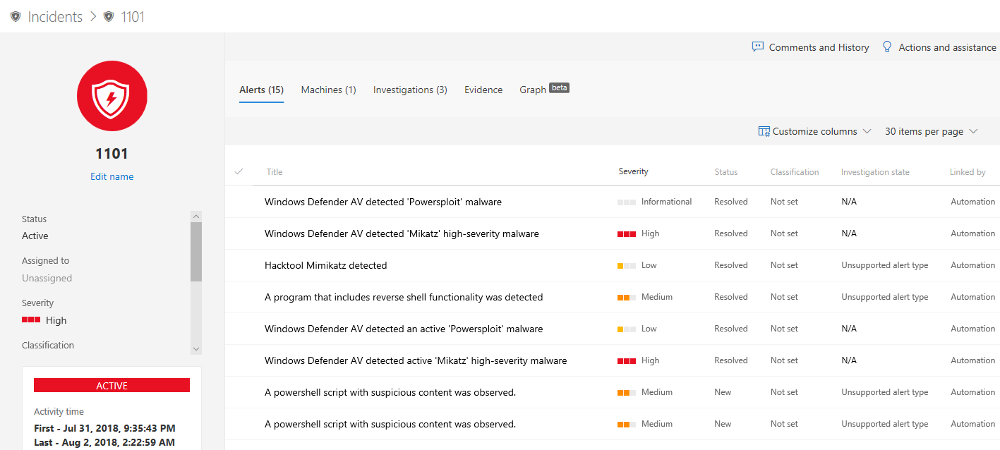
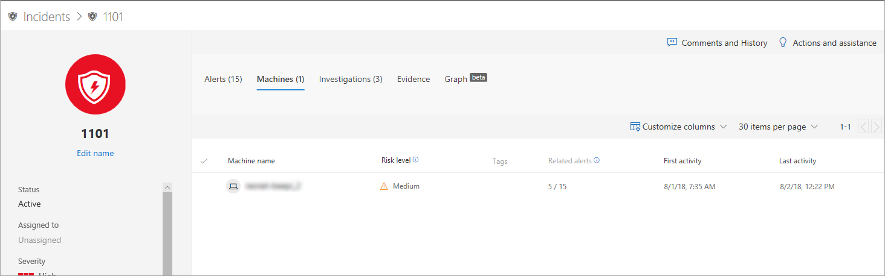
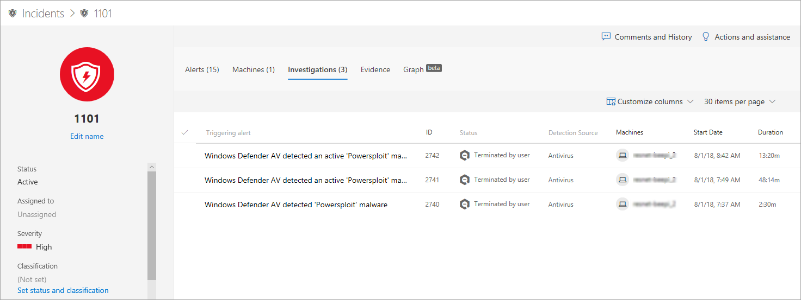

# Investigate incidents in Windows Defender ATP

**Applies to:**
- Windows Defender Advanced Threat Protection (Windows Defender ATP)

[!include[Prerelease information](prerelease.md)]

Investigate incidents that affect your network, understand what they mean, and collate evidence to resolve them. 

## Analyze incident details 
Click an incident to see the **Incident pane**. Select **Open incident page** to see the incident details and related information (alerts, machines, investigations, evidence, graph) that you need to investigate. 

### Alerts
You can investigate the associated alerts, manage an alert, and see alert metadata along with other information that can help you make better decisions on how to approach them. For more information, see [Investigate alerts](investigate-alerts-windows-defender-advanced-threat-protection.md). 

### Machines
You can also investigate the machines that are at risk in a given incident. For more information, see [Investigate machines](investigate-machines-windows-defender-advanced-threat-protection.md).

### Investigations
Select **Investigations** to see the summary of the ongoing investigations, the detection source, affected machines, and their duration.

## Going through the evidence
It helps your organization to see a summary and the status of the evidence collated through the incident.
 
Your team lead, for example, can take a quick look at the Evidence page to know how many has been analyzed or remediated so far, out of all the evidence collated. It helps in the decision of ramping the investigating team’s efforts up or down.

## Visualizing associated cybersecurity threats 
Windows Defender Advanced Threat Protection aggregates the threat information into an incident so you can see the patterns and correlations coming in from various data points. You can view such correlation through the incident graph.

### Incident graph
The **Graph** provides a visual representation of how the alerts and its evidence are inter-related.

You can click the circles on the incident graph to view the details of the malicious files, associated file detections, how many instances has there been worldwide, whether it’s been observed in your organization, if so, how many instances.

## Related topics
- [Incidents queue](incidents-queue.md)
- [View and organize the Incidents queue](view-incidents-queue.md)
- [Manage incidents](manage-incidents-windows-defender-advanced-threat-protection.md)

