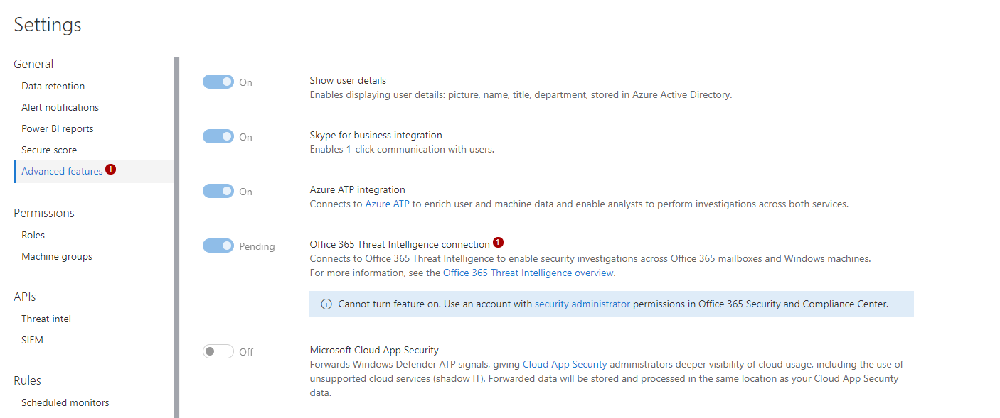
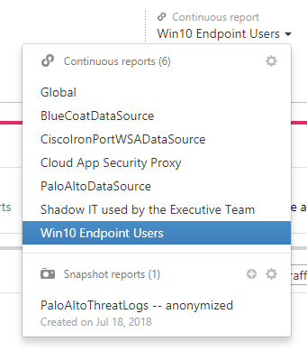
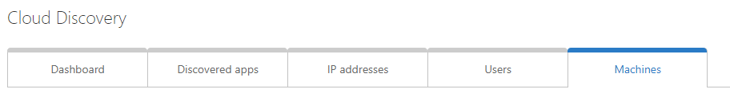

# Microsoft Cloud App Security Integration
 
## Overview

Cloud App Security gives you visibility into your cloud apps and services, allows you to control and limit access to cloud apps, and enforce compliance requirements on data stored in the cloud.

Cloud App Security integrates to your eco-system in two places:

1.	Firewall and proxy servers that routes your endpoints traffic to the web forwards cloud traffic logs to MCAS.

2.	MCAS connects to your cloud app public API to enable control and governance of the data stored on cloud apps.

For more information, see [Configure MCAS]()

## Configuring MCAS

To benefit from WDATP cloud app discovery signals, just turn on Microsoft Cloud App Security integration in WDATP Settings page, under Advanced features:

Once activated, WDATP will immediately start forwarding discovery signals to MCAS.

To view the data collected, browse to Cloud App Security portal (portal.cloudappsecurity.com). Navigate to Cloud Discovery dashboard and select Win10 Endpoint Users report, which contains the data coming from WDATP.  

This report is similar to the existing discovery report with one major difference: you can now benefit from visibility to the machine context. Notice the new Machines tab that allows you to view the data split to the device dimensions. This is available in the main report page or any subpage (e.g., when drilling down to a specific cloud app).

