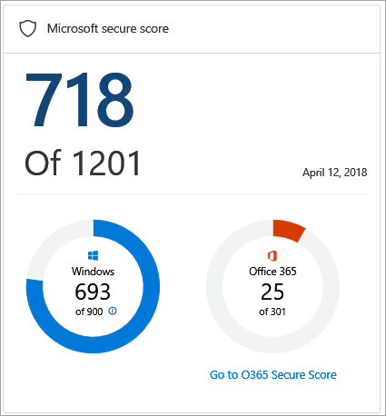
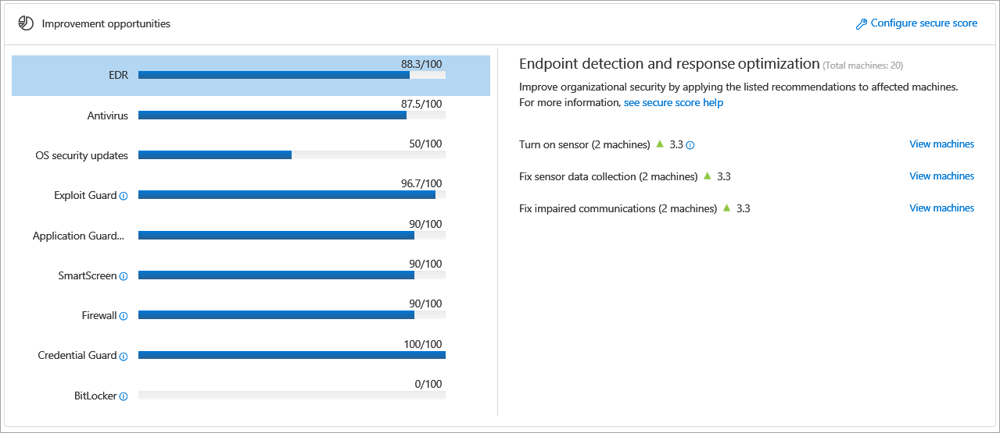
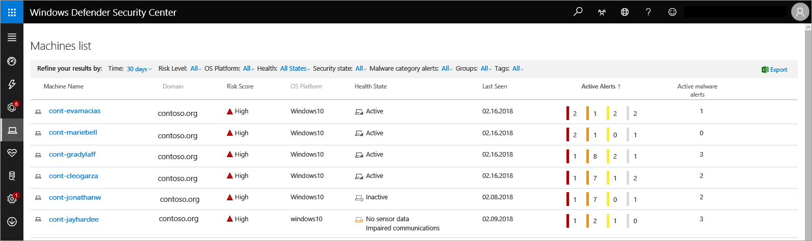

# Overview of Secure score in Windows Defender Security Center
The Secure score dashboard expands your visibility into the overall security posture of your organization. From this dashboard, you'll be able to quickly assess the security posture of your organization, see machines that require attention, as well as recommendations for actions to further reduce the attack surface in your organization - all in one place. From there you can take action based on the recommended configuration baselines.

>[!IMPORTANT]
> This feature is available for machines on Windows 10, version  1703 or later. 

The **Secure score dashboard** displays a snapshot of:
- Microsoft Secure score
- Windows Defender security controls
- Improvement opportunities
- Security score over time

## Microsoft secure score
The Microsoft secure score tile is reflective of the sum of all the Windows Defender security controls that are configured according to the recommended baseline and Office 365 controls. It allows you to drill down into each portal for further analysis. You can also improve this score by taking the steps in configuring each of the security controls in the optimal settings.

Each Windows Defender security control contributes 100 points to the score. The total number is reflective of the score potential and calculated by multiplying the number of supported security controls (Windows Defender security controls pillars) by the maximum points that each pillar contributes (maximum of 100 points for each pillar). 

The Office 365 Secure Score looks at your settings and activities and compares them to a baseline established by Microsoft. For more information, see [Introducing the Office 365 Secure Score](https://support.office.com/en-us/article/introducing-the-office-365-secure-score-c9e7160f-2c34-4bd0-a548-5ddcc862eaef#howtoaccess).

In the example image, the total points for the Windows security controls and Office 365 add up to 718 points. 

You can set the baselines for calculating the score of Windows Defender security controls on the Secure score dashboard through the **Settings**. For more information, see [Enable Secure score security controls](enable-secure-score-windows-defender-advanced-threat-protection.md).

## Windows Defender security controls
The security controls tile shows a bar graph where each bar represents a Windows Defender security control. Each bar reflects the number of machines that are well configured and those that require **any kind of attention** for each security control. Hovering on top of the individual bars will show exact numbers for each category. Machines that are green are well configured, while machines that are orange require some level of attention. 

## Improvement opportunities 
Improve your score by taking the recommended improvement actions listed on this tile. The goal is to reduce the gap between the perfect score and the current score for each control.

Click on each control to see the recommended optimizations.

The numbers beside the green triangle icon on each recommended action represents the number of points you can gain by taking the action.  When added together, the total number makes up the numerator in the fraction for each segment in the Improvement opportunities tile.

>[!IMPORTANT]
>Recommendations that do not display a green triangle icon are informational only and no action is required. 

Clicking **View machines** in a specific recommendation opens up the **Machines list** with filters applied to show only the list of machines where the recommendation is applicable. You can export the list in Excel to create a target collection and apply relevant policies using a management solution of your choice. 

The following image shows an example list of machines where the EDR sensor is not turned on.

## Security score over time
You can track the progression of your organizational security posture over time using this tile. It displays the overall and individual control scores in a historical trend line enabling you to see how taking the recommended actions increase your overall security posture.

You can click on specific date points to see the total score for that security control is on a particular date.

## Related topic
