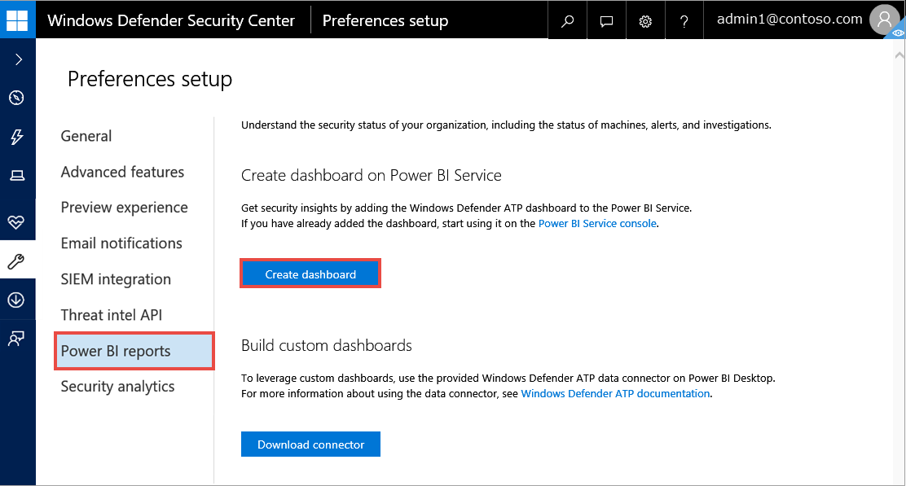
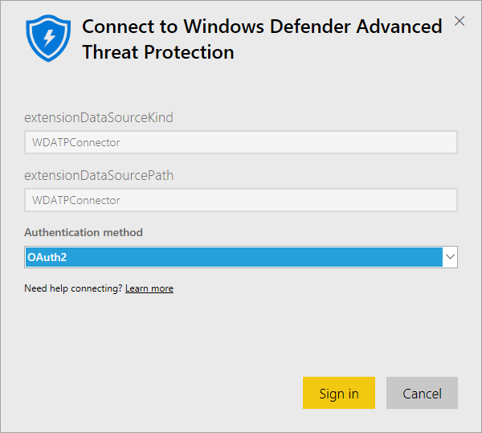
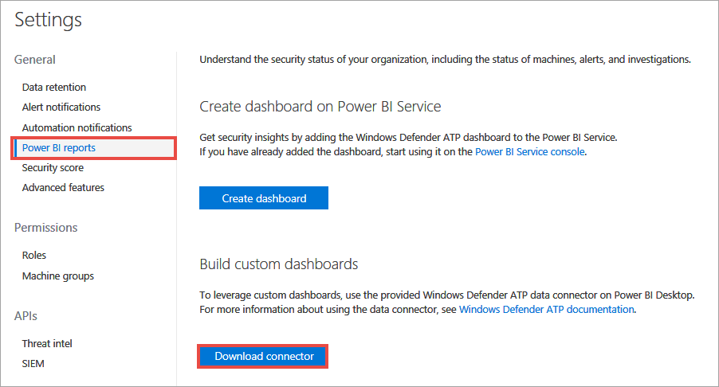
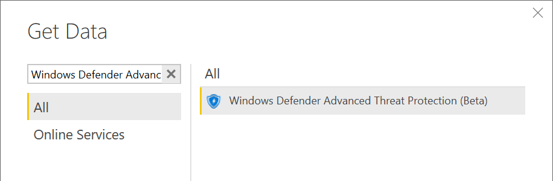

# Create and build Power BI reports using Windows Defender ATP data

**Applies to:**

- Windows 10 Enterprise
- Windows 10 Education
- Windows 10 Pro
- Windows 10 Pro Education
- Windows Defender Advanced Threat Protection (Windows Defender ATP)

[!include[Prerelease information](prerelease.md)]

>Want to experience Windows Defender ATP? [Sign up for a free trial.](https://www.microsoft.com/en-us/WindowsForBusiness/windows-atp?ocid=docs-wdatp-powerbireports-abovefoldlink) 

Understand the security status of your organization, including the status of machines, alerts, and investigations using the Windows Defender ATP reporting feature that integrates with Power BI. 

Windows Defender ATP supports the use of Power BI data connectors to enable you to connect and access Windows Defender ATP data using Microsoft Graph.

Data connectors integrate seamlessly in Power BI, and make it easy for power users to query, shape and combine data to build reports and dashboards that meet the needs of your organization. 

You can easily get started by:
- Creating a dashboard on the Power BI service:
  - From the Windows Defender ATP portal or 
  - From the Power BI portal
- Building a custom dashboard on Power BI Desktop and tweaking it to fit the visual analytics and reporting requirements of your organization 

You can access these options from the Windows Defender ATP portal. Both the Power BI service and Power BI Desktop are supported. 

## Create a Power BI dashboard from the Windows Defender ATP portal
Windows Defender ATP makes it easy to create a Power BI dashboard by providing an option straight from the portal. 

1. In the navigation pane, select **Preferences setup** > **Power BI reports**.
    
    

2.	Click **Create dashboard**. You'll see a notification that things are being loaded. 

    

3. Specify the following details:
    - **extensionDataSourceKind**: WDATPConnector
    - **extensionDataSourcePath**: WDATPConnector
    - **Authentication method**: OAuth2

    

4. Click **Sign in**. If this is the first time you’re using Power BI with Windows Defender ATP, you’ll need to sign in and give consent to Windows Defender ATP Power BI app. By providing consent, you’re allowing Windows Defender ATP Power BI to sign in and read your profile, and access your data.

      

5.	Click **Accept**. Power BI service will start downloading your Windows Defender ATP data from Microsoft Graph. After a successful login, you'll see a notification that data is being imported:

    
    
    >[!NOTE]
    >Depending on the number of onboarded machines, loading your data in the Power BI service can take several minutes. A larger number might take longer to load. 

    When importing data is completed and the dataset is ready, you’ll the following notification:

    

6. Click **View dataset** to explore your data.

For more information, see [Create a Power BI dashboard from a report](https://powerbi.microsoft.com/en-us/documentation/powerbi-service-create-a-dashboard/).

## Create a Power BI dashboard from the Power BI portal

1. Login to [Power BI](https://powerbi.microsoft.com/).

2. Click **Get Data**.

3. Select **Microsoft AppSource** > **My Organization** > **Get**.

    

4. In the AppSource window, select **Apps** and search for Windows Defender Advanced Threat Protection.

    

5. Click **Get it now**.

6. Specify the following details:
    - **extensionDataSourceKind**: WDATPConnector
    - **extensionDataSourcePath**: WDATPConnector
    - **Authentication method**: OAuth2

    

7. Click **Sign in**. If this is the first time you’re using Power BI with Windows Defender ATP, you’ll need to sign in and give consent to Windows Defender ATP Power BI app. By providing consent, you’re allowing Windows Defender ATP Power BI to sign in and read your profile, access your data, and report refresh.

      

8.	Click **Accept**. Power BI service will start downloading your Windows Defender ATP data from Microsoft Graph. After a successful login, you'll see a notification that data is being imported:

    
    
    >[!NOTE]
    >Depending on the number of onboarded machines, loading your data in the Power BI service can take several minutes. A larger number might take longer to load. 

    When importing data is completed and the dataset is ready, you’ll the following notification:

    

9. Click **View dataset** to explore your data.

## Build a custom Windows Defender ATP dashboard in Power BI Desktop
You can create a custom dashboard in Power BI Desktop to create visualizations that cater to the specific views that your organization requires.  

### Before you begin
1.	Make sure you use Power BI Desktop June 2017 and above. [Download the latest version](https://powerbi.microsoft.com/en-us/desktop/).

2.	In the Windows Defender ATP portal navigation pane, select **Preferences setup** > **Power BI reports**.

3.	Click **Download connector** to download the WDATPPowerBI.zip file and extract it.

    

4.	Create a new directory `Microsoft Power BI Desktop\Custom Connectors` under the user's Documents folder.

5.	Copy WDATPDataConnector.mez from the zip to the directory you just created.

6.	Open Power BI Desktop.

7.	Click **File** > **Options and settings** > **Custom data connectors**.

8.	Select **New table and matrix visuals** and **Custom data connectors** and click **OK**.
    
    >[!NOTE]
    >If you are using Power BI Desktop July 2017 version (or later), you won't need to select **New table and matrix visuals**. You'll only need to select **Custom data connectors**.

    
    
9. Restart Power BI Desktop.

## Customize the Windows Defender ATP Power BI dashboard
After completing the steps in the Before you begin section, you can proceed with building your custom dashboard.

1.	Open WDATPPowerBI.pbit from the zip with Power BI Desktop.

2.	If this is the first time you’re using Power BI with Windows Defender ATP, you’ll need to sign in and give consent to Windows Defender ATP Power BI app. By providing consent, you’re allowing Windows Defender ATP Power BI to sign in and read your profile, and access your data.

    

3.	Click **Accept**. Power BI Desktop will start downloading your Windows Defender ATP data from Microsoft Graph. When all data has been downloaded, you can proceed to customize your reports.

## Mashup Windows Defender ATP data with other data sources
You can use Power BI Desktop to analyse data from Windows Defender ATP and mash that data up with other data sources to gain better security perspective in your organization.

1.	In Power BI Desktop, in the Home ribbon, click **Get data** and search for **Windows Defender Advanced Threat Protection**.

    

2. Click **Connect**.

3.	On the Preview Connector windows, click **Continue**. 

     

4.	If this is the first time you’re using Power BI with Windows Defender ATP, you’ll need to sign in and give consent to Windows Defender ATP Power BI app. By providing consent, you’re allowing Windows Defender ATP Power BI to sign in and read your profile, and access your data.

    

5.	Click **Accept**. Power BI Desktop will start downloading your Windows Defender ATP data from Microsoft Graph. When all data has been downloaded, you can proceed to customize your reports.

6.	In the Navigator dialog box, select the Windows Defender ATP feeds you'd like to download and use in your reports and click Load. Data will start to be downloaded from the Microsoft Graph.

     

7.	Load other data sources by clicking **Get data item** in the Home ribbon, and select another data source.

8.	Add visuals and select fields from the available data sources. 

## Related topics
- [Update general settings in Windows Defender ATP](general-settings-windows-defender-advanced-threat-protection.md)
- [Turn on advanced features in Windows Defender ATP](advanced-features-windows-defender-advanced-threat-protection.md)
- [Turn on the preview experience in Windows Defender ATP](preview-settings-windows-defender-advanced-threat-protection.md)
- [Configure email notifications in Windows Defender ATP](configure-email-notifications-windows-defender-advanced-threat-protection.md)
- [Enable SIEM integration in Windows Defender ATP](enable-siem-integration-windows-defender-advanced-threat-protection.md)
- [Enable the custom threat intelligence API in Windows Defender ATP](enable-custom-ti-windows-defender-advanced-threat-protection.md)

