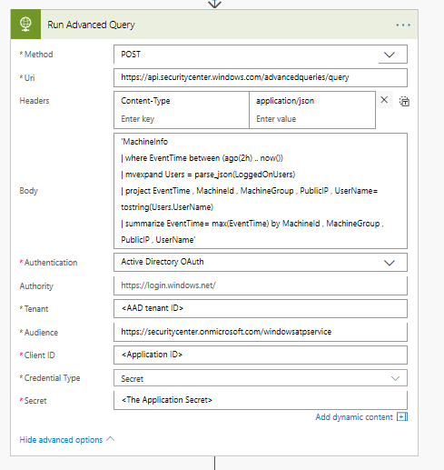
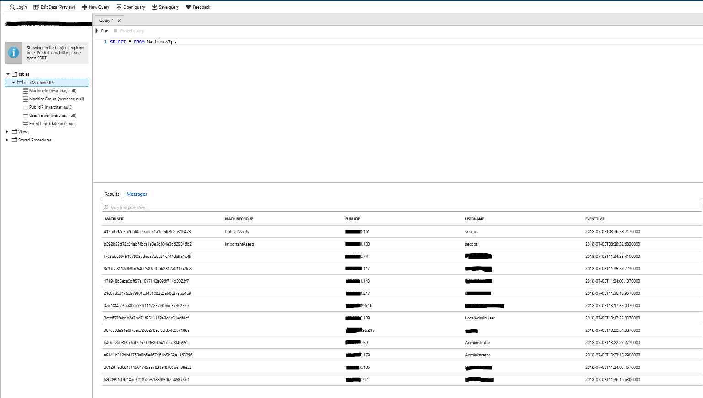
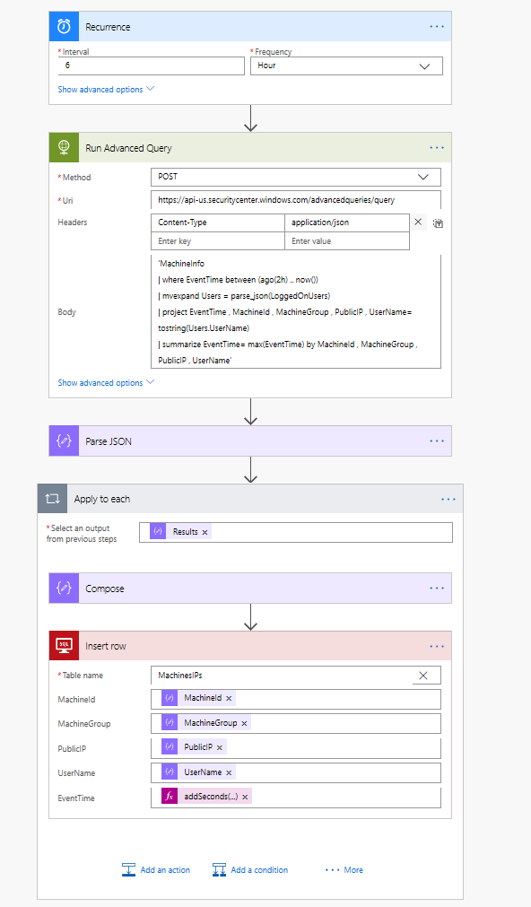

---
title: Advanced Hunting API
description: Use this API to run advanced queries
keywords: apis, supported apis, advanced hunting, query
search.product: eADQiWindows 10XVcnh
ms.prod: w10
ms.mktglfcycl: deploy
ms.sitesec: library
ms.pagetype: security
ms.author: macapara
author: mjcaparas
ms.localizationpriority: medium
ms.date: 12/08/2017
---

# Schedule Advanced Hunting using Microsoft Flow 

**Applies to:**

- Windows Defender Advanced Threat Protection (Windows Defender ATP)

Schedule advanced query.

## Use case

You need to schedule an advanced query and use the result for follow up actions and processing.

You can use [Microsoft Flow](https://flow.microsoft.com/) (or Logic Apps) for it!

## Define a flow to run query and parse results

You will find below a very basic flow example:

1. Define the trigger – Recurrence by time

2. Add an action – Select HTTP

	

	- Set method to be POST
	- Uri is https://api.securitycenter.windows.com/advancedqueries/query or one of the region specific locations
		- US: https://api-us.securitycenter.windows.com/advancedqueries/query
		- Europe: https://api-eu.securitycenter.windows.com/advancedqueries/query
		- United Kingdom: https://api-uk.securitycenter.windows.com/advancedqueries/query
	- Add the Header: Content-Type              application/json
	- In the body write your query surrounded by single quotation mark (')
	- In the Advanced options select Authentication to be Active Directory OAuth
	- Set the Tenant with proper AAD Tenant Id
	- Audience is https://securitycenter.onmicrosoft.com/windowsatpservice
	- Client ID is your application ID
	- Credential Type should be Secret
	- Secret is the application secret generated in the Azure Active directory.

	

3. You can use the "Parse JSON" action to get the schema of data – just "use sample payload to generate schema" and copy an output from of the expected result.

	

## Expand the flow to use the query results

	The below section shows how to use the parsed results to insert them in SQL database.

	This is an example only, you could perform on your results any other action supported by Microsoft Flow.

	- Add an 'Apply to each' action
	- Select the Results json (which was an output of the last parse action)
	- Add an 'Insert row' action – you will need to supply the connection details
	- Select the table you want to update and define the mapping between the WD-ATP output to the SQL. Note it is possible to manipulate the data inside the flow. In the example I changed the type of the EventTime.

	

	The output in the SQL DB is getting updates and can be used for correlation with other data sources. You can now read from your table:

	

You can find below the full definition

	

## Related topic
- [Advanced Hunting API](run-advanced-query-windows-defender-advanced-threat-protection.md)
- [Advanced Hunting using PowerShell](run-advanced-query-windows-defender-advanced-threat-protection-sample-powershell.md)
- [Create your app](exposed-apis-windows-defender-advanced-threat-protection-new.md)