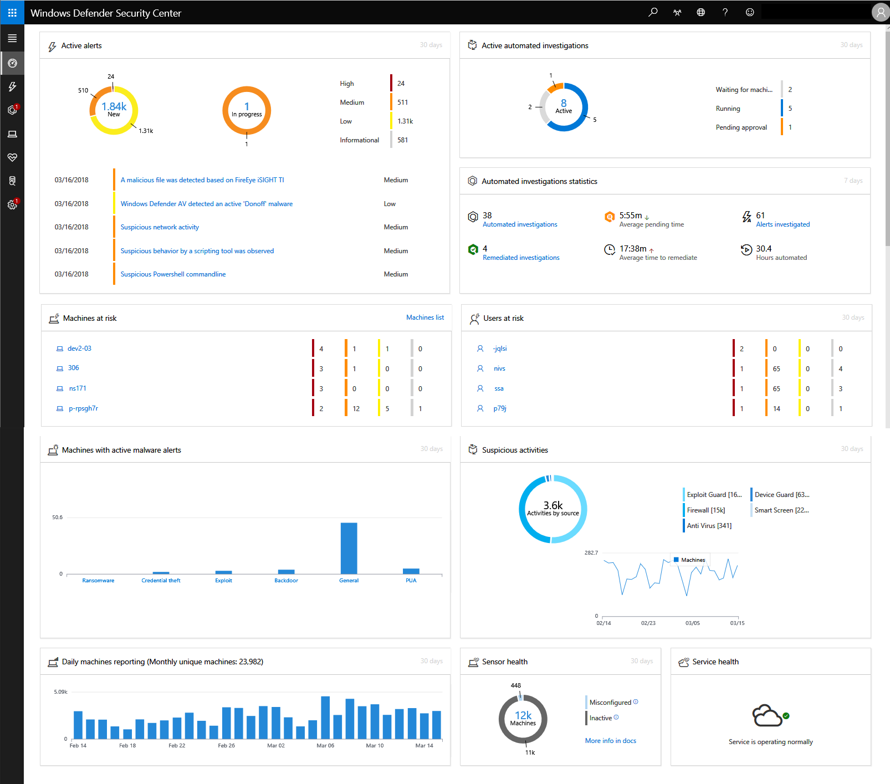
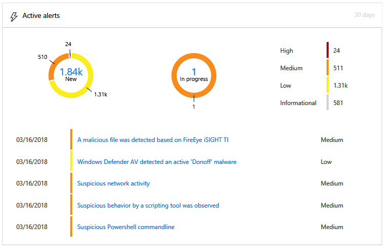
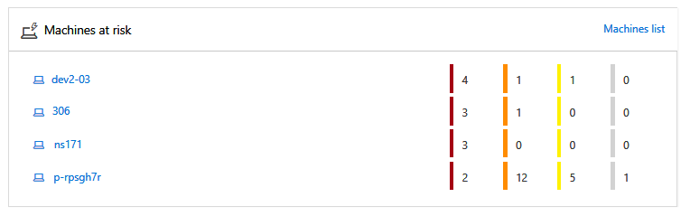
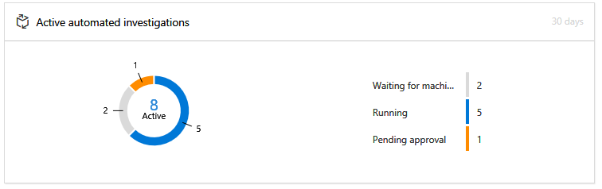
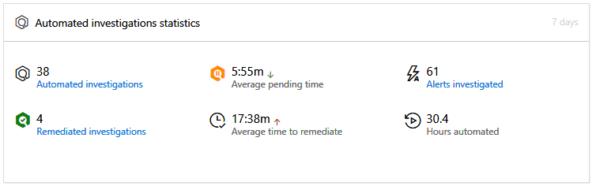
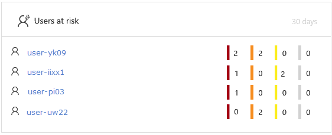
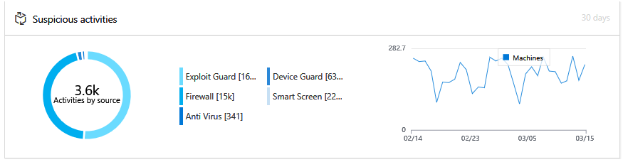
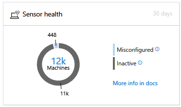
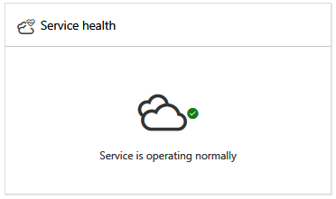

# View the Windows Defender Advanced Threat Protection Security operations dashboard

**Applies to:**

- Windows 10 Enterprise
- Windows 10 Education
- Windows 10 Pro
- Windows 10 Pro Education
- Windows Defender Advanced Threat Protection (Windows Defender ATP)

[!include[Prerelease information](prerelease.md)]

>Want to experience Windows Defender ATP? [Sign up for a free trial.](https://www.microsoft.com/en-us/WindowsForBusiness/windows-atp?ocid=docs-wdatp-secopsdashboard-abovefoldlink) 

The **Security operations dashboard** displays a snapshot of:

- The latest active alerts on your network
- Machines at risk
- Machines with active malware alerts
- Daily machines reporting
- Active automated investigations
- Automated investigations statistics
- Users at risk
- Suspicious activities
- Sensor health
- Service health

You can explore and investigate alerts and machines to quickly determine if, where, and when suspicious activities occurred in your network to help you understand the context they appeared in.

From the **Security operations dashboard** you will see aggregated events to facilitate the identification of significant events or behaviors on a machine. You can also drill down into granular events and low-level indicators.

It also has clickable tiles that give visual cues on the overall health state of your organization. Each tile opens a detailed view of the corresponding overview.

## Active alerts
You can view the overall number of active ATP alerts from the last 30 days in your network from the **ATP alerts** tile. Alerts are grouped into **New** and **In progress**.

Each group is further sub-categorized into their corresponding alert severity levels. Click the number of alerts inside each alert ring to see a sorted view of that category's queue (**New** or **In progress**).

For more information see, [Alerts overview](alerts-queue-windows-defender-advanced-threat-protection.md).

The **Latest active alerts** section includes the latest active alerts in your network. Each row includes an alert severity category and a short description of the alert. Click an alert to see its detailed view, or **Alerts queue** at the top of the list to go directly to the Alerts queue. For more information see,  [Investigate Windows Defender Advanced Threat Protection alerts](investigate-alerts-windows-defender-advanced-threat-protection.md) and [Alerts overview](alerts-queue-windows-defender-advanced-threat-protection.md).

## Machines at risk
This tile shows you a list of machines with the highest number of active alerts. The total number of alerts for each machine is shown in a circle next to the machine name, and then further categorized by severity levels at the far end of the tile (hover over each severity bar to see its label).

Click the name of the machine to see details about that machine. For more information see, [Investigate machines in the Windows Defender Advanced Threat Protection Machines list](investigate-machines-windows-defender-advanced-threat-protection.md).

You can also click **Machines list** at the top of the tile to go directly to the **Machines list**, sorted by the number of active alerts. For more information see, [Investigate machines in the Windows Defender Advanced Threat Protection Machines list](investigate-machines-windows-defender-advanced-threat-protection.md).

## Machines with active malware detections
The **Machines with active malware detections** tile will only appear if your machines are using Windows Defender Antivirus.

Active malware is defined as threats that were actively executing at the time of detection.

Hover over each bar to see the number of active malware detections (as **Malware detections**) and the number of machines with at least one active detection (as **Machines**) over the past 30 days.

The chart is sorted into five categories:

- **Ransomware** - threats that prevent user access to a machine or its files and demand payment to restore access.
- **Credential theft** - threats that attempt to steal credentials.
- **Exploit** - threats that use software vulnerabilities to infect machines.
- **Backdoor** - threats that gives a malicious hacker access to and control of machines.
- **General** - threats that perform unwanted actions, including actions that can disrupt, cause direct damage, and facilitate intrusion and data theft.
- **PUA** - applications that install and perform undesirable activity without adequate user consent.

Threats are considered "active" if there is a very high probability that the malware was executing on your network, as opposed to statically located on-disk.

Clicking on any of these categories will navigate to the [Machines list](investigate-machines-windows-defender-advanced-threat-protection.md), filtered by the appropriate category. This lets you see a detailed breakdown of which machines have active malware detections, and how many threats were detected per machine.

> [!NOTE]
> The **Machines with active malware detections** tile will only appear if your machines are using [Windows Defender Antivirus](https://technet.microsoft.com/library/mt622091(v=vs.85).aspx) as the default real-time protection antimalware product.

## Daily machines reporting
The **Daily machines reporting** tile shows a bar graph that represents the number of machines reporting daily in the last 30 days. Hover over individual bars on the graph to see the exact number of machines reporting in each day.

## Active automated investigations
You can view the overall number of automated investigations from the last 30 days in your network from the **Active automated investigations** tile. Investigations are grouped into **Waiting for machine**, **Running**, and **Pending approval**.

## Automated investigations statistics
This tile shows statistics related to automated investigations in the last 30 days. It shows the number of investigations completed, the number of successfully remediated investigations, the average pending time it takes for an investigaiton to be initiated, the average time it takes to remediate an alert, the number of alerts investigated, and the number of hours of automation saved from a typical manual investigation. 

You can click on **Automated investigations**, **Remidated investigations**, and **Alerts investigated** to navigate to the **Invesgations** page, filtered by the appropriate category. This lets you see a detailed breakdown of investigations in context.

## Users at risk
The tile shows you a list of user accounts with the most active alerts and the number of alerts seen on high, medium, or low alerts. 

Click the user account to see details about the user account. For more information see [Investigate a user account](investigate-user-windows-defender-advanced-threat-protection.md).

## Suspicious activities
This tile shows audit events based on detections from various security components.

## Sensor health
The **Sensor health** tile provides information on the individual machine’s ability to provide sensor data to the Windows Defender ATP service. It reports how many machines require attention and helps you identify problematic machines.

There are two status indicators that provide information on the number of machines that are not reporting properly to the service:
- **Inactive** - Machines that have stopped reporting to the Windows Defender ATP service for more than seven days in the past month.
-	**Misconfigured** – These machines might partially be reporting sensor data to the Windows Defender ATP service and might have configuration errors that need to be corrected.

When you click any of the groups, you’ll be directed to machines list, filtered according to your choice. For more information, see [Check sensor state](check-sensor-status-windows-defender-advanced-threat-protection.md) and [Investigate machines](investigate-machines-windows-defender-advanced-threat-protection.md).

## Service health
The **Service health** tile informs you if the service is active or if there are issues.

For more information on the service health, see [Check the Windows Defender ATP service health](service-status-windows-defender-advanced-threat-protection.md).

>Want to experience Windows Defender ATP? [Sign up for a free trial.](https://www.microsoft.com/en-us/WindowsForBusiness/windows-atp?ocid=docs-wdatp-secopsdashboard-belowfoldlink)

## Related topics
- [Understand the Windows Defender Advanced Threat Protection portal](use-windows-defender-advanced-threat-protection.md)
- [Portal overview](portal-overview-windows-defender-advanced-threat-protection.md)
- [View the Secure Score dashboard and improve your secure score](secure-score-dashboard-windows-defender-advanced-threat-protection.md)
- [View the Threat analytics dashboard and take recommended mitigation actions](threat-analytics-dashboard-windows-defender-advanced-threat-protection.md)

