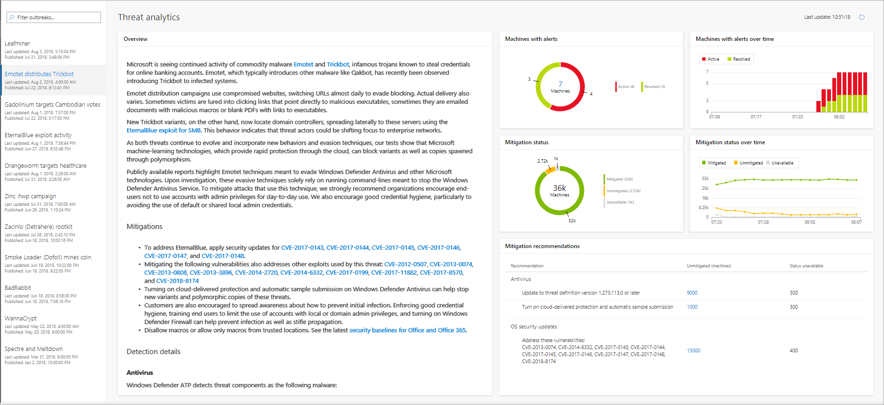

# Threat analytics 
**Applies to:**
- Windows Defender Advanced Threat Protection (Windows Defender ATP)

[!include[Prerelease information](prerelease.md)]

Cyber threats are emerging more frequently and prevalently. It is critical for enterprises to be able to quickly assess their security posture, including impact, and organizational resilience in the context of specific emerging threats. 

Threat Analytics is a set of interactive reports published by the Windows Defender ATP research team as soon as emerging threats and outbreaks are identified. The reports help security operations teams assess impact on their environment and provides recommended actions to contain, increase organizational resilience, and prevent specific threats.
 

>[!NOTE]
>Threat analytics requires all Windows Defender ATP components to be running, including Next generation protection and Attack surface reduction.

Each threat report provides a summary to describe details such as where the threat is coming from, where it's been seen, or techniques and tools that were used by the threat. 

The dashboard shows the impact in your organization through the following tiles:
- Machines with alerts - shows the current distinct number of impacted machines in your organization 
- Machines with alerts over time - shows the distinct number of impacted over time
- Mitigation recommendations - provides specific actionable recommendations to take for the threat can be contained
- Mitigation status - shows the current distinct number of machines that have been mitigated, unmitigated, and unavailable
- Mitigation status over time - shows the distinct number of machines that have been mitigated, unmitigated, and unavailable over time

## Organizational impact
You can assess the organizational impact of a threat using the **Machines with alerts** and **Machines with alerts over time** tiles.

A machine is categorized as **Active** if there is at least 1 alert associated with that threat and **Resolved** if *all** alerts associated with the threat on the machine are resolved.

The **Machine with alerts over time**, shows the number of distinct machines with **Active** and **Resolved alerts over time**. An indication of threat containment is reflected by the number of **Resolved alerts**. Total number of Resolved alerts increasing over time is a good indication of threat containment.

## Organizational resilience
The **Mitigation recommendations** section provides specific actionable recommendations to improve your visibility into this threat and increase your organizational resilience.

The **Mitigation status** and **Mitigation status over time** shows the endpoint configuration status assessed based on the recommended mitigations. Clicking on the **Mitigated** or **Unmitigated** parts of the pies brings you to the Machines list filtered based on the machines that are missing at least one specific threat mitigation.

>[!NOTE]
>The Unavailable category indicates that there is no data available from the specific machine yet. 

## Related topics
- [Threat analytics for Spectre and Meltdown](threat-analytics-dashboard-windows-defender-advanced-threat-protection.md)

