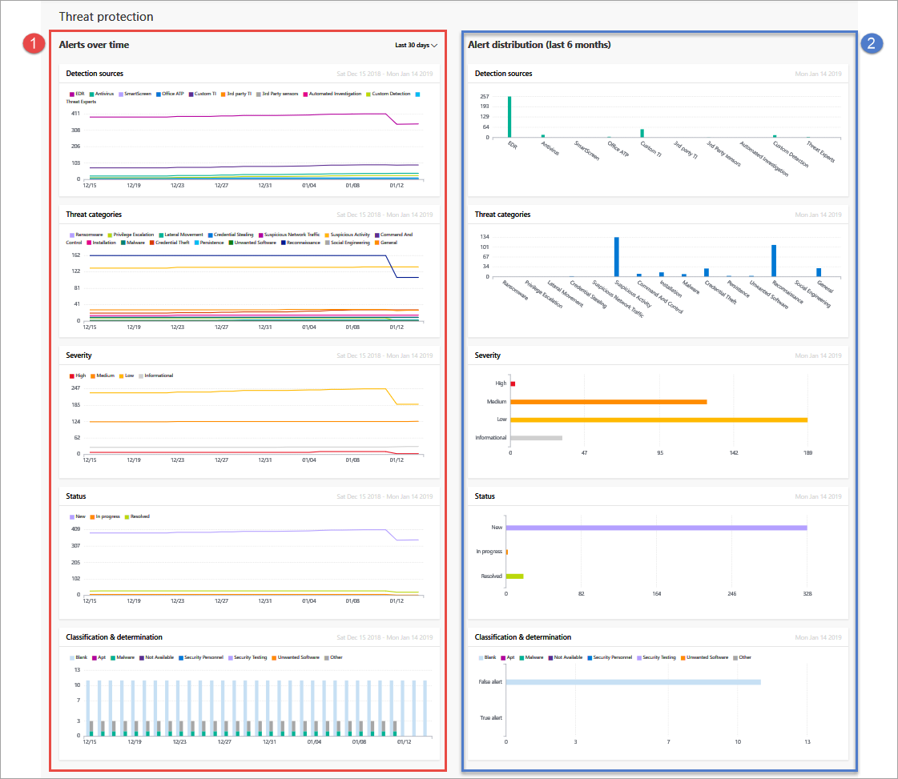

# Threat protection report in Windows Defender ATP

**Applies to:**
- [Windows Defender Advanced Threat Protection (Windows Defender ATP)](https://wincom.blob.core.windows.net/documents/Windows10_Commercial_Comparison.pdf)

[!include[Prerelease information](prerelease.md)]

The threat protection report provides high-level information about alerts generated in your organization. The report includes trending information showing the detection sources, categories, severities, statuses, classifications, and determinations of alerts across time.

The dashboard is structured into two columns:

Section | Description 
:---|:---
1 | Alerts over time
2 | Alert distribution (last 6 months)

## Alert attributes
The report is made up of cards that display the following alert attributes:

- **Detection sources**: shows information about the sensors and detection technologies that provide the data used by Windows Defender ATP to trigger alerts.

- **Threat categories**: shows the types of threat or attack activity that triggered alerts, indicating possible focus areas for your security operations.

- **Severity**: shows the severity level of alerts, indicating the collective potential impact of threats to your organization and the level of response needed to address them.

- **Status**: shows the resolution status of alerts, indicating the efficiency of your manual alert responses and of automated remediation (if enabled). 

- **Classification & determination**: shows how you have classified alerts upon resolution, whether you have classified them as actual threats (true alerts) or as incorrect detections (false alerts). These cards also show the determination of resolved alerts, providing additional insight like the types of actual threats found or the legitimate activities that were incorrectly detected.

## Date range for alerts over time

By default, the alerts over time column displays alert information from the 30-day period ending in the latest full day. To adjust this, select a time range from the drop-down options.
 

## Filter data

Use the provided filters to include or exclude alerts with certain attributes.

>[!NOTE]
>These filters apply to **all** the cards in the report.

For example, to show data about high-severity alerts only:

1. Under **Filters > Severity**, select **High**
2. Ensure that all other options under **Severity** are deselected.
3. Select **Apply**. 