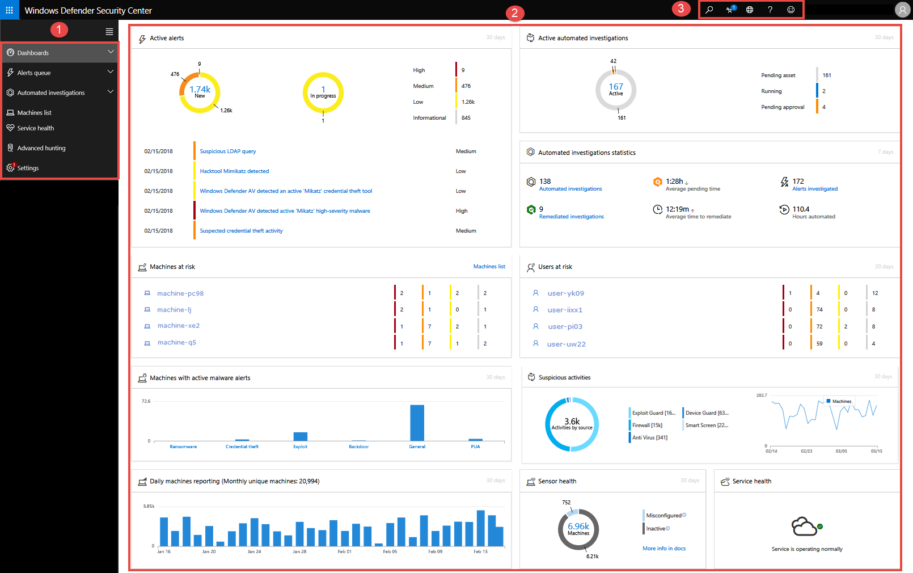

---
title: What's in the dashboard and what it means for my organization's security posture
description: 
keywords: 
search.product: Windows 10
search.appverid: met150
ms.prod: w10
ms.mktglfcycl: deploy
ms.sitesec: library
ms.pagetype: security
ms.author: dolmont
author: Dolcita Montemayor
ms.localizationpriority: medium
manager: dansimp
audience: ITPro
ms.collection: M365-security-compliance 
ms.topic: conceptual
---
# Windows Defender Advanced Threat Protection portal overview

**Applies to:**
- [Microsoft Defender Advanced Threat Protection (Microsoft Defender ATP)](https://go.microsoft.com/fwlink/p/?linkid=2069559)

[!include[Prerelease�information](prerelease.md)]

>Want to experience Windows Defender ATP? [Sign up for a free trial.](https://www.microsoft.com/en-us/WindowsForBusiness/windows-atp?ocid=docs-wdatp-portaloverview-abovefoldlink) 

Enterprise security teams can use Windows Defender Security Center to monitor and assist in responding to alerts of potential advanced persistent threat (APT) activity or data breaches.

You can use [Windows Defender Security Center](https://securitycenter.windows.com/) to:
- View, sort, and triage alerts from your endpoints
- Search for more information on observed indicators such as files and IP Addresses
- Change Windows Defender ATP settings, including time zone and review licensing information.

## Windows Defender Security Center
When you open the portal, you’ll see the main areas of the application:

 

- (1) Menu in the navigation pane
- (2) Threat & Vulnerability Management icon
- (3) Threat & Vulnerability Management dashboard

> [!NOTE]
> Malware related detections will only appear if your machines are using Windows Defender Antivirus as the default real-time protection antimalware product.

You can navigate through the portal using the menu options available in all sections. Refer to the following table for a description of each section.

Area | Description
:---|:---
(1) Menu | Select menu to expand the navigation pane and see the names of the Threat and Vulnerability Management capabilities.
(2) Threat & Vulnerability Management navigation pane** | Use the navigation pane to move across the Threat and Vulnerability Management Dashboard, Security recommendations, Remediation tasks, and Software inventory.
**Dashboards**	| Get a high-level view of the organization exposure score, MDATP configuration score, top remediation activities, top security recommendations, top vulnerable software, and top exposed machines data.
**Security recommendations** | See the list of security recommendations, their related components, insights, number or exposed devices, impact, and request for remediation.
**Remediation** | Vvvv
**Software inventory** | Dddddd.
(3) Threat & Vulnerability Management dashboard | Access the Exposure score, Configuration score, Exposure distrubition, Top security recommendations, Top vulnerable software, Top remediation activities, Top exposed machines, and Threat campaigns.

See [Microsoft Defender ATP icons](https://docs.microsoft.com/en-us/windows/security/threat-protection/windows-defender-atp/portal-overview-windows-defender-advanced-threat-protection#windows-defender-atp-icons) to provide the information on the icons used throughout the portal.

## Related topics
- [Threat & Vulnerability Management](next-gen-threat-and-vuln-mgt.md)
- [Configuration score](configuration-score.md)
- [Configure Threat & Vulnerability Management](configure-and-manage-tvm.md)
- [Scenarios](threat-and-vuln-mgt-scenarios.md)