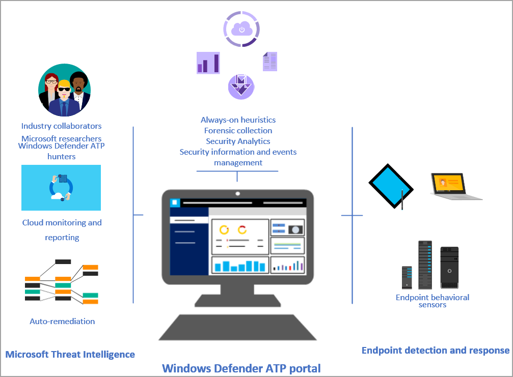

# Windows Defender Advanced Threat Protection

**Applies to:**

- Windows 10 Enterprise
- Windows 10 Education
- Windows 10 Pro
- Windows 10 Pro Education
- Windows Defender Advanced Threat Protection (Windows Defender ATP)

[!include[Prerelease information](prerelease.md)]

>Want to experience Windows Defender ATP? [Sign up for a free trial.](https://www.microsoft.com/en-us/WindowsForBusiness/windows-atp?ocid=docs-wdatp-main-abovefoldlink)
>
>For more info about Windows 10 Enterprise Edition features and functionality, see [Windows 10 Enterprise edition](https://www.microsoft.com/WindowsForBusiness/buy).

Windows Defender Advanced Threat Protection (Windows Defender ATP) is a security service that enables enterprise customers to detect, investigate, and respond to advanced threats on their networks.

Get a quick, but in-depth overview of Windows Defender ATP for Windows 10 and the new capabilities in Windows 10, version 1703 see [Windows Defender ATP for Windows 10 Creators Update](https://technet.microsoft.com/en-au/windows/mt782787).

Windows Defender ATP uses the following combination of technology built into Windows 10 and Microsoft's robust cloud service:

-   **Endpoint behavioral sensors**: Embedded in Windows 10, these sensors
    collect and process behavioral signals from the operating system
    (for example, process, registry, file, and network communications)
    and sends this sensor data to your private, isolated, cloud instance of Windows Defender ATP.

-   **Cloud security analytics**: Leveraging big-data, machine-learning, and
    unique Microsoft optics across the Windows ecosystem (such as the
    [Microsoft Malicious Software Removal Tool](https://www.microsoft.com/en-au/download/malicious-software-removal-tool-details.aspx),
    enterprise cloud products (such as Office 365), and online assets
    (such as Bing and SmartScreen URL reputation), behavioral signals
    are translated into insights, detections, and recommended responses
    to advanced threats.

-   **Threat intelligence**: Generated by Microsoft hunters, security teams,
    and augmented by threat intelligence provided by partners, threat
    intelligence enables Windows Defender ATP to identify attacker
    tools, techniques, and procedures, and generate alerts when these
    are observed in collected sensor data.

Endpoint investigation capabilities in this service let you drill down
into security alerts and understand the scope and nature of a potential
breach. You can submit files for deep analysis and receive the results
without leaving the [Windows Defender ATP portal](https://securitycenter.windows.com).

Windows Defender ATP works with existing Windows security technologies
on endpoints, such as Windows Defender Antivirus, AppLocker, and Windows Defender Device Guard. It
can also work side-by-side with third-party security solutions and
antimalware products.

Windows Defender ATP leverages Microsoft technology and expertise to
detect sophisticated cyber-attacks, providing:

- Behavior-based, cloud-powered, advanced attack detection

    Finds the attacks that made it past all other defenses (post breach detection), provides actionable, correlated alerts for known and unknown adversaries trying to hide their activities on endpoints.

- Rich timeline for forensic investigation and mitigation

    Easily investigate the scope of breach or suspected behaviours on any machine through a rich machine timeline. File, URLs, and network connection inventory across the network. Gain additional insight using deep collection and analysis (“detonation”) for any file or URLs.

- Built in unique threat intelligence knowledge base

    Unparalleled threat optics provides actor details and intent context for every threat intel-based detection – combining first and third-party intelligence sources.

## In this section

Topic | Description
:---|:---
Get started  |  Learn about the minimum requirements, validate licensing and complete setup, know about preview features, understand data storage and privacy, and how to assign user access to the portal.
[Onboard endpoints and set up access](onboard-configure-windows-defender-advanced-threat-protection.md) | Learn about configuring client, server, and non-Windows endpoints. Learn how to run a detection test, configure proxy and Internet connectivity settings, and how to troubleshoot potential onboarding issues.
[Understand the Windows Defender ATP portal](use-windows-defender-advanced-threat-protection.md) | Understand the Security operations and Secure score dashboard, and how to navigate the portal.
Investigate and remediate threats | Investigate alerts, machines, and take response actions to remediate threats.
API and SIEM support | Use the supported APIs to pull and create custom alerts, or automate workflows. Use the supported SIEM tools to pull alerts from the Windows Defender ATP portal.
Reporting | Create and build Power BI reports using Windows Defender ATP data.
Check service health and sensor state | Verify that the service is running and check the sensor state on endpoints.
[Configure Windows Defender settings](preferences-setup-windows-defender-advanced-threat-protection.md) | Configure general settings, turn on the preview experience, notifications, and enable other features.
[Access the Windows Defender ATP Community Center](community-windows-defender-advanced-threat-protection.md) | Access the Windows Defender ATP Community Center to learn, collaborate, and share experiences about the product.
[Troubleshoot Windows Defender ATP](troubleshoot-windows-defender-advanced-threat-protection.md) | This section addresses issues that might arise as you use the Windows Defender Advanced Threat service.
[Windows Defender Antivirus compatibility with Windows Defender ATP](defender-compatibility-windows-defender-advanced-threat-protection.md) | Understand how Windows Defender Antivirus integrates with Windows Defender ATP. 

## Related topic
[Windows Defender ATP helps detect sophisticated threats](https://www.microsoft.com/itshowcase/Article/Content/854/Windows-Defender-ATP-helps-detect-sophisticated-threats)
