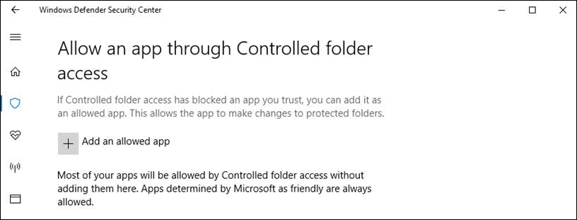

# Customize controlled folder access

**Applies to:**

- [Microsoft Defender Advanced Threat Protection (Microsoft Defender ATP)](https://go.microsoft.com/fwlink/p/?linkid=2069559)

Controlled folder access helps you protect valuable data from malicious apps and threats, such as ransomware. Controlled folder access is supported on Windows Server 2019 as well as Windows 10 clients.

This topic describes how to customize the following settings of the controlled folder access feature with the Windows Security app, Group Policy, PowerShell, and mobile device management (MDM) configuration service providers (CSPs):

- [Add additional folders to be protected](#protect-additional-folders)
- [Add apps that should be allowed to access protected folders](#allow-specific-apps-to-make-changes-to-controlled-folders)

>[!WARNING]
>Controlled folder access monitors apps for activities that may be malicious. Sometimes it might block a legitimate app from making legitimate changes to your files.
>
>This may impact your organization's productivity, so you may want to consider running the feature in [audit mode](audit-windows-defender-exploit-guard.md) to fully assess the feature's impact.

## Protect additional folders

Controlled folder access applies to a number of system folders and default locations, including folders such as Documents, Pictures, Movies, and Desktop.

You can add additional folders to be protected, but you cannot remove the default folders in the default list.

Adding other folders to controlled folder access can be useful, for example, if you don't store files in the default Windows libraries or you've changed the location of the libraries away from the defaults.

You can also enter network shares and mapped drives. Environment variables and wildcards are supported. For information about using wildcards, see [Use wildcards in the file name and folder path or extension exclusion lists](https://docs.microsoft.com/en-us/windows/security/threat-protection/windows-defender-antivirus/configure-extension-file-exclusions-windows-defender-antivirus#use-wildcards-in-the-file-name-and-folder-path-or-extension-exclusion-lists). 

You can use the Windows Security app or Group Policy to add and remove additional protected folders.

### Use the Windows Security app to protect additional folders

1. Open the Windows Security app by clicking the shield icon in the task bar or searching the start menu for **Defender**.

2. Click the **Virus & threat protection** tile (or the shield icon on the left menu bar) and then click **Ransomware protection**:

3. Under the **Controlled folder access** section, click **Protected folders**

4. Click **Add a protected folder** and follow the prompts to add apps.
 
### Use Group Policy to protect additional folders

1.  On your Group Policy management computer, open the [Group Policy Management Console](https://technet.microsoft.com/library/cc731212.aspx), right-click the Group Policy Object you want to configure and click **Edit**.

2.  In the **Group Policy Management Editor**, go to **Computer configuration** and click **Administrative templates**.

3.  Expand the tree to **Windows components** > **Windows Defender Antivirus** > **Windows Defender Exploit Guard** > **Controlled folder access**.

4. Double-click **Configured protected folders** and set the option to **Enabled**. Click **Show** and enter each folder.

### Use PowerShell to protect additional folders

1. Type **powershell** in the Start menu, right click **Windows PowerShell** and click **Run as administrator**
2. Enter the following cmdlet:

    ```PowerShell
    Add-MpPreference -ControlledFolderAccessProtectedFolders "<the folder to be protected>"
    ```

Continue to use `Add-MpPreference -ControlledFolderAccessProtectedFolders` to add more folders to the list. Folders added using this cmdlet will appear in the Windows Security app.


>[!IMPORTANT]
>Use `Add-MpPreference` to append or add apps to the list. Using the `Set-MpPreference` cmdlet will overwrite the existing list. 

### Use MDM CSPs to protect additional folders

Use the [./Vendor/MSFT/Policy/Config/Defender/GuardedFoldersList](https://docs.microsoft.com/windows/client-management/mdm/policy-csp-defender#defender-guardedfolderslist) configuration service provider (CSP) to allow apps to make changes to protected folders.

## Allow specific apps to make changes to controlled folders

You can specify if certain apps should always be considered safe and given write access to files in protected folders. Allowing apps can be useful if you're finding a particular app that you know and trust is being blocked by the controlled folder access feature. 

>[!IMPORTANT]
>By default, Windows adds apps that it considers friendly to the allowed list—apps added automatically by Windows are not recorded in the list shown in the Windows Security app or by using the associated PowerShell cmdlets.
>You shouldn't need to add most apps. Only add apps if they are being blocked and you can verify their trustworthiness.

When you add an app, you have to specify the app's location. Only the app in that location will be permitted access to the protected folders - if the app (with the same name) is located in a different location, then it will not be added to the allow list and may be blocked by controlled folder access.

An allowed application or service only has write access to a controlled folder after it starts. For example, if you allow an update service that is already running, the update service will continue to trigger events until the service is stopped and restarted.


### Use the Windows Defender Security app to allow specific apps

1. Open the Windows Security by clicking the shield icon in the task bar or searching the start menu for **Defender**.

2. Click the **Virus & threat protection** tile (or the shield icon on the left menu bar) and then click **Ransomware protection**.

3.	Under the **Controlled folder access** section, click **Allow an app through Controlled folder access**

4. Click **Add an allowed app** and follow the prompts to add apps.

    

### Use Group Policy to allow specific apps

1.  On your Group Policy management machine, open the [Group Policy Management Console](https://technet.microsoft.com/library/cc731212.aspx), right-click the Group Policy Object you want to configure and click **Edit**.

2.  In the **Group Policy Management Editor** go to **Computer configuration** and click **Administrative templates**.

3.  Expand the tree to **Windows components** > **Windows Defender Antivirus** > **Windows Defender Exploit Guard** > **Controlled folder access**.

4. Double-click the **Configure allowed applications** setting and set the option to **Enabled**. Click **Show** and enter each app.

### Use PowerShell to allow specific apps

1. Type **powershell** in the Start menu, right-click **Windows PowerShell** and click **Run as administrator**
2. Enter the following cmdlet:

    ```PowerShell
    Add-MpPreference -ControlledFolderAccessAllowedApplications "<the app that should be allowed, including the path>"
    ```

    For example, to add the executable *test.exe* located in the folder *C:\apps*, the cmdlet would be as follows:

    ```PowerShell
    Add-MpPreference -ControlledFolderAccessAllowedApplications "c:\apps\test.exe"
    ```
Continue to use `Add-MpPreference -ControlledFolderAccessAllowedApplications` to add more apps to the list. Apps added using this cmdlet will appear in the Windows Security app.


>[!IMPORTANT]
>Use `Add-MpPreference` to append or add apps to the list. Using the `Set-MpPreference` cmdlet will overwrite the existing list. 

### Use MDM CSPs to allow specific apps

Use the [./Vendor/MSFT/Policy/Config/Defender/GuardedFoldersAllowedApplications](https://docs.microsoft.com/windows/client-management/mdm/policy-csp-defender#defender-guardedfoldersallowedapplications) configuration service provider (CSP) to allow apps to make changes to protected folders. 

## Customize the notification

See the [Windows Security](../windows-defender-security-center/windows-defender-security-center.md#customize-notifications-from-the-windows-defender-security-center) topic for more information about customizing the notification when a rule is triggered and blocks an app or file.

## Related topics
- [Protect important folders with controlled folder access](controlled-folders-exploit-guard.md)
- [Enable controlled folder access](enable-controlled-folders-exploit-guard.md) 
- [Evaluate attack surface reduction rules](evaluate-windows-defender-exploit-guard.md)
