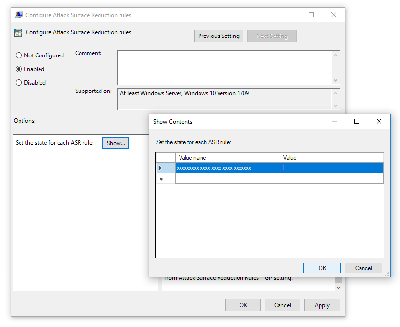

# Enable attack surface reduction rules

[Attack surface reduction rules](attack-surface-reduction-exploit-guard.md) help prevent actions and apps that malware often uses to infect computers. You can set attack surface reduction rules for computers running Windows 10 or Windows Server 2019. 

Each ASR rule contains three settings:

* Not configured: Disable the ASR rule
* Block: Enable the ASR rule
* Audit: Evaluate how the ASR rule would impact your organization if enabled

To use ASR rules, you need either a Windows 10 Enterprise E3 or E5 license. We recommend an E5 license so you can take advantage of the advanced monitoring and reporting capabilities available in Microsoft Defender Advanced Threat Protection (Microsoft Defender ATP). These advanced capabilities aren't available with an E3 license, but you can develop your own monitoring and reporting tools to use in conjunction with ASR rules.

You can enable attack surface reduction rules by using any of these methods:

- [Microsoft Intune](#intune) 
- [Mobile Device Management (MDM)](#mdm)
- [System Center Configuration Manager (SCCM)](#sccm)
- [Group Policy](#group-policy)
- [PowerShell](#powershell)

Enterprise-level management such as Intune or SCCM is recommended. Enterprise-level management will overwrite any conflicting Group Policy or PowerShell settings on startup.

## Exclude files and folders from ASR rules

You can exclude files and folders from being evaluated by most attack surface reduction rules. This means that even if an ASR rule determines the file or folder contains malicious behavior, it will not block the file from running. This could potentially allow unsafe files to run and infect your devices.

>[!WARNING]
>Excluding files or folders can severely reduce the protection provided by ASR rules. Excluded files will be allowed to run, and no report or event will be recorded.
> 
>If ASR rules are detecting files that you believe shouldn't be detected, you should [use audit mode first to test the rule](evaluate-attack-surface-reduction.md).

>[!IMPORTANT]
>File and folder exclusions do not apply to the following ASR rules:
>
>- Block process creations originating from PSExec and WMI commands
>- Block JavaScript or VBScript from launching downloaded executable content

You can specify individual files or folders (using folder paths or fully qualified resource names) but you can't specify which rules the exclusions apply to. An exclusion is applied only when when the excluded application or service starts. For example, if you add an exclusion for an update service that is already running, the update service will continue to trigger events until the service is stopped and restarted.

ASR rules support environment variables and wildcards. For information about using wildcards, see [Use wildcards in the file name and folder path or extension exclusion lists](https://docs.microsoft.com/windows/security/threat-protection/windows-defender-antivirus/configure-extension-file-exclusions-windows-defender-antivirus#use-wildcards-in-the-file-name-and-folder-path-or-extension-exclusion-lists). 

The following procedures for enabling ASR rules include instructions for how to exclude files and folders.

## Intune

1. In Intune, select **Device configuration** > **Profiles**. Choose an existing endpoint protection profile or create a new one. To create a new one, select **Create profile** and enter information for this profile. For **Profile type**, select **Endpoint protection**. If you've chosen an existing profile, select **Properties** and then select **Settings**.

2. In the **Endpoint protection** pane, select **Windows Defender Exploit Guard**, then select **Attack Surface Reduction**. Select the desired setting for each ASR rule.

3. Under **Attack Surface Reduction exceptions**, you can enter individual files and folders, or you can select **Import** to import a CSV file that contains files and folders to exclude from ASR rules. Each line in the CSV file should be in the following format:
	
   *C:\folder*, *%ProgramFiles%\folder\file*, *C:\path*	

4. Select **OK** on the three configuration panes and then select **Create** if you're creating a new endpoint protection file or **Save** if you're editing an existing one.

## MDM

Use the [./Vendor/MSFT/Policy/Config/Defender/AttackSurfaceReductionRules](https://docs.microsoft.com/en-us/windows/client-management/mdm/policy-csp-defender#defender-attacksurfacereductionrules) configuration service provider (CSP) to individually enable and set the mode for each rule.

The following is a sample for reference, using [GUID values for ASR rules](https://docs.microsoft.com/en-us/windows/security/threat-protection/windows-defender-exploit-guard/attack-surface-reduction-exploit-guard#attack-surface-reduction-rules). 

OMA-URI path: ./Vendor/MSFT/Policy/Config/Defender/AttackSurfaceReductionRules

Value: {75668C1F-73B5-4CF0-BB93-3ECF5CB7CC84}=2|{3B576869-A4EC-4529-8536-B80A7769E899}=1|{D4F940AB-401B-4EfC-AADC-AD5F3C50688A}=2|{D3E037E1-3EB8-44C8-A917-57927947596D}=1|{5BEB7EFE-FD9A-4556-801D-275E5FFC04CC}=0|{BE9BA2D9-53EA-4CDC-84E5-9B1EEEE46550}=1

The values to enable, disable, or enable in audit mode are:

-  Disable = 0
-  Block (enable ASR rule) = 1
-  Audit = 2

Use the [./Vendor/MSFT/Policy/Config/Defender/AttackSurfaceReductionOnlyExclusions](https://docs.microsoft.com/windows/client-management/mdm/policy-csp-defender#defender-attacksurfacereductiononlyexclusions) configuration service provider (CSP) to add exclusions.

Example:

OMA-URI path: ./Vendor/MSFT/Policy/Config/Defender/AttackSurfaceReductionOnlyExclusions

Value: c:\path|e:\path|c:\Whitelisted.exe

>[!NOTE]
>Be sure to enter OMA-URI values without spaces.

## SCCM

1. In System Center Configuration Manager, click **Assets and Compliance** > **Endpoint Protection** > **Windows Defender Exploit Guard**.
1. Click **Home** > **Create Exploit Guard Policy**.
1. Enter a name and a description, click **Attack Surface Reduction**, and click **Next**.
1. Choose which rules will block or audit actions and click **Next**.
1. Review the settings and click **Next** to create the policy.
1. After the policy is created, click **Close**. 

## Group Policy

>[!WARNING]
>If you manage your computers and devices with Intune, SCCM, or other enterprise-level management platform, the management software will overwrite any conflicting Group Policy settings on startup.

1. On your Group Policy management computer, open the [Group Policy Management Console](https://technet.microsoft.com/library/cc731212.aspx), right-click the Group Policy Object you want to configure and click **Edit**.

2. In the **Group Policy Management Editor** go to **Computer configuration** and click **Administrative templates**.

3. Expand the tree to **Windows components** > **Windows Defender Antivirus** > **Windows Defender Exploit Guard** > **Attack surface reduction**.

4. Select **Configure Attack surface reduction rules** and select **Enabled**. You can then set the individual state for each rule in the options section:
   - Click **Show...** and enter the rule ID in the **Value name** column and your desired state in the **Value** column as follows:
       -  Disable = 0
       -  Block (enable ASR rule) = 1
       -  Audit = 2

     

5. To exclude files and folders from ASR rules, select the **Exclude files and paths from Attack surface reduction rules** setting and set the option to **Enabled**. Click **Show** and enter each file or folder in the **Value name** column. Enter **0** in the **Value** column for each item. 
 
## PowerShell

>[!WARNING]
>If you manage your computers and devices with Intune, SCCM, or other enterprise-level management platform, the management software will overwrite any conflicting PowerShell settings on startup.

1. Type **powershell** in the Start menu, right-click **Windows PowerShell** and click **Run as administrator**.

2. Enter the following cmdlet:

    ```PowerShell
    Set-MpPreference -AttackSurfaceReductionRules_Ids <rule ID> -AttackSurfaceReductionRules_Actions Enabled
    ```

	To enable ASR rules in audit mode, use the following cmdlet:

	```PowerShell
	Add-MpPreference -AttackSurfaceReductionRules_Ids <rule ID> -AttackSurfaceReductionRules_Actions AuditMode
    ```

	To turn off ASR rules, use the following cmdlet:

	```PowerShell
	Add-MpPreference -AttackSurfaceReductionRules_Ids <rule ID> -AttackSurfaceReductionRules_Actions Disabled
    ```

	>[!IMPORTANT]
	>You must specify the state individually for each rule, but you can combine rules and states in a comma-separated list. 
	>
	>In the following example, the first two rules will be enabled, the third rule will be disabled, and the fourth rule will be enabled in audit mode:
	>
	>```PowerShell
	>Set-MpPreference -AttackSurfaceReductionRules_Ids <rule ID 1>,<rule ID 2>,<rule ID 3>,<rule ID 4> -AttackSurfaceReductionRules_Actions Enabled, Enabled, Disabled, AuditMode
	>```

	You can also the `Add-MpPreference` PowerShell verb to add new rules to the existing list. 

	>[!WARNING]
	>`Set-MpPreference` will always overwrite the existing set of rules. If you want to add to the existing set, you should use `Add-MpPreference` instead.
	>You can obtain a list of rules and their current state by using `Get-MpPreference`

3. To exclude files and folders from ASR rules, use the following cmdlet:

    ```PowerShell
    Add-MpPreference -AttackSurfaceReductionOnlyExclusions "<fully qualified path or resource>"
    ```

	Continue to use `Add-MpPreference -AttackSurfaceReductionOnlyExclusions` to add more files and folders to the list. 

	>[!IMPORTANT]
	>Use `Add-MpPreference` to append or add apps to the list. Using the `Set-MpPreference` cmdlet will overwrite the existing list. 


## Related topics

- [Reduce attack surfaces with attack surface reduction rules](attack-surface-reduction-exploit-guard.md)
- [Evaluate attack surface reduction](evaluate-attack-surface-reduction.md)
- [Enable cloud-delivered protection](https://docs.microsoft.com/windows/security/threat-protection/windows-defender-antivirus/enable-cloud-protection-windows-defender-antivirus)
