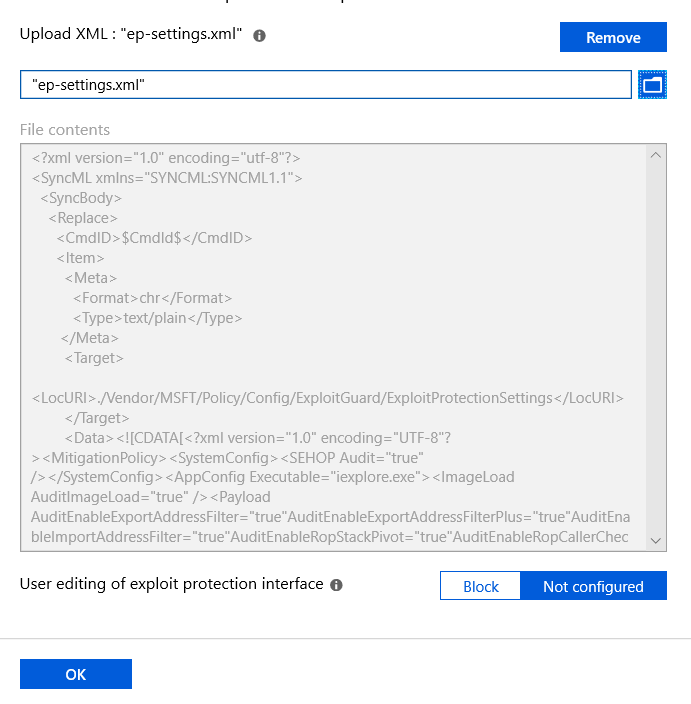

# Enable exploit protection

**Applies to:**

- [Windows Defender Advanced Threat Protection (Windows Defender ATP)](https://go.microsoft.com/fwlink/p/?linkid=2069559)

[Exploit protection](exploit-protection-exploit-guard.md) helps protect against malware that uses exploits to infect devices and spread. It consists of a number of mitigations that can be applied to either the operating system or individual apps.

Many features from the Enhanced Mitigation Experience Toolkit (EMET) are included in exploit protection. 

You can also set mitigations to [audit mode](evaluate-exploit-protection.md). Audit mode allows you to test how the mitigations would work (and review events) without impacting the normal use of the machine.

You can enable each mitigation separately by using any of these methods:

- [Windows Security app](#windows-security-app)
- [Microsoft Intune](#intune) 
- [Mobile Device Management (MDM)](#mdm)
- [System Center Configuration Manager (SCCM)](#sccm)
- [Group Policy](#group-policy)
- [PowerShell](#powershell)

They are configured by default in Windows 10. 

You can set each mitigation to on, off, or to its default value. 
Some mitigations have additional options.

You can [export these settings as an XML file](import-export-exploit-protection-emet-xml.md) and deploy them to other machines. 

## Windows Security app

1. Open the Windows Security app by clicking the shield icon in the task bar or searching the start menu for **Defender**.

2. Click the **App & browser control** tile (or the app icon on the left menu bar) and then click **Exploit protection**.
      
3.	Go to **Program settings** and choose the app you want to apply mitigations to:

    1. If the app you want to configure is already listed, click it and then click **Edit**
    2. If the app is not listed, at the top of the list click **Add program to customize** and then choose how you want to add the app:
        - Use **Add by program name** to have the mitigation applied to any running process with that name. You must specify a file with an extension. You can enter a full path to limit the mitigation to only the app with that name in that location.
        - Use **Choose exact file path** to use a standard Windows Explorer file picker window to find and select the file you want.
		        
4. After selecting the app, you'll see a list of all the mitigations that can be applied. Choosing **Audit** will apply the mitigation in audit mode only. You will be notified if you need to restart the process or app, or if you need to restart Windows.

5. Repeat this for all the apps and mitigations you want to configure. 

3. Under the **System settings** section, find the mitigation you want to configure and select one of the following. Apps that aren't configured individually in the **Program settings** section will use the settings configured here:
    - **On by default** - The mitigation is *enabled* for apps that don't have this mitigation set in the app-specific **Program settings** section
    - **Off by default** - The mitigation is *disabled* for apps that don't have this mitigation set in the app-specific **Program settings** section
    - **Use default** - The mitigation is either enabled or disabled, depending on the default configuration that is set up by Windows 10 installation; the default value (**On** or **Off**) is always specified next to the **Use default** label for each mitigation

5. Repeat this for all the system-level mitigations you want to configure. Click **Apply** when you're done setting up your configuration.

If you add an app to the **Program settings** section and configure individual mitigation settings there, they will be honored above the configuration for the same mitigations specified in the **System settings** section. The following matrix and examples help to illustrate how defaults work:

Enabled in **Program settings** | Enabled in **System settings** | Behavior
:-: | :-: | :-:
[!include[Check mark yes](images/svg/check-yes.svg)] | [!include[Check mark no](images/svg/check-no.svg)] | As defined in **Program settings**
[!include[Check mark yes](images/svg/check-yes.svg)] | [!include[Check mark yes](images/svg/check-yes.svg)] | As defined in **Program settings**
[!include[Check mark no](images/svg/check-no.svg)] | [!include[Check mark yes](images/svg/check-yes.svg)] | As defined in **System settings**
[!include[Check mark no](images/svg/check-no.svg)] | [!include[Check mark yes](images/svg/check-yes.svg)] | Default as defined in **Use default** option

**Example 1**  
   
Mikael configures **Data Execution Prevention (DEP)** in the **System settings** section to be **Off by default**.

Mikael then adds the app *test.exe* to the **Program settings** section. In the options for that app, under **Data Execution Prevention (DEP)**, he enables the **Override system settings** option and sets the switch to **On**. There are no other apps listed in the **Program settings** section.
 
The result will be that DEP only will be enabled for *test.exe*. All other apps will not have DEP applied.

**Example 2**

Josie configures **Data Execution Prevention (DEP)** in the **System settings** section to be **Off by default**.

Josie then adds the app *test.exe* to the **Program settings** section. In the options for that app, under **Data Execution Prevention (DEP)**, she enables the **Override system settings** option and sets the switch to **On**. 

Josie also adds the app *miles.exe* to the **Program settings** section and configures **Control flow guard (CFG)** to **On**. She doesn't enable the **Override system settings** option for DEP or any other mitigations for that app.

The result will be that DEP will be enabled for *test.exe*. DEP will not be enabled for any other app, including *miles.exe*. 
CFG will be enabled for *miles.exe*.

1. Open the Windows Security app by clicking the shield icon in the task bar or searching the start menu for **Defender**.

2. Click the **App & browser control** tile (or the app icon on the left menu bar) and then click **Exploit protection**.
      
3.	Go to **Program settings** and choose the app you want to apply mitigations to:

    1. If the app you want to configure is already listed, click it and then click **Edit**
    2. If the app is not listed, at the top of the list click **Add program to customize** and then choose how you want to add the app:
        - Use **Add by program name** to have the mitigation applied to any running process with that name. You must specify a file with an extension. You can enter a full path to limit the mitigation to only the app with that name in that location.
        - Use **Choose exact file path** to use a standard Windows Explorer file picker window to find and select the file you want.
		        
4. After selecting the app, you'll see a list of all the mitigations that can be applied. Choosing **Audit** will apply the mitigation in audit mode only. You will be notified if you need to restart the process or app, or if you need to restart Windows.

5. Repeat this for all the apps and mitigations you want to configure. Click **Apply** when you're done setting up your configuration.

## Intune

1. Sign in to the [Azure portal](https://portal.azure.com) and open Intune.
1. Click **Device configuration** > **Profiles** > **Create profile**.
1. Name the profile, choose **Windows 10 and later** and **Endpoint protection**.
    
1. Click **Configure** > **Windows Defender Exploit Guard** > **Exploit protection**.  
1. Upload an [XML file](https://docs.microsoft.com/windows/client-management/mdm/policy-csp-exploitguard) with the exploit protection settings:  
   
1. Click **OK** to save each open blade and click **Create**. 
1. Click the profile **Assignments**, assign to **All Users & All Devices**, and click **Save**.

## MDM

Use the [./Vendor/MSFT/Policy/Config/ExploitGuard/ExploitProtectionSettings](https://docs.microsoft.com/windows/client-management/mdm/policy-csp-exploitguard) configuration service provider (CSP) to enable or disable exploit protection mitigations or to use audit mode.

## SCCM

1. In System Center Configuration Manager, click **Assets and Compliance** > **Endpoint Protection** > **Windows Defender Exploit Guard**.
1. Click **Home** > **Create Exploit Guard Policy**.
1. Enter a name and a description, click **Exploit protection**, and click **Next**.
1. Browse to the location of the exploit protection XML file and click **Next**.
1. Review the settings and click **Next** to create the policy.
1. After the policy is created, click **Close**. 

## Group Policy

1.  On your Group Policy management machine, open the [Group Policy Management Console](https://technet.microsoft.com/library/cc731212.aspx), right-click the Group Policy Object you want to configure and click **Edit**.

1.  In the **Group Policy Management Editor** go to **Computer configuration** and click **Administrative templates**.

1.  Expand the tree to **Windows components** > **Windows Defender Exploit Guard** > **Exploit Protection** > **Use a common set of exploit protection settings**.

6. Click **Enabled** and type the location of the [XML file](https://docs.microsoft.com/windows/client-management/mdm/policy-csp-exploitguard) and click **OK**.

## PowerShell

You can use the PowerShell verb `Get` or `Set` with the cmdlet `ProcessMitigation`. Using `Get` will list the current configuration status of any mitigations that have been enabled on the device - add the `-Name` cmdlet and app exe to see mitigations for just that app:

```PowerShell
Get-ProcessMitigation -Name processName.exe 
```

>[!IMPORTANT]
>System-level mitigations that have not been configured will show a status of `NOTSET`. 
>
>For system-level settings, `NOTSET` indicates the default setting for that mitigation has been applied. 
>
>For app-level settings, `NOTSET` indicates the system-level setting for the mitigation will be applied. 
>
>The default setting for each system-level mitigation can be seen in the Windows Security.

Use `Set` to configure each mitigation in the following format:

```PowerShell
Set-ProcessMitigation -<scope> <app executable> -<action> <mitigation or options>,<mitigation or options>,<mitigation or options>
```
Where:

- \<Scope>:
    - `-Name` to indicate the mitigations should be applied to a specific app. Specify the app's executable after this flag.
    - `-System` to indicate the mitigation should be applied at the system level
- \<Action>:
    - `-Enable` to enable the mitigation
    - `-Disable` to disable the mitigation
- \<Mitigation>:
    - The mitigation's cmdlet along with any suboptions (surrounded with spaces). Each mitigation is separated with a comma.

For example, to enable the Data Execution Prevention (DEP) mitigation with ATL thunk emulation and for an executable called *testing.exe* in the folder *C:\Apps\LOB\tests*, and to prevent that executable from creating child processes, you'd use the following command:

```PowerShell
Set-ProcessMitigation -Name c:\apps\lob\tests\testing.exe -Enable DEP, EmulateAtlThunks, DisallowChildProcessCreation
```

>[!IMPORTANT]
>Separate each mitigation option with commas.

If you wanted to apply DEP at the system level, you'd use the following command:

```PowerShell
Set-Processmitigation -System -Enable DEP
```

To disable mitigations, you can replace `-Enable` with `-Disable`. However, for app-level mitigations, this will force the mitigation to be disabled only for that app.

If you need to restore the mitigation back to the system default, you need to include the `-Remove` cmdlet as well, as in the following example:

```PowerShell
Set-Processmitigation -Name test.exe -Remove -Disable DEP
```

This table lists the PowerShell cmdlets (and associated audit mode cmdlet) that can be used to configure each mitigation. 


Mitigation | Applies to | PowerShell cmdlets | Audit mode cmdlet
- | - | - | -
Control flow guard (CFG) | System and app-level |   CFG,   StrictCFG,   SuppressExports  | Audit not available
Data Execution Prevention (DEP) | System and app-level |   DEP,   EmulateAtlThunks  | Audit not available
Force randomization for images (Mandatory ASLR) | System and app-level |   ForceRelocateImages  | Audit not available
Randomize memory allocations (Bottom-Up ASLR) | System and app-level |   BottomUp,   HighEntropy  | Audit not available
Validate exception chains (SEHOP) | System and app-level |   SEHOP,   SEHOPTelemetry  | Audit not available
Validate heap integrity | System and app-level |   TerminateOnHeapError  | Audit not available
Arbitrary code guard (ACG) | App-level only |   DynamicCode  |   AuditDynamicCode 
Block low integrity images | App-level only |   BlockLowLabel  |   AuditImageLoad 
Block remote images | App-level only |   BlockRemoteImages  | Audit not available 
Block untrusted fonts | App-level only |   DisableNonSystemFonts  |   AuditFont,   FontAuditOnly 
Code integrity guard | App-level only |   BlockNonMicrosoftSigned,   AllowStoreSigned  |   AuditMicrosoftSigned,   AuditStoreSigned 
Disable extension points | App-level only |   ExtensionPoint  | Audit not available
Disable Win32k system calls | App-level only |   DisableWin32kSystemCalls  |   AuditSystemCall
Do not allow child processes | App-level only |   DisallowChildProcessCreation  |   AuditChildProcess
Export address filtering (EAF) | App-level only |   EnableExportAddressFilterPlus,   EnableExportAddressFilter  <a href="#r1" id="t1">\[1\]</a> | Audit not available 
Import address filtering (IAF) | App-level only |   EnableImportAddressFilter  | Audit not available 
Simulate execution (SimExec) | App-level only |   EnableRopSimExec  | Audit not available 
Validate API invocation (CallerCheck) | App-level only |   EnableRopCallerCheck  | Audit not available 
Validate handle usage | App-level only |   StrictHandle  | Audit not available
Validate image dependency integrity | App-level only |   EnforceModuleDepencySigning  | Audit not available 
Validate stack integrity (StackPivot) | App-level only |   EnableRopStackPivot  | Audit not available 


<a href="#t1" id="r1">\[1\]</a>: Use the following format to enable EAF modules for dlls for a process:

```PowerShell
Set-ProcessMitigation -Name processName.exe -Enable EnableExportAddressFilterPlus -EAFModules dllName1.dll,dllName2.dll 
```


## Customize the notification

See the [Windows Security](../windows-defender-security-center/windows-defender-security-center.md#customize-notifications-from-the-windows-defender-security-center) topic for more information about customizing the notification when a rule is triggered and blocks an app or file.


## Related topics

- [Comparison with Enhanced Mitigation Experience Toolkit](emet-exploit-protection-exploit-guard.md)
- [Evaluate exploit protection](evaluate-exploit-protection.md)
- [Configure and audit exploit protection mitigations](customize-exploit-protection.md)
- [Import, export, and deploy exploit protection configurations](import-export-exploit-protection-emet-xml.md)
