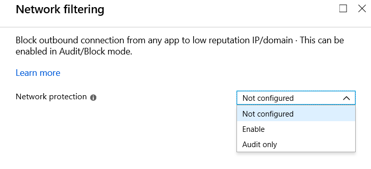

# Enable network protection

**Applies to:**

* [Microsoft Defender Advanced Threat Protection (Microsoft Defender ATP)](https://go.microsoft.com/fwlink/p/?linkid=2069559)

[Network protection](network-protection.md) helps to prevent employees from using any application to access dangerous domains that may host phishing scams, exploits, and other malicious content on the Internet.
You can [audit network protection](evaluate-network-protection.md) in a test environment to see which apps would be blocked before you enable it.  

You can enable network protection by using any of these methods:

* [Microsoft Intune](#intune)
* [Mobile Device Management (MDM)](#mdm)
* [System Center Configuration Manager (SCCM)](#sccm)
* [Group Policy](#group-policy)
* [PowerShell](#powershell)

## Intune

1. Sign in to the [Azure portal](https://portal.azure.com) and open Intune.
1. Click **Device configuration** > **Profiles** > **Create profile**.
1. Name the profile, choose **Windows 10 and later** and **Endpoint protection**.
   
1. Click **Configure** > **Windows Defender Exploit Guard** > **Network filtering** > **Enable**.  
   
1. Click **OK** to save each open blade and click **Create**.
1. Click the profile **Assignments**, assign to **All Users & All Devices**, and click **Save**.

## MDM

Use the [./Vendor/MSFT/Policy/Config/Defender/EnableNetworkProtection](https://docs.microsoft.com/windows/client-management/mdm/policy-csp-defender#defender-enablenetworkprotection) configuration service provider (CSP) to enable or disable network protection or enable audit mode.

## SCCM

1. In System Center Configuration Manager, click **Assets and Compliance** > **Endpoint Protection** > **Windows Defender Exploit Guard**.
1. Click **Home** > **Create Exploit Guard Policy**.
1. Enter a name and a description, click **Network protection**, and click **Next**.
1. Choose whether to block or audit access to suspicious domains and click **Next**.
1. Review the settings and click **Next** to create the policy.
1. After the policy is created, click **Close**.

## Group Policy

You can use the following procedure to enable network protection on domain-joined computers or on a standalone computer.

1. On a standalone computer, click **Start**, type and then click **Edit group policy**.

    -Or-

    On a domain-joined Group Policy management computer, open the [Group Policy Management Console](https://technet.microsoft.com/library/cc731212.aspx), right-click the Group Policy Object you want to configure and click **Edit**.

2. In the **Group Policy Management Editor** go to **Computer configuration** and click **Administrative templates**.

3. Expand the tree to **Windows components** > **Windows Defender Antivirus** > **Windows Defender Exploit Guard** > **Network protection**.

4. Double-click the **Prevent users and apps from accessing dangerous websites** setting and set the option to **Enabled**. In the options section, you must specify one of the following:
    * **Block** - Users will not be able to access malicious IP addresses and domains
    * **Disable (Default)** - The Network protection feature will not work. Users will not be blocked from accessing malicious domains
    * **Audit Mode** - If a user visits a malicious IP address or domain, an event will be recorded in the Windows event log but the user will not be blocked from visiting the address.

> [!IMPORTANT]
> To fully enable network protection, you must set the Group Policy option to **Enabled** and also select **Block** in the options drop-down menu.

You can confirm network protection is enabled on a local computer by using Registry editor:

1. Click **Start** and type **regedit** to open **Registry Editor**.
1. Navigate to Computer\HKEY_LOCAL_MACHINE\SOFTWARE\Microsoft\Windows Defender\Windows Defender Exploit Guard\Network Protection
1. Click **EnableNetworkProtection** and confirm the value:
   * 0=Off
   * 1=On
   * 2=Audit

## PowerShell

1. Type **powershell** in the Start menu, right-click **Windows PowerShell** and click **Run as administrator**
2. Enter the following cmdlet:

    ```PowerShell
    Set-MpPreference -EnableNetworkProtection Enabled
    ```

You can enable the feature in audit mode using the following cmdlet:

```PowerShell
Set-MpPreference -EnableNetworkProtection AuditMode
```

Use `Disabled` instead of `AuditMode` or `Enabled` to turn the feature off.

## Related topics

* [Windows Defender Exploit Guard](windows-defender-exploit-guard.md)
* [Network protection](network-protection.md)
* [Evaluate network protection](evaluate-network-protection.md)
* [Troubleshoot network protection](troubleshoot-np.md)
