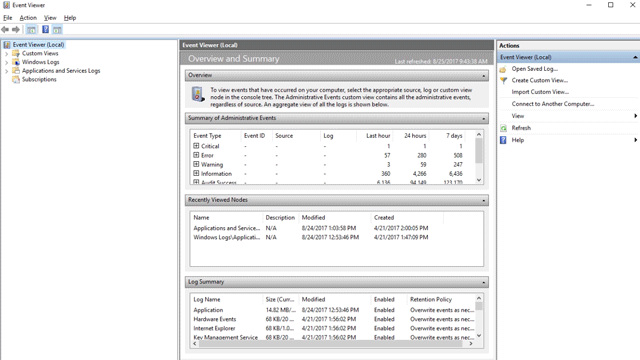

# View attack surface reduction events

**Applies to:**

- [Microsoft Defender Advanced Threat Protection (Microsoft Defender ATP)](https://go.microsoft.com/fwlink/p/?linkid=2069559)

You can review attack surface reduction events in Event Viewer. This is useful so you can monitor what rules or settings are working, and determine if any settings are too "noisy" or impacting your day to day workflow.

Reviewing the events is also handy when you are evaluating the features, as you can enable audit mode for the features or settings, and then review what would have happened if they were fully enabled.

This topic lists all the events, their associated feature or setting, and describes how to create custom views to filter to specific events.

You can also get detailed reporting into events and blocks as part of Windows Security, which you access if you have an E5 subscription and use [Microsoft Defender Advanced Threat Protection](../microsoft-defender-atp/microsoft-defender-advanced-threat-protection.md). 

## Use custom views to review attack surface reduction capabilities

You can create custom views in the Windows Event Viewer to only see events for specific capabilities and settings.

The easiest way to do this is to import a custom view as an XML file. You can copy the XML directly from this page.

You can also manually navigate to the event area that corresponds to the feature. 

### Import an existing XML custom view

1. Create an empty .txt file and copy the XML for the custom view you want to use into the .txt file. Do this for each of the custom views you want to use. Rename the files as follows (ensure you change the type from .txt to .xml):
    -  Controlled folder access events custom view: *cfa-events.xml*
    -  Exploit protection events custom view: *ep-events.xml*
    -  Attack surface reduction events custom view: *asr-events.xml*
    -  Network/ protection events custom view: *np-events.xml*

1. Type **event viewer** in the Start menu and open **Event Viewer**.

3. Click **Action** > **Import Custom View...**

    

4. Navigate to where you extracted XML file for the custom view you want and select it. 

4. Click **Open**.

5. This will create a custom view that filters to only show the events related to that feature.


### Copy the XML directly


1. Type **event viewer** in the Start menu and open the Windows **Event Viewer**.

3. On the left panel, under **Actions**, click **Create Custom View...**

    

4. Go to the XML tab and click **Edit query manually**. You'll see a warning that you won't be able to edit the query using the **Filter** tab if you use the XML option. Click **Yes**.

5.  Paste the XML code for the feature you want to filter events from into the XML section.

4. Click **OK**. Specify a name for your filter.

5. This will create a custom view that filters to only show the events related to that feature.

### XML for attack surface reduction rule events

```xml
<QueryList>
  <Query Id="0" Path="Microsoft-Windows-Windows Defender/Operational">
   <Select Path="Microsoft-Windows-Windows Defender/Operational">*[System[(EventID=1121 or EventID=1122 or EventID=5007)]]</Select>
   <Select Path="Microsoft-Windows-Windows Defender/WHC">*[System[(EventID=1121 or EventID=1122 or EventID=5007)]]</Select>
  </Query>
</QueryList>
```

### XML for controlled folder access events

```xml
<QueryList>
  <Query Id="0" Path="Microsoft-Windows-Windows Defender/Operational">
   <Select Path="Microsoft-Windows-Windows Defender/Operational">*[System[(EventID=1123 or EventID=1124 or EventID=5007)]]</Select>
   <Select Path="Microsoft-Windows-Windows Defender/WHC">*[System[(EventID=1123 or EventID=1124 or EventID=5007)]]</Select>
  </Query>
</QueryList>
```

### XML for exploit protection events

```xml
<QueryList>
  <Query Id="0" Path="Microsoft-Windows-Security-Mitigations/KernelMode">
   <Select Path="Microsoft-Windows-Security-Mitigations/KernelMode">*[System[Provider[@Name='Microsoft-Windows-Security-Mitigations' or @Name='Microsoft-Windows-WER-Diag' or @Name='Microsoft-Windows-Win32k' or @Name='Win32k'] and ( (EventID &gt;= 1 and EventID &lt;= 24)  or EventID=5 or EventID=260)]]</Select>
   <Select Path="Microsoft-Windows-Win32k/Concurrency">*[System[Provider[@Name='Microsoft-Windows-Security-Mitigations' or @Name='Microsoft-Windows-WER-Diag' or @Name='Microsoft-Windows-Win32k' or @Name='Win32k'] and ( (EventID &gt;= 1 and EventID &lt;= 24)  or EventID=5 or EventID=260)]]</Select>
   <Select Path="Microsoft-Windows-Win32k/Contention">*[System[Provider[@Name='Microsoft-Windows-Security-Mitigations' or @Name='Microsoft-Windows-WER-Diag' or @Name='Microsoft-Windows-Win32k' or @Name='Win32k'] and ( (EventID &gt;= 1 and EventID &lt;= 24)  or EventID=5 or EventID=260)]]</Select>
   <Select Path="Microsoft-Windows-Win32k/Messages">*[System[Provider[@Name='Microsoft-Windows-Security-Mitigations' or @Name='Microsoft-Windows-WER-Diag' or @Name='Microsoft-Windows-Win32k' or @Name='Win32k'] and ( (EventID &gt;= 1 and EventID &lt;= 24)  or EventID=5 or EventID=260)]]</Select>
   <Select Path="Microsoft-Windows-Win32k/Operational">*[System[Provider[@Name='Microsoft-Windows-Security-Mitigations' or @Name='Microsoft-Windows-WER-Diag' or @Name='Microsoft-Windows-Win32k' or @Name='Win32k'] and ( (EventID &gt;= 1 and EventID &lt;= 24)  or EventID=5 or EventID=260)]]</Select>
   <Select Path="Microsoft-Windows-Win32k/Power">*[System[Provider[@Name='Microsoft-Windows-Security-Mitigations' or @Name='Microsoft-Windows-WER-Diag' or @Name='Microsoft-Windows-Win32k' or @Name='Win32k'] and ( (EventID &gt;= 1 and EventID &lt;= 24)  or EventID=5 or EventID=260)]]</Select>
   <Select Path="Microsoft-Windows-Win32k/Render">*[System[Provider[@Name='Microsoft-Windows-Security-Mitigations' or @Name='Microsoft-Windows-WER-Diag' or @Name='Microsoft-Windows-Win32k' or @Name='Win32k'] and ( (EventID &gt;= 1 and EventID &lt;= 24)  or EventID=5 or EventID=260)]]</Select>
   <Select Path="Microsoft-Windows-Win32k/Tracing">*[System[Provider[@Name='Microsoft-Windows-Security-Mitigations' or @Name='Microsoft-Windows-WER-Diag' or @Name='Microsoft-Windows-Win32k' or @Name='Win32k'] and ( (EventID &gt;= 1 and EventID &lt;= 24)  or EventID=5 or EventID=260)]]</Select>
   <Select Path="Microsoft-Windows-Win32k/UIPI">*[System[Provider[@Name='Microsoft-Windows-Security-Mitigations' or @Name='Microsoft-Windows-WER-Diag' or @Name='Microsoft-Windows-Win32k' or @Name='Win32k'] and ( (EventID &gt;= 1 and EventID &lt;= 24)  or EventID=5 or EventID=260)]]</Select>
   <Select Path="System">*[System[Provider[@Name='Microsoft-Windows-Security-Mitigations' or @Name='Microsoft-Windows-WER-Diag' or @Name='Microsoft-Windows-Win32k' or @Name='Win32k'] and ( (EventID &gt;= 1 and EventID &lt;= 24)  or EventID=5 or EventID=260)]]</Select>
   <Select Path="Microsoft-Windows-Security-Mitigations/UserMode">*[System[Provider[@Name='Microsoft-Windows-Security-Mitigations' or @Name='Microsoft-Windows-WER-Diag' or @Name='Microsoft-Windows-Win32k' or @Name='Win32k'] and ( (EventID &gt;= 1 and EventID &lt;= 24)  or EventID=5 or EventID=260)]]</Select>
  </Query>
</QueryList>
```

### XML for network protection events

```xml
<QueryList>
 <Query Id="0" Path="Microsoft-Windows-Windows Defender/Operational">
  <Select Path="Microsoft-Windows-Windows Defender/Operational">*[System[(EventID=1125 or EventID=1126 or EventID=5007)]]</Select>
  <Select Path="Microsoft-Windows-Windows Defender/WHC">*[System[(EventID=1125 or EventID=1126 or EventID=5007)]]</Select>
 </Query>
</QueryList>

```

## List of attack surface reduction events


All attack surface reductiond events are located under **Applications and Services Logs > Microsoft > Windows** and then the folder or provider as listed in the following table.

You can access these events in Windows Event viewer:

1. Open the **Start** menu and type **event viewer**, and then click on the **Event Viewer** result.
2. Expand **Applications and Services Logs > Microsoft > Windows** and then go to the folder listed under **Provider/source** in the table below.
3. Double-click on the sub item to see events. Scroll through the events to find the one you are looking.

  

Feature | Provider/source | Event ID | Description
:-|:-|:-:|:-
Exploit protection | Security-Mitigations (Kernel Mode/User Mode) | 1 | ACG audit
Exploit protection | Security-Mitigations (Kernel Mode/User Mode) | 2 | ACG enforce
Exploit protection | Security-Mitigations (Kernel Mode/User Mode) | 3 | Do not allow child processes audit
Exploit protection | Security-Mitigations (Kernel Mode/User Mode) | 4 | Do not allow child processes block
Exploit protection | Security-Mitigations (Kernel Mode/User Mode) | 5 | Block low integrity images audit
Exploit protection | Security-Mitigations (Kernel Mode/User Mode) | 6 | Block low integrity images block
Exploit protection | Security-Mitigations (Kernel Mode/User Mode) | 7 | Block remote images audit
Exploit protection | Security-Mitigations (Kernel Mode/User Mode) | 8 | Block remote images block
Exploit protection | Security-Mitigations (Kernel Mode/User Mode) | 9 | Disable win32k system calls audit
Exploit protection | Security-Mitigations (Kernel Mode/User Mode) | 10 | Disable win32k system calls block
Exploit protection | Security-Mitigations (Kernel Mode/User Mode) | 11 | Code integrity guard audit
Exploit protection | Security-Mitigations (Kernel Mode/User Mode) | 12 | Code integrity guard block
Exploit protection | Security-Mitigations (Kernel Mode/User Mode) | 13 | EAF audit
Exploit protection | Security-Mitigations (Kernel Mode/User Mode) | 14 | EAF enforce
Exploit protection | Security-Mitigations (Kernel Mode/User Mode) | 15 | EAF+ audit
Exploit protection | Security-Mitigations (Kernel Mode/User Mode) | 16 | EAF+ enforce
Exploit protection | Security-Mitigations (Kernel Mode/User Mode) | 17 | IAF audit
Exploit protection | Security-Mitigations (Kernel Mode/User Mode) | 18 | IAF enforce
Exploit protection | Security-Mitigations (Kernel Mode/User Mode) | 19 | ROP StackPivot audit
Exploit protection | Security-Mitigations (Kernel Mode/User Mode) | 20 | ROP StackPivot enforce
Exploit protection | Security-Mitigations (Kernel Mode/User Mode) | 21 | ROP CallerCheck audit
Exploit protection | Security-Mitigations (Kernel Mode/User Mode) | 22 | ROP CallerCheck enforce
Exploit protection | Security-Mitigations (Kernel Mode/User Mode) | 23 | ROP SimExec audit
Exploit protection | Security-Mitigations (Kernel Mode/User Mode) | 24 | ROP SimExec enforce
Exploit protection | WER-Diagnostics | 5 | CFG Block
Exploit protection | Win32K (Operational) | 260 | Untrusted Font
Network protection | Windows Defender (Operational) | 5007 | Event when settings are changed
Network protection | Windows Defender (Operational) | 1125 | Event when Network protection fires in Audit-mode 
Network protection | Windows Defender (Operational) | 1126 | Event when Network protection fires in Block-mode 
Controlled folder access | Windows Defender (Operational) | 5007 | Event when settings are changed
Controlled folder access | Windows Defender (Operational) | 1124 | Audited Controlled folder access event
Controlled folder access | Windows Defender (Operational) | 1123 | Blocked Controlled folder access event
Controlled folder access | Windows Defender (Operational) | 1127 | Blocked Controlled folder access sector write block event
Controlled folder access | Windows Defender (Operational) | 1128 | Audited Controlled folder access sector write block event
Attack surface reduction | Windows Defender (Operational) | 5007 | Event when settings are changed
Attack surface reduction | Windows Defender (Operational) | 1122 | Event when rule fires in Audit-mode 
Attack surface reduction | Windows Defender (Operational) | 1121 | Event when rule fires in Block-mode 
