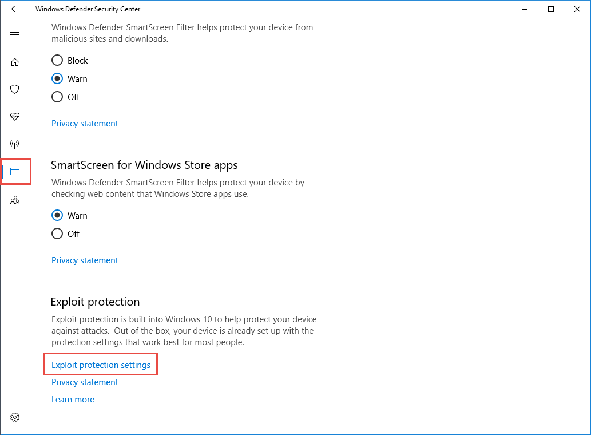
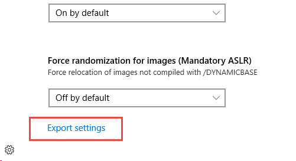

# Import, export, and deploy exploit protection configurations

**Applies to:**

- [Microsoft Defender Advanced Threat Protection (Microsoft Defender ATP)](https://go.microsoft.com/fwlink/p/?linkid=2069559)

Exploit protection applies helps protect devices from malware that use exploits to spread and infect. It consists of a number of mitigations that can be applied at either the operating system level, or at the individual app level.

It is part of [Windows Defender Exploit Guard](windows-defender-exploit-guard.md).

Many of the features that are part of the [Enhanced Mitigation Experience Toolkit (EMET)](https://technet.microsoft.com/security/jj653751) are now included in exploit protection. 

You use the Windows Security app or PowerShell to create a set of mitigations (known as a configuration). You can then export this configuration as an XML file and share it with multiple machines on your network so they all have the same set of mitigation settings.

You can also convert and import an existing EMET configuration XML file into an exploit protection configuration XML.

This topic describes how to create a configuration file and deploy it across your network, and how to convert an EMET configuration.

The [Exploit Guard Evaluation Package](https://aka.ms/mp7z2w) contains a sample configuration file (name *ProcessMitigation-Selfhost-v4.xml* that you can use to see how the XML structure looks. The sample file also contains settings that have been converted from an EMET configuration. You can open the file in a text editor (such as Notepad) or import it directly into exploit protection and then review the settings in the Windows Security app, as described further in this topic.

## Create and export a configuration file

Before you export a configuration file, you need to ensure you have the correct settings.

You should first configure exploit protection on a single, dedicated machine. See [Customize exploit protection](customize-exploit-protection.md) for descriptions about and instructions for configuring mitigations.

When you have configured exploit protection to your desired state (including both system-level and app-level mitigations), you can export the file using either the Windows Security app or PowerShell.

### Use the Windows Security app to export a configuration file

1. Open the Windows Security app by clicking the shield icon in the task bar or searching the start menu for **Defender**.

2. Click the **App & browser control** tile (or the app icon on the left menu bar) and then click **Exploit protection settings**:

    
        
3. At the bottom of the **Exploit protection** section, click **Export settings** and then choose the location and name of the XML file where you want the configuration to be saved.



>[!NOTE]
>When you export the settings, all settings for both app-level and system-level mitigations are saved. This means you don't need to export a file from both the **System settings** and **Program settings** sections - either section will export all settings.

### Use PowerShell to export a configuration file

1. Type **powershell** in the Start menu, right click **Windows PowerShell** and click **Run as administrator**
2. Enter the following cmdlet:

    ```PowerShell
    Get-ProcessMitigation -RegistryConfigFilePath filename.xml 
    ```

Change `filename` to any name or location of your choosing.

> [!IMPORTANT]
> When you deploy the configuration using Group Policy, all machines that will use the configuration must be able to access the configuration file. Ensure you place the file in a shared location. 

## Import a configuration file

You can import an exploit protection configuration file that you've previously created. You can only use PowerShell to import the configuration file.

After importing, the settings will be instantly applied and can be reviewed in the Windows Security app.

### Use PowerShell to import a configuration file


1. Type **powershell** in the Start menu, right click **Windows PowerShell** and click **Run as administrator**
2. Enter the following cmdlet:

    ```PowerShell
    Set-ProcessMitigation -PolicyFilePath filename.xml 
    ```

Change `filename` to the location and name of the exploit protection XML file.

>[!IMPORTANT]
>
>Ensure you import a configuration file that is created specifically for exploit protection. You cannot directly import an EMET configuration file, you must convert it first.


## Convert an EMET configuration file to an exploit protection configuration file

You can convert an existing EMET configuration file to the new format used by exploit protection. You must do this if you want to import an EMET configuration into exploit protection in Windows 10.

You can only do this conversion in PowerShell.

>[!WARNING]
>
>You cannot directly convert the default EMET configuration files that are distributed with EMET. These files are intended to help set up EMET for a first-time user. Attempting to directly convert these files into an Exploit protection configuration file will not work.
>
>However, if you want to apply the same settings as in the default EMET configuration files, you must first import the default configuration file into EMET, then export the settings to a new file. 
>
>You can then convert that file using the PowerShell cmdlet described here before importing the settings into Exploit protection.


1. Type **powershell** in the Start menu, right click **Windows PowerShell** and click **Run as administrator**
2. Enter the following cmdlet:

    ```PowerShell
    ConvertTo-ProcessMitigationPolicy -EMETFilePath emetFile.xml -OutputFilePath filename.xml
    ```

Change `emetFile` to the name and location of the EMET configuration file, and change `filename` to whichever location and file name you want to use.

>[!IMPORTANT]
>
>If you have enabled Mandatory ASLR for any apps in EMET, export the EMET settings to an XML file, and then convert the XML file into an Exploit protection configuration file, you will need to manually edit the converted XML file to ensure the Mandatory ASLR mitigation setting is correctly configured:
>
> 1. Open the PowerShell-converted XML file in a text editor.
> 2. Search for `ASLR ForceRelocateImages="false"` and change it to `ASLR ForceRelocateImages="true"` for each app that you want Mandatory ASLR to be enabled.


## Manage or deploy a configuration

You can use Group Policy to deploy the configuration you've created to multiple machines in your network.

> [!IMPORTANT]
> When you deploy the configuration using Group Policy, all machines that will use the configuration must be able to access the configuration XML file. Ensure you place the file in a shared location. 

### Use Group Policy to distribute the configuration

1.  On your Group Policy management machine, open the [Group Policy Management Console](https://technet.microsoft.com/library/cc731212.aspx), right-click the Group Policy Object you want to configure and click **Edit**.

3.  In the **Group Policy Management Editor** go to **Computer configuration** and click **Administrative templates**.

5.  Expand the tree to **Windows components** > **Windows Defender Exploit Guard** > **Exploit protection**.

    

6. Double-click the **Use a common set of Exploit protection settings** setting and set the option to **Enabled**. 

7. In the **Options::** section, enter the location and filename of the Exploit protection configuration file that you want to use, such as in the following examples:
    - C:\MitigationSettings\Config.XML
    -  \\\Server\Share\Config.xml
    -  https://localhost:8080/Config.xml

8. Click **OK** and [Deploy the updated GPO as you normally do](https://msdn.microsoft.com/library/ee663280(v=vs.85).aspx). 


## Related topics

- [Protect devices from exploits](exploit-protection-exploit-guard.md)
- [Comparison with Enhanced Mitigation Experience Toolkit](emet-exploit-protection-exploit-guard.md)
- [Evaluate exploit protection](evaluate-exploit-protection.md)
- [Enable exploit protection](enable-exploit-protection.md)
- [Configure and audit exploit protection mitigations](customize-exploit-protection.md)
