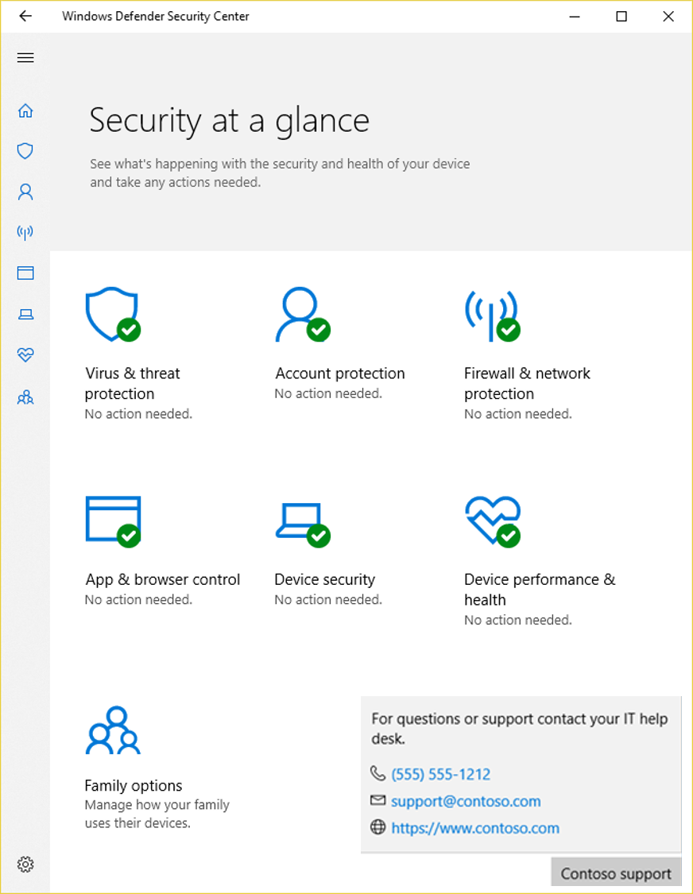
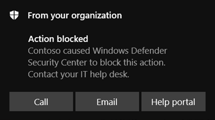

# Customize the Windows Security app for your organization

**Applies to**

- Windows 10, version 1709 and later

**Audience**

- Enterprise security administrators

**Manageability available with**

- Group Policy

You can add information about your organization in a contact card to the Windows Security app. This can include a link to a support site, a phone number for a help desk, and an email address for email-based support.

This information will also be shown in some enterprise-specific notifications (including those for the [Block at first sight feature](/windows/threat-protection/windows-defender-antivirus/configure-block-at-first-sight-windows-defender-antivirus), and [potentially unwanted applications](/windows/threat-protection/windows-defender-antivirus/detect-block-potentially-unwanted-apps-windows-defender-antivirus).

Users can click on the displayed information to initiate a support request:

- Clicking **Call** or the phone number will open Skype to start a call to the displayed number
- Clicking **Email** or the email address will create a new email in the machine's default email app address to the displayed email
- Clicking **Help portal** or the website URL will open the machine's default web browser and go to the displayed address

## Requirements

You must have Windows 10, version 1709 or later. The ADMX/ADML template files for earlier versions of Windows do not include these Group Policy settings.

## Use Group Policy to enable and customize contact information

There are two stages to using the contact card and customized notifications. First, you have to enable the contact card or custom notifications (or both), and then you must specify at least a name for your organization and one piece of contact information.

This can only be done in Group Policy.

1. On your Group Policy management machine, open the [Group Policy Management Console](https://technet.microsoft.com/library/cc731212.aspx), right-click the Group Policy Object you want to configure and click **Edit**.

2. In the **Group Policy Management Editor** go to **Computer configuration** and click **Administrative templates**.

3. Expand the tree to **Windows components > Windows Security > Enterprise Customization**.

4. Enable the contact card and the customized notifications by configuring two separate Group Policy settings. They will both use the same source of information (explained in Steps 5 and 6). You can enable both, or slect one or the other:

    1. To enable the contact card, open the **Configure customized contact information** setting and set it to **Enabled**. Click **OK**.

    2. To enable the customized notifications, open the **Configure customized notifications** setting and set it to **Enabled**. Click **OK**.

5. After you've enabled the contact card or the customized notifications (or both), you must configure the **Specify contact company name** to **Enabled**. Enter your company or organization's name in the field in the **Options** section. Click **OK**.

6. To ensure the custom notifications or contact card appear, you must also configure at least one of the following settings by opening them, setting them to **Enabled** and adding the contact information in the field under **Options**:
    1. **Specify contact email address or Email ID**
    2. **Specify contact phone number or Skype ID**
    3. **Specify contact website**

7. Click **OK** after configuring each setting to save your changes.

>[!IMPORTANT]
>You must specify the contact company name and at least one contact method - email, phone number, or website URL. If you do not specify the contact name and a contact method the customization will not apply, the contact card will not show, and notifications will not be customized.
