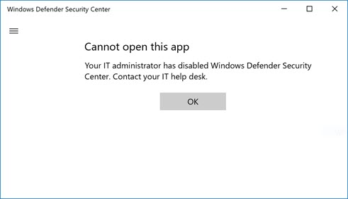

# Family options

**Applies to**

- Windows 10, version 1703 and later

The **Family options** section contains links to settings and further information for parents of a Windows 10 PC. It is not generally intended for enterprise or business environments.

Home users can learn more at the [Help protection your family online in Windows Security topic at support.microsoft.com](https://support.microsoft.com/help/4013209/windows-10-protect-your-family-online-in-windows-defender)

In Windows 10, version 1709, the section can be hidden from users of the machine. This can be useful if you don't want employees in your organization to see or have access to this section.

## Hide the Family options section

You can choose to hide the entire section by using Group Policy. The section will not appear on the home page of the Windows Security app, and its icon will not be shown on the navigiation bar on the side of the app.

This can only be done in Group Policy.

>[!IMPORTANT]
>### Requirements
>
>You must have Windows 10, version 1709 or later. The ADMX/ADML template files for earlier versions of Windows do not include these Group Policy settings. 

1.  On your Group Policy management machine, open the [Group Policy Management Console](https://technet.microsoft.com/library/cc731212.aspx), right-click the Group Policy Object you want to configure and click **Edit**.

3.  In the **Group Policy Management Editor** go to **Computer configuration** and click **Administrative templates**.

5.  Expand the tree to **Windows components > Windows Security > Family options**.

6.  Open the **Hide the Family options area** setting and set it to **Enabled**. Click **OK**.

7. [Deploy the updated GPO as you normally do](https://msdn.microsoft.com/library/ee663280(v=vs.85).aspx). 

>[!NOTE]
>If you hide all sections then the app will show a restricted interface, as in the following screenshot:
>  
>