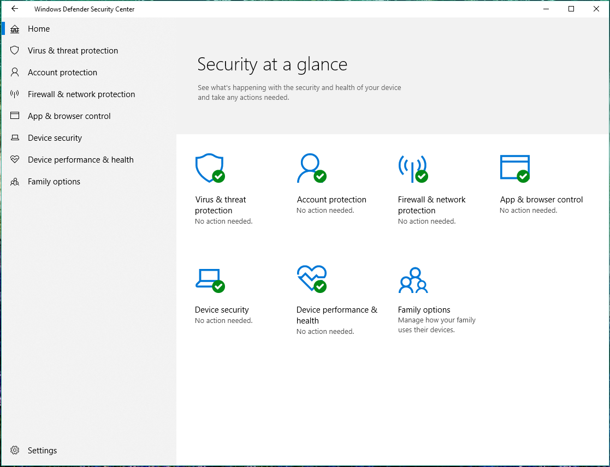

# The Windows Security app

**Applies to**

- Windows 10, version 1703 and later

This library describes the Windows Security app, and provides information on configuring certain features, including:

- [Showing and customizing contact information on the app and in notifications](wdsc-customize-contact-information.md)
- [Hiding notifications](wdsc-hide-notifications.md)

In Windows 10, version 1709 and later, the app also shows information from third-party antivirus and firewall apps.

In Windows 10, version 1803, the app has two new areas, **Account protection** and **Device security**.

>[!NOTE]
>The Windows Security app is a client interface on Windows 10, version 1703 and later. It is not the Microsoft Defender Security Center web portal console that is used to review and manage [Microsoft Defender Advanced Threat Protection](https://docs.microsoft.com/windows/threat-protection/windows-defender-atp/windows-defender-advanced-threat-protection).

You can't uninstall the Windows Security app, but you can do one of the following:

- Disable the interface on Windows Server 2016. See [Windows Defender Antivirus on Windows Server 2016](https://docs.microsoft.com/windows/security/threat-protection/windows-defender-antivirus/windows-defender-antivirus-on-windows-server-2016). 
- Hide all of the sections on client computers (see below).
- Disable Windows Defender Antivirus, if needed. See [Enable and configure Windows Defender AV always-on protection and monitoring](https://docs.microsoft.com/windows/security/threat-protection/windows-defender-antivirus/configure-real-time-protection-windows-defender-antivirus).

You can find more information about each section, including options for configuring the sections - such as hiding each of the sections - at the following topics:

- [Virus & threat protection](wdsc-virus-threat-protection.md), which has information and access to antivirus ransomware protection settings and notifications, including the Controlled folder access feature of Windows Defender Exploit Guard and sign-in to Microsoft OneDrive.
- [Account protection](wdsc-account-protection.md), which has information and access to sign-in and account protection settings. 
- [Firewall & network protection](wdsc-firewall-network-protection.md), which has information and access to firewall settings, including Windows Defender Firewall.
- [App & browser control](wdsc-app-browser-control.md), covering Windows Defender SmartScreen settings and Exploit protection mitigations.
- [Device security](wdsc-device-security.md), which provides access to built-in device security settings.
- [Device performance & health](wdsc-device-performance-health.md), which has information about drivers, storage space, and general Windows Update issues.  
- [Family options](wdsc-family-options.md), which includes access to parental controls along with tips and information for keeping kids safe online.

>[!NOTE]
>If you hide all sections then the app will show a restricted interface, as in the following screenshot:
>  
>

## Open the Windows Security app
- Click the icon in the notification area on the taskbar.

    
- Search the Start menu for **Windows Security**.

    
- Open an area from Windows **Settings**.

    

> [!NOTE]
> Settings configured with management tools, such as Group Policy, Microsoft Intune, or System Center Configuration Manager, will generally take precedence over the settings in the Windows Security. See the topics for each of the sections for links to configuring the associated features or products.

## How the Windows Security app works with Windows security features

>[!IMPORTANT]
>Windows Defender AV and the Windows Security app use similarly named services for specific purposes.  
>  
>The Windows Security app uses the Windows Security Service (*SecurityHealthService* or *Windows Security Health Servce*), which in turn utilizes the Security Center service ([*wscsvc*](https://technet.microsoft.com/library/bb457154.aspx#EDAA)) to ensure the app provides the most up-to-date information about the protection status on the endpoint, including protection offered by third-party antivirus products, Windows Defender Firewall, third-party firewalls, and other security protection.  
>  
>These services do not affect the state of Windows Defender AV. Disabling or modifying these services will not disable Windows Defender AV, and will lead to a lowered protection state on the endpoint, even if you are using a third-party antivirus product.  
>  
>Windows Defender AV will be [disabled automatically when a third-party antivirus product is installed and kept up to date](../windows-defender-antivirus/windows-defender-antivirus-compatibility.md).
>  
>Disabling the Windows Security Center service will not disable Windows Defender AV or [Windows Defender Firewall](https://docs.microsoft.com/windows/access-protection/windows-firewall/windows-firewall-with-advanced-security).  

> [!WARNING] 
> If you disable the Security Center service, or configure its associated Group Policy settings to prevent it from starting or running, the Windows Security app may display stale or inaccurate information about any antivirus or firewall products you have installed on the device.  
>  
>It may also prevent Windows Defender AV from enabling itself if you have an old or outdated third-party antivirus, or if you uninstall any third-party antivirus products you may have previously installed. 
>  
>This will significantly lower the protection of your device and could lead to malware infection. 

The Windows Security app operates as a separate app or process from each of the individual features, and will display notifications through the Action Center. 

It acts as a collector or single place to see the status and perform some configuration for each of the features.

Disabling any of the individual features (through Group Policy or other management tools, such as System Center Configuration Manager) will prevent that feature from reporting its status in the Windows Security app. The Windows Security app itself will still run and show status for the other security features.

> [!IMPORTANT] 
> Individually disabling any of the services will not disable the other services or the Windows Security app.

For example, [using a third-party antivirus will disable Windows Defender Antivirus](https://docs.microsoft.com/windows/threat-protection/windows-defender-antivirus/windows-defender-antivirus-compatibility). However, the Windows Security app will still run, show its icon in the taskbar, and display information about the other features, such as Windows Defender SmartScreen and Windows Defender Firewall.

