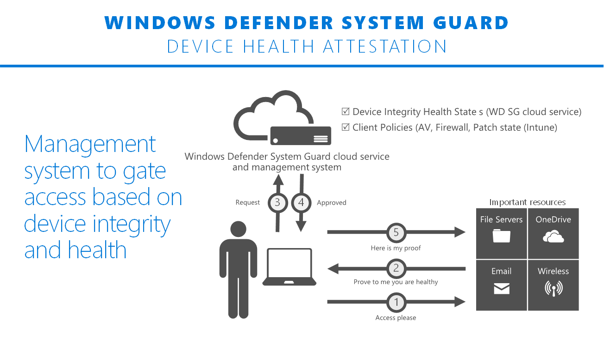

# Windows Defender System Guard: How hardware-based containers help protect Windows 10

Windows 10 uses containers to isolate sensitive system services and data, enabling them to remain secure even when the operating system has been compromised. 
Windows 10 protects critical resources, such as the Windows authentication stack, single sign-on tokens, Windows Hello biometric stack, and Virtual Trusted Platform Module, by using a container type called Windows Defender System Guard. 

Windows Defender System Guard reorganizes the existing Windows 10 system integrity features under one roof and sets up the next set of investments in Windows security. It's designed to make the these security guarantees:

- Protect and maintain the integrity of the system as it starts up
- Protect and maintain the integrity of the system after it's running
- Validate that system integrity has truly been maintained through local and remote attestation

## Maintaining the integrity of the system as it starts

With Windows 7, one of the means attackers would use to persist and evade detection was to install what is often referred to as a bootkit or rootkit on the system. This malicious software would start before Windows started, or during the boot process itself, enabling it to start with the highest level of privilege.

With Windows 10 running on modern hardware (that is, Windows 8-certified or greater) we have a hardware-based root of trust that helps us ensure that no unauthorized firmware or software (such as a bootkit) can start before the Windows bootloader. This hardware-based root of trust comes from the device’s Secure Boot feature, which is part of the Unified Extensible Firmware Interface (UEFI). 

After successful verification and startup of the device’s firmware and Windows bootloader, the next opportunity for attackers to tamper with the system’s integrity is while the rest of the Windows operating system and defenses are starting. As an attacker, embedding your malicious code using a rootkit within the boot process enables you to gain the maximum level of privilege and gives you the ability to more easily persist and evade detection. 

This is where Windows Defender System Guard protection begins with its ability to ensure that only properly signed and secure Windows files and drivers, including third party, can start on the device. At the end of the Windows boot process, System Guard will start the system’s antimalware solution, which scans all third party drivers, at which point the system boot process is completed. In the end, Windows Defender System Guard helps ensure that the system securely boots with integrity and that it hasn’t been compromised before the remainder of your system defenses start.

## Maintaining integrity of the system after it’s running (run time)

Prior to Windows 10, if an attacker exploited the system and gained SYSTEM level privilege or they compromised the kernel itself, it was game over. The level of control that an attacker would acquire in this condition would enable them to tamper with and bypass many, if not all, of your system defenses. While we have a number of development practices and technologies (such as Windows Defender Exploit Guard) that have made it difficult to gain this level of privilege in Windows 10, the reality is that we needed a way to maintain the integrity of the most sensitive Windows services and data, even when the highest level of privilege has been secured by an adversary.

With Windows 10, we introduced the concept of virtualization-based security (VBS), which enables us to contain the most sensitive Windows services and data in hardware-based isolation, which is the Windows Defender System Guard container. This secure environment provides us with the hardware-based security boundary we need to be able to secure and maintain the integrity of critical system services at run time like Credential Guard, Device Guard, Virtual TPM and parts of Windows Defender Exploit Guard, just to name a few.

 

## Validating platform integrity after Windows is running (run time)

While Windows Defender System Guard provides advanced protection that will help protect and maintain the integrity of the platform during boot and at run time, the reality is that we must apply an "assume breach" mentality to even our most sophisticated security technologies. We should be able to trust that the technologies are successfully doing their jobs, but we also need the ability to verify that they were successful in achieving their goals. When it comes to platform integrity, we can’t just trust the platform, which potentially could be compromised, to self-attest to its security state. So Windows Defender System Guard includes a series of technologies that enable remote analysis of the device’s integrity.

As Windows 10 boots, a series of integrity measurements are taken by Windows Defender System Guard using the device’s Trusted Platform Module 2.0 (TPM 2.0). This process and data are hardware-isolated away from Windows to help ensure that the measurement data is not subject to the type of tampering that could happen if the platform was compromised. From here, the measurements can be used to determine the integrity of the device’s firmware, hardware configuration state, and Windows boot-related components, just to name a few. After the system boots, Windows Defender System Guard signs and seals these measurements using the TPM. Upon request, a management system like Intune or System Center Configuration Manager can acquire them for remote analysis. If Windows Defender System Guard indicates that the device lacks integrity, the management system can take a series of actions, such as denying the device access to resources.

