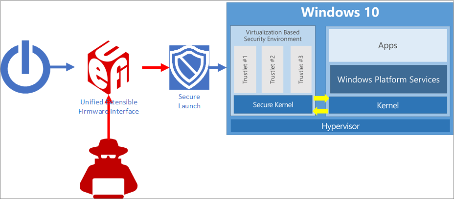
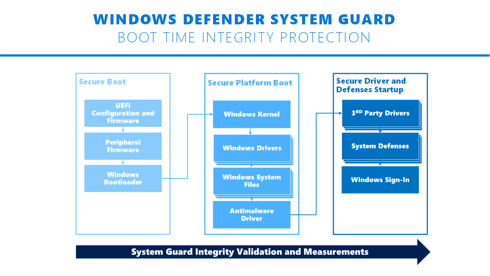

# Windows Defender System Guard: How a hardware-based root of trust helps protect Windows 10

In order to protect critical resources such as the Windows authentication stack, single sign-on tokens, the Windows Hello biometric stack, and the Virtual Trusted Platform Module, a system's firmware and hardware must be trustworthy.

Windows Defender System Guard reorganizes the existing Windows 10 system integrity features under one roof and sets up the next set of investments in Windows security. It's designed to make these security guarantees:

- Protect and maintain the integrity of the system as it starts up
- Validate that system integrity has truly been maintained through local and remote attestation

## Maintaining the integrity of the system as it starts

### Static Root of Trust for Measurement (SRTM)

With Windows 7, one of the means attackers would use to persist and evade detection was to install what is often referred to as a bootkit or rootkit on the system. 
This malicious software would start before Windows started, or during the boot process itself, enabling it to start with the highest level of privilege.

With Windows 10 running on modern hardware (that is, Windows 8-certified or greater) a hardware-based root of trust helps ensure that no unauthorized firmware or software (such as a bootkit) can start before the Windows bootloader. 
This hardware-based root of trust comes from the device’s Secure Boot feature, which is part of the Unified Extensible Firmware Interface (UEFI). 
This technique of measuring the static early boot UEFI components is called the Static Root of Trust for Measurement (SRTM). 

As there are thousands of PC vendors that produce numerous models with different UEFI BIOS versions, there becomes an incredibly large number of SRTM measurements upon bootup. 
Two techniques exist to establish trust here—either maintain a list of known 'bad' SRTM measurements (also known as a blacklist), or a list of known 'good' SRTM measurements (also known as a whitelist). 
Each option has a drawback:

- A list of known 'bad' SRTM measurements allows a hacker to change just 1 bit in a component to create an entirely new SRTM hash that needs to be listed. This means that the SRTM flow is inherently brittle - a minor change can invalidate the entire chain of trust.
- A list of known 'good' SRTM measurements requires each new BIOS/PC combination measurement to be carefully added, which is slow. 
In addition, a bug fix for UEFI code can take a long time to design, build, retest, validate, and redeploy.

### Secure Launch—the Dynamic Root of Trust for Measurement (DRTM)

Windows Defender System Guard Secure Launch, first introduced in Windows 10 version 1809, aims to alleviate these issues by leveraging a technology known as the Dynamic Root of Trust for Measurement (DRTM). 
DRTM lets the system freely boot into untrusted code initially, but shortly after launches the system into a trusted state by taking control of all CPUs and forcing them down a well-known and measured code path. 
This has the benefit of allowing untrusted early UEFI code to boot the system, but then being able to securely transition into a trusted and measured state.

Secure Launch simplifies management of SRTM measurements because the launch code is now unrelated to a specific hardware configuration. This means the number of valid code measurements is small, and future updates can be deployed more widely and quickly. 

### System Management Mode (SMM) protection

System Management Mode (SMM) is a special-purpose CPU mode in x86 microcontrollers that handles power management, hardware configuration, thermal monitoring, and anything else the manufacturer deems useful. 
Whenever one of these system operations is requested, a non-maskable interrupt (SMI) is invoked at runtime, which executes SMM code installed by the BIOS. 
SMM code executes in the highest privilege level and is invisible to the OS, which makes it an attractive target for malicious activity. Even if System Guard Secure Launch is used to late launch, SMM code can potentially access hypervisor memory and change the hypervisor. 
To defend against this, two techniques are used:

1. Paging protection to prevent inappropriate access to code and data
2. SMM hardware supervision and attestation

Paging protection can be implemented to lock certain code tables to be read-only to prevent tampering. 
This prevents access to any memory that has not been specifically assigned. 

A hardware-enforced processor feature known as a supervisor SMI handler can monitor the SMM and make sure it does not access any part of the address space that it is not supposed to. 

SMM protection is built on top of the Secure Launch technology and requires it to function. 
In the future, Windows 10 will also measure this SMI Handler’s behavior and attest that no OS-owned memory has been tampered with. 

## Validating platform integrity after Windows is running (run time)

While Windows Defender System Guard provides advanced protection that will help protect and maintain the integrity of the platform during boot and at run time, the reality is that we must apply an "assume breach" mentality to even our most sophisticated security technologies. We should be able to trust that the technologies are successfully doing their jobs, but we also need the ability to verify that they were successful in achieving their goals. When it comes to platform integrity, we can’t just trust the platform, which potentially could be compromised, to self-attest to its security state. So Windows Defender System Guard includes a series of technologies that enable remote analysis of the device’s integrity.

As Windows 10 boots, a series of integrity measurements are taken by Windows Defender System Guard using the device’s Trusted Platform Module 2.0 (TPM 2.0). System Guard Secure Launch will not support earlier TPM versions, such as TPM 1.2. This process and data are hardware-isolated away from Windows to help ensure that the measurement data is not subject to the type of tampering that could happen if the platform was compromised. From here, the measurements can be used to determine the integrity of the device’s firmware, hardware configuration state, and Windows boot-related components, just to name a few. 

After the system boots, Windows Defender System Guard signs and seals these measurements using the TPM. Upon request, a management system like Intune or System Center Configuration Manager can acquire them for remote analysis. If Windows Defender System Guard indicates that the device lacks integrity, the management system can take a series of actions, such as denying the device access to resources.

