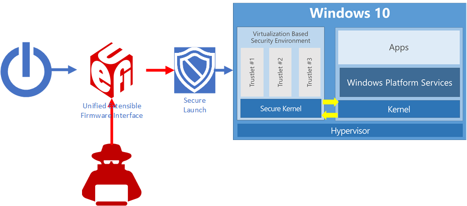

# System Guard Secure Launch and SMM protection

This topic explains how System Guard Secure Launch and System Memory Management (SMM protection) improve the startup security of Windows 10 devices.

## Static Root of Trust for Measurement (SRTM)

Starting with Windows 8-certified hardware, a hardware-based root of trust helps ensure that no unauthorized firmware or software (such as a bootkit) can start before the Windows bootloader. 
This hardware-based root of trust comes from the device’s Secure Boot feature, which is part of the Unified Extensible Firmware Interface (UEFI). 
This technique of measuring the static early boot UEFI components is called the Static Root of Trust for Measurement (SRTM). 

As there are thousands of PC vendors that produce numerous models with different UEFI BIOS versions, there becomes an incredibly large number of SRTM measurements upon bootup. 
Two techniques exist to establish trust here - either maintain a list of known 'bad' SRTM measurements (also known as a blacklist), or a list of known 'good' SRTM measurements (also known as a whitelist). 
Each option has a drawback:

- A list of known 'bad' SRTM measurements allows a hacker to change just 1 bit in a component to create an entirely new SRTM hash that needs to be listed.
- A list of known 'good' SRTM measurements requires each new BIOS/PC combination measurement to be carefully added, which is slow. 
In addition, a bug fix for UEFI code can take a long time to design, build, retest, validate, and redeploy.

## Secure Launch - The Dynamic Root of Trust for Measurement (DRTM)

Windows Defender System Guard Secure Launch, first introduced in Windows 10 version 1809, aims to alleviate this issue by leveraging a technology known as the Dynamic Root of Trust for Measurement (DRTM). 
DRTM lets the system freely boot into untrusted code initially, but shortly after launches the system into a trusted state by taking control of all CPUs and forcing them down a well-known and measured code path. 
This has the benefit of allowing untrusted early UEFI code to boot the system, but then securely transitioning into a trusted state.

