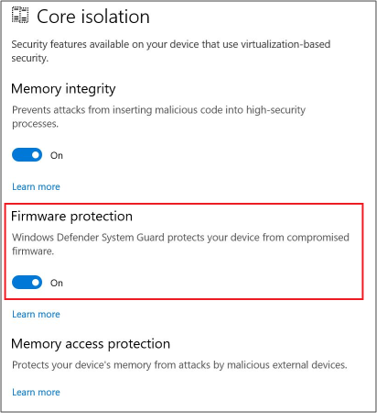
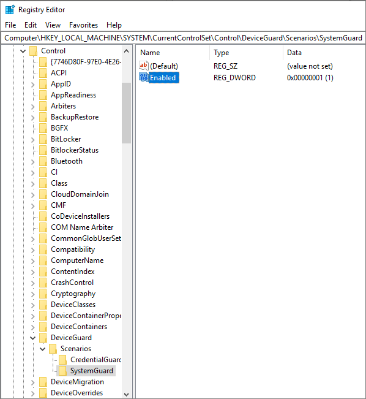
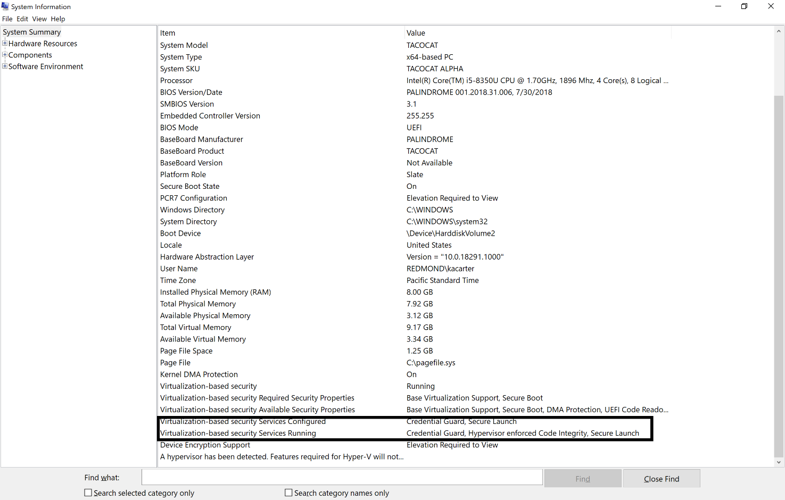

# System Guard Secure Launch and SMM protection

This topic explains how to configure System Guard Secure Launch and System Management Mode (SMM) protection to improve the startup security of Windows 10 devices. The information below is presented from a client perspective.

## How to enable System Guard Secure Launch

You can enable System Guard Secure Launch by using any of these options:

- [Mobile Device Management (MDM)](#mobile-device-management)
- [Group Policy](#group-policy)
- [Windows Security Center](#windows-security-center)
- [Registry](#registry)

### Mobile Device Management

System Guard Secure Launch can be configured for Mobile Device Management (MDM) by using DeviceGuard policies in the Policy CSP, specifically [DeviceGuard/ConfigureSystemGuardLaunch](https://docs.microsoft.com/windows/client-management/mdm/policy-csp-deviceguard#deviceguard-configuresystemguardlaunch).

### Group Policy

1. Click **Start** > type and then click **Edit group policy**. 
2. Click **Computer Configuration** > **Administrative Templates** > **System** > **Device Guard** > **Turn On Virtualization Based Security** > **Secure Launch Configuration**.

### Windows Security Center

Click **Start** > **Settings** > **Update & Security** > **Windows Security** > **Open Windows Security** > **Device security** > **Core isolation** > **Firmware protection**.

### Registry

1. Open Registry editor.
2. Click **HKEY_LOCAL_MACHINE** > **SYSTEM** > **CurrentControlSet** > **Control** > **DeviceGuard** > **Scenarios**.
3. Right-click **Scenarios** > **New** > **Key** and name the new key **SystemGuard**.
4. Right-click **SystemGuard** > **New** > **DWORD (32-bit) Value** and name the new DWORD **Enabled**. 
5. Double-click **Enabled**, change the value to **1**, and click **OK**.

## How to verify System Guard Secure Launch is configured and running

To verify that Secure Launch is running, use System Information (MSInfo32). Click **Start**, search for **System Information**, and look under **Virtualization-based Security Services Running** and **Virtualization-based Security Services Configured**.

>[!NOTE]
>To enable System Guard Secure launch, the platform must meet all the baseline requirements for [Device Guard](https://docs.microsoft.com/en-us/windows/security/threat-protection/device-guard/introduction-to-device-guard-virtualization-based-security-and-windows-defender-application-control), [Credential Guard](https://docs.microsoft.com/en-us/windows/security/identity-protection/credential-guard/credential-guard-requirements), and [Virtualization Based Security](https://docs.microsoft.com/en-us/windows/security/threat-protection/windows-defender-exploit-guard/enable-virtualization-based-protection-of-code-integrity).

## For Intel® vPro™ processors starting with Intel® Coffeelake, Whiskeylake, or later silicon requirements
Your environment needs the following hardware to run System Guard Secure Launch.

|Intel® Hardware requirement|Description|
|--------|-----------|
|64-bit CPU|A 64-bit computer with minimum 4 cores (logical processors) is required for hypervisor and virtualization-based security (VBS). For more info about Hyper-V, see [Hyper-V on Windows Server 2016](https://docs.microsoft.com/windows-server/virtualization/hyper-v/hyper-v-on-windows-server) or [Introduction to Hyper-V on Windows 10](https://docs.microsoft.com/virtualization/hyper-v-on-windows/about/). For more info about hypervisor, see [Hypervisor Specifications](https://docs.microsoft.com/virtualization/hyper-v-on-windows/reference/tlfs).|
|Trusted Platform Module (TPM) 2.0|Platforms must support a discrete TPM 2.0. Integrated/firmware TPMs are not supported.|
|Windows DMA Protection|Platforms must meet the Windows DMA Protection Specification (all external DMA ports must be off by default until the OS explicitly powers them)|
|SMM communication buffers| All SMM communication buffers must be implemented in EfiRuntimeServicesData ,EfiRuntimeServicesCode , EfiACPIMemoryNVS, or EfiReservedMemoryType memory types. |
|SMM Page Tables| Must NOT contain any mappings to EfiConventionalMemory (e.g. no OS/VMM owned memory),  NOT contain any mappings to code sections within EfiRuntimeServicesCode,  NOT have execute and write permissions for the same page  Platforms must allow ONLY that TSEG pages can be marked executable and the memory map must report TSEG EfiReservedMemoryType  BIOS SMI handler must be implemented such that SMM page tables are locked on every SMM entry  |
|Modern/Connected Standby|Platforms must support Modern/Connected Standby|
|TPM AUX Index|Platform must set up a AUX index with index, attributes, and policy that exactly corresponds to the AUX index specified in the TXT DG with a data size of exactly 104 bytes (for SHA256 AUX data). (NameAlg = SHA256) 

Platforms must set up a PS (Platform Supplier) index with:   

Exactly the “TXT PS2” style Attributes on creation as follows:   

AuthWrite   

PolicyDelete   

WriteLocked   

WriteDefine   

AuthRead    

NoDa    

Written   

PlatformCreate   

A policy of exactly PolicyCommandCode(CC = TPM2_CC_UndefineSpaceSpecial) (SHA256 NameAlg and Policy)   

Size of exactly 70 bytes   

NameAlg = SHA256   

In addition, it must have been initialized and locked (TPMA_NV_WRITTEN = 1, TPMA_NV_WRITELOCKED = 1) at time of OS launch. 

PS index data DataRevocationCounters, SINITMinVersion, and PolicyControl must all be 0x00 |
|AUX Policy|The required AUX policy must be as follows:   A = TPM2_PolicyLocality (Locality 3 & Locality 4)  

B = TPM2_PolicyCommandCode (TPM_CC_NV_UndefineSpecial)  

authPolicy = {A} OR {{A} AND {B}}  

authPolicy digest = 0xef, 0x9a, 0x26, 0xfc, 0x22, 0xd1, 0xae, 0x8c, 0xec, 0xff, 0x59, 0xe9, 0x48, 0x1a, 0xc1, 0xec, 0x53, 0x3d, 0xbe, 0x22, 0x8b, 0xec, 0x6d, 0x17, 0x93, 0x0f, 0x4c, 0xb2, 0xcc, 0x5b, 0x97, 0x24 |
|Platform firmware|Platform firmware must carry all code required to execute an Intel® Trusted Execution Technology secure launch:  

Intel SINIT ACM must be carried in the OEM BIOS  

Platforms must ship with a production ACM signed by the correct production Intel ACM signer for the platform |
|System firmware update|System firmware is recommended to be updated via UpdateCapsule in Windows Update |
## Software requirements
Your environment needs the following software to run Windows Defender Application Guard.

|Software|Description|
|--------|-----------|
|Operating system|Windows 10 Enterprise edition, version 1709 or higher Windows 10 Professional edition, version 1803|