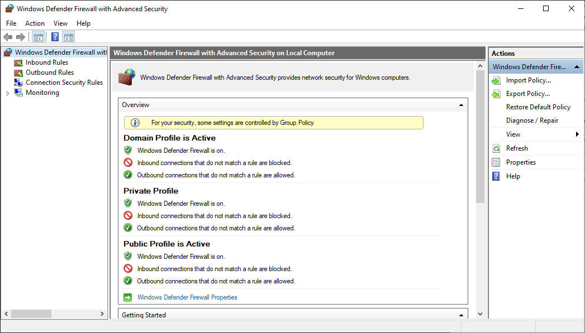
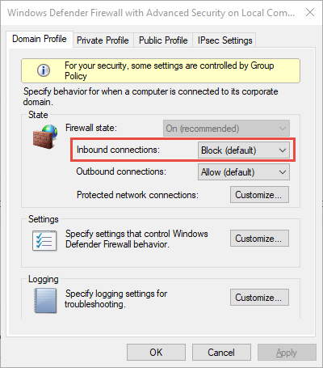
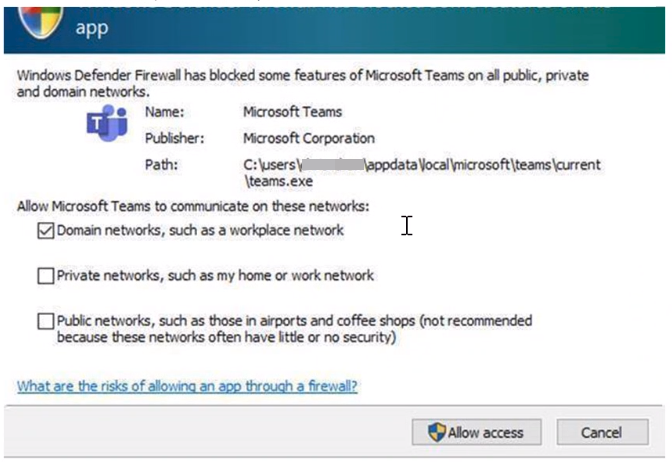
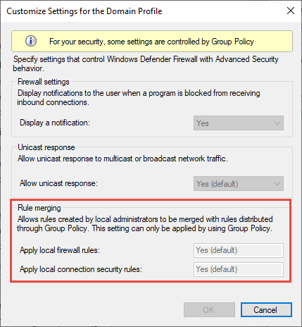
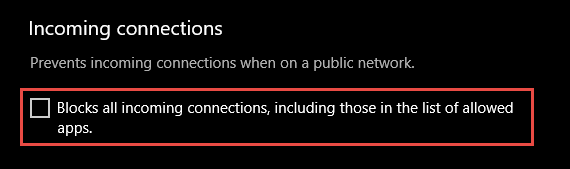
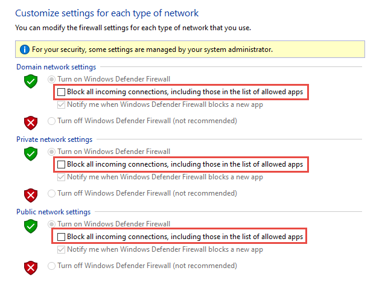

# Best practices for configuring Windows Defender Firewall

**Applies to**

-   Windows operating systems including Windows 10

-   Windows Server Operating Systems

Windows Defender Firewall with Advanced Security provides host-based, two-way
network traffic filtering and blocks unauthorized network traffic flowing into
or out of the local device. Configuring your Windows Firewall based on the
following best practices can help you optimize protection for devices in your
network. These recommendations cover a wide range of deployments including home
networks and enterprise desktop/server systems.

To open Windows Firewall, go to the **Start** menu, select **Run**,
type **WF.msc**, and then select **OK**. See also [Open Windows Firewall](https://docs.microsoft.com/windows/security/threat-protection/windows-firewall/open-windows-firewall-with-advanced-security).

## Keep default settings

When you open the Windows Defender Firewall for the first time, you can see the default settings applicable to the local computer. The Overview panel displays security settings for each type of network to which the device can connect.

*Figure 1: Windows Defender Firewall*

1.  **Domain profile**: Used for networks where there is a system of account authentication against a domain controller (DC), such as an Azure Active Directory DC

2.  **Private profile**: Designed for and best used
    in private networks such as a home network

3.  **Public profile**: Designed with higher security in mind
    for public networks like Wi-Fi hotspots, coffee shops, airports, hotels, or stores

View detailed settings for each profile by right-clicking the top-level **Windows Defender Firewall with Advanced Security** node in the left pane and then selecting **Properties**.

Maintain the default settings in Windows Defender
Firewall whenever possible. These settings have been designed to secure your device for use in most network scenarios. One key example is the default Block behavior for Inbound connections. 

*Figure 2: Default Inbound/Outbound connection behavior*

> [!IMPORTANT]
> To maintain maximum security, do not change the default Block setting for inbound connections.

For more on configuring basic firewall settings, see [Turn on Windows Firewall and Configure Default Behavior](https://docs.microsoft.com/windows/security/threat-protection/windows-firewall/turn-on-windows-firewall-and-configure-default-behavior) and [Checklist: Configuring Basic Firewall Settings](https://docs.microsoft.com/windows/security/threat-protection/windows-firewall/checklist-configuring-basic-firewall-settings).

## Understand rule precedence

In many cases, a next step for administrators will be to customize these profiles using rules (sometimes called filters) so that they can work with user apps or other types of software. For example, an administrator or user may choose to add a rule to accommodate a program, open a port or protocol, or allow a predefined type of traffic.

This can be accomplished by right-clicking (or selecting and holding) either **Inbound Rules** or **Outbound Rules**, and selecting **New Rule**. The interface for adding a new rule looks like this:

*Figure 3: Rule Creation Wizard*

> [!NOTE]
>This article does not cover step-by-step rule
configuration. See the [Windows Firewall with Advanced Security Deployment
Guide](https://docs.microsoft.com/windows/security/threat-protection/windows-firewall/windows-firewall-with-advanced-security-deployment-guide)
for general guidance on policy creation.

In many cases, allowing specific types of inbound traffic will be required for
applications to function in the network. Administrators should keep the following rule precedence behaviors in mind when
allowing these inbound exceptions.

1.  Explicitly defined allow rules will take precedence over the default block setting.

2.  Block rules will take precedence over any conflicting    allow rules.

3.  More specific rules will take precedence over less specific rules, except in the case of explicit block rules as mentioned in 2. (For example, if the parameters of rule 1 includes an IP address range, while the parameters of rule 2 include a single IP host address, rule 2 will take precedence.)

Because of 1 and 2, it is important that, when designing a set of policies, you make sure that there are no other active block rules in place that could inadvertently overlap, thus preventing the traffic flow you wish to allow.

A general security best practice in creating inbound rules is to be as specific as possible. However, when new rules must be made that use ports or IP addresses, consider using consecutive ranges or subnets instead of individual addresses or ports where possible. This avoids creation of multiple filters under the hood, thus reducing complexity and helping to avoid
performance degradation.

> [!NOTE] 
Windows Defender Firewall does not support traditional weighted, administrator-assigned rule ordering. An effective policy set with expected behaviors can be created by keeping in mind the few, consistent, and logical rule behaviors described above.

## Create rules for new applications before first launch

### Inbound allow rules

When first installed, networked applications and services issue a 'listen call' specifying the protocol/port information required for them to function properly. As there is a default block action in place on the Windows Defender Firewall, it
is necessary to create inbound exception rules to allow this traffic. In such a scenario it is common for the app or the app installer itself to add this firewall rule. Failing that, the responsibility falls to the user (or firewall admin on behalf of the user) to manually create a rule.

Assuming there are no active application or administrator-defined allow rule(s) already present, creation will have to be dealt with the first time the application is launched or otherwise tries to communicate on the network. In such a case a dialog box will prompt the user to either allow or block the packets.

- If the user has admin permissions, they will be prompted. If they respond ‘no’ or otherwise cancel the prompt, block rules will be created (typically two; one for TCP traffic and one for UDP traffic).

- If the user is not a local admin they will not be prompted and, in most cases, block rules will be created.

In either of the scenarios above, once these rules are added they must be deleted in order to generate the prompt again. If not, the traffic will continue to be blocked.

> [!NOTE]
> The firewall's default settings are designed for security. Allowing all inbound connections by default introduces the network to various threats. Therefore, creating exceptions for inbound connections from third-party software should be determined by trusted app developers, the user, or the admin on behalf of the user. 

### Known issues with user query behaviors

When designing a set of firewall policies for your network, it is a best
practice to configure allow rules for any networked applications deployed on the
host. Having these rules in place before the user first launches the application
will help ensure a seamless experience.

The absence of these staged rules does not necessarily mean that in the end an
application will be unable to communicate on the network. However, the behaviors
involved in the automatic creation of application rules at runtime can sometimes
be problematic due to the need for user interaction. The source of confusion
around this process can typically be boiled down to a few primary causes:

1.  A user with sufficient privileges receives a query notification advising
    them that the application needs to make a change to the firewall policy. Not
    fully understanding the meaning of the prompt, the user then cancels or
    otherwise dismisses the prompt.

2.  A user lacking sufficient privileges and is therefore not prompted to allow
    the application to make the appropriate policy changes.

3.  Local Policy Merge is disabled, preventing the application or network
    service from plumbing local rules.

*Figure 4: User query notification*

See also [Checklist: Creating Inbound Firewwall Rules](https://docs.microsoft.com/windows/security/threat-protection/windows-firewall/checklist-creating-inbound-firewall-rules).

## Establish local policy merge and application rules

Firewall rules can be deployed:
1. Locally using the Firewall snap-in (**WF.msc**) 
2. Locally using PowerShell 
3. Remotely using Group Policy if the device is a member of:
    1. an Active Directory Name
    2. SCCM
    3. Intune (using workplace join)

Rule merging settings control how rules from different policy sources can be combined. Administrators can configure different merge behaviors for Domain, Private, and Public profiles.

The rule merging settings either allow or prevent local admins from creating their own firewall rules in addition to those obtained from Group Policy.

*Figure 5: Rule merging setting*

The equivalent setting *AllowLocalPolicyMerge* is used when configuring using the firewall [configuration service provider](https://docs.microsoft.com/windows/client-management/mdm/firewall-csp) and is exposed under each respective profile
node, *DomainProfile*, *PrivateProfile*, and *PublicProfile*.

If merging of local policies is disabled, centralized deployment of rules is required for any app that needs inbound connectivity.

Admins may disable *LocalPolicyMerge* in high security environments to maintain tighter control over endpoints. This can impact some apps and services that automatically generate a local firewall policy upon installation as discussed above. For these types of apps and services to work, admins should push rules centrally via group policy (GP), Mobile Device
Management (MDM), or both (for hybrid or co-management environments).

As a best practice, it is important to list and log such apps, including the network ports used for communications. Typically, you can find what ports must be open for a given service on the app's website. For more complex or customer application deployments however, a more thorough analysis may be needed using network packet capture tools. 

In any event, to maintain maximum security administrators should only push firewall exceptions for apps and services determined to serve legitimate purposes.

> [!NOTE]
The use of wildcard patterns, such as *C:\*\\teams.exe* is not
supported in application rules. We currently only support rules created using the full path to the application(s).

## Know how to use "shields up" mode for active attacks

An important firewall feature you can use to mitigate damage during an active attack is the "shields up" mode. It is an informal term referring to an easy method a firewall administrator can use to achieve a temporarily heightened state of security in the face of an active attack.

Shields up can be achieved by checking **Block all
incoming connections, including those in the list of allowed apps** setting found in either the Windows Settings app or the legacy file *firewall.cpl*.

*Figure 6: Windows settings App/Windows Security/Firewall Protection/Network Type*

*Figure 7: Legacy firewall.cpl*

By default, the Windows Defender Firewall will block everything unless there is an exception rule created. This setting overrides the exceptions. 

Consider an example involving Remote Desktop. If Remote Desktop is enabled, but no firewall rules were created beforehand, users cannot remotely access the device. This is why the Remote Desktop feature automatically creates filters when the feature is enabled. Meanwhile, if there is an exploit using multiple ports and services on a host, you can, instead of disabling individual rules, use the shields up mode to block all inbound connections, overriding previous exceptions. The Remote Desktop rules are intact but remote access will not work as long as shields up is activated. 

Once the emergency is over, uncheck the setting to restore regular network traffic.

## Create outbound rules

What follows are a few general guidelines for configuring outbound rules.

- The default configuration of Blocked for Outbound rules can be
    considered for certain highly secure environments. However, the Inbound rule configuration should never be changed in a way that Allows traffic by default.

- It is recommended to Allow Outbound by default for most deployments for the sake of simplification around app deployments, unless the enterprise prefers tight security controls over ease-of-use.

- In high security environments, an inventory of all enterprise-spanning apps must be taken and logged by the administrator or administrators. Records must include whether an app used requires network connectivity. Administrators will need to create new rules specific to each app that needs network connectivity and push those rules centrally, via group policy (GP), Mobile Device Management (MDM), or both (for hybrid or co-management environments).

For tasks related to creating outbound rules, see [Checklist: Creating Outbound Firewall Rules](https://docs.microsoft.com/windows/security/threat-protection/windows-firewall/checklist-creating-outbound-firewall-rules).

## Document your changes

When creating an inbound or outbound rule, you should specify details about the app itself, the port range used, and important notes like creation date. The goal of creating any new rule is for it to be tightly secured and explicitly
documented so that its existence is easily grasped by new administrators, or existing administrators who may not revisit the rule for a quarter year or more. We highly encourage taking the time  to make the work of reviewing your firewall rules at a later date easier. And *never* create unnecessary holes in your firewall.
