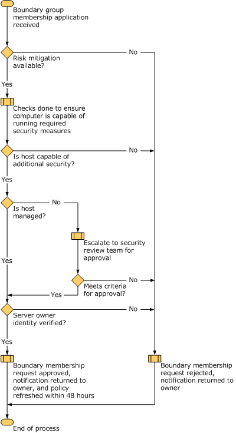

# Boundary Zone

**Applies to**
-   Windows 10
-   Windows Server 2016

In most organizations, some devices must be able to receive network traffic from devices that are not part of the isolated domain, and therefore cannot authenticate. To accept communications from untrusted devices, create a boundary zone within your isolated domain.

Devices in the boundary zone are trusted devices that can accept communication requests both from other isolated domain member devices and from untrusted devices. Boundary zone devices try to authenticate any incoming request by using IPsec, initiating an IKE negotiation with the originating device.

The GPOs you build for the boundary zone include IPsec or connection security rules that request authentication for both inbound and outbound network connections, but do not require it.

Because these boundary zone devices can receive unsolicited inbound communications from untrusted devices that use plaintext, they must be carefully managed and secured in other ways. Mitigating this additional risk is an important part of deciding whether to add a device to the boundary zone. For example, completing a formal business justification process before adding each device to the boundary zone can help ensure that the additional risk is minimized. The following illustration shows a sample process that can help make such a decision.

The goal of this process is to determine whether the risk of adding a device to a boundary zone can be mitigated to a level that makes it acceptable to the organization. Ultimately, if the risk cannot be mitigated, membership must be denied.

You must create a group in Active Directory to contain the members of the boundary zones. The settings and rules for the boundary zone are typically very similar to those for the isolated domain, and you can save time and effort by copying those GPOs to serve as a starting point. The primary difference is that the authentication connection security rule must be set to request authentication for both inbound and outbound traffic, instead of requiring inbound authentication and requesting outbound authentication as used by the isolated domain.

Creation of the group and how to link it to the GPOs that apply the rules to members of the group are discussed in the [Planning Group Policy Deployment for Your Isolation Zones](planning-group-policy-deployment-for-your-isolation-zones.md) section.

## GPO settings for boundary zone servers running at least Windows Server 2008

The boundary zone GPO for devices running at least Windows Server 2008 should include the following:

-   IPsec default settings that specify the following options:

    1.  Exempt all ICMP traffic from IPsec.

    2.  Key exchange (main mode) security methods and algorithm. We recommend that you use at least DH4, AES and SHA2 in your settings. Use the strongest algorithm combinations that are common to all your supported operating systems.

    3.  Data protection (quick mode) algorithm combinations. We recommend that you do not include DES or MD5 in any setting. They are included only for compatibility with previous versions of Windows. Use the strongest algorithm combinations that are common to all your supported operating systems..

        If any NAT devices are present on your networks, use ESP encapsulation. If isolated domain members must communicate with hosts in the encryption zone, ensure that you include algorithms that are compatible with the requirements of the encryption mode policies.

    4.  Authentication methods. Include at least device-based Kerberos V5 authentication. If you want to use user-based access to isolated servers then you must also include user-based Kerberos V5 authentication as an optional authentication method. Likewise, if any of your domain isolation members cannot use Kerberos V5, you must include certificate-based authentication as an optional authentication method.

-   The following connection security rules:

    -   A connection security rule that exempts all devices on the exemption list from authentication. Be sure to include all your Active Directory domain controllers on this list. Enter subnet addresses, if applicable in your environment.

    -   A connection security rule, from **Any IP address** to **Any IP address**, that requests inbound and outbound authentication.

-   A registry policy that includes the following values:

    -   Enable PMTU discovery. Enabling this setting allows TCP/IP to dynamically determine the largest packet size supported across a connection. The value is found at HKLM\\System\\CurrentControlSet\\Services\\TCPIP\\Parameters\\EnablePMTUDiscovery (dword). The sample GPO preferences XML file in [Appendix A: Sample GPO Template Files for Settings Used in this Guide](appendix-a-sample-gpo-template-files-for-settings-used-in-this-guide.md) sets the value to **1**.

    >**Note:**  For a sample template for these registry settings, see [Appendix A: Sample GPO Template Files for Settings Used in this Guide](appendix-a-sample-gpo-template-files-for-settings-used-in-this-guide.md)

**Next:**[Encryption Zone](encryption-zone.md)
