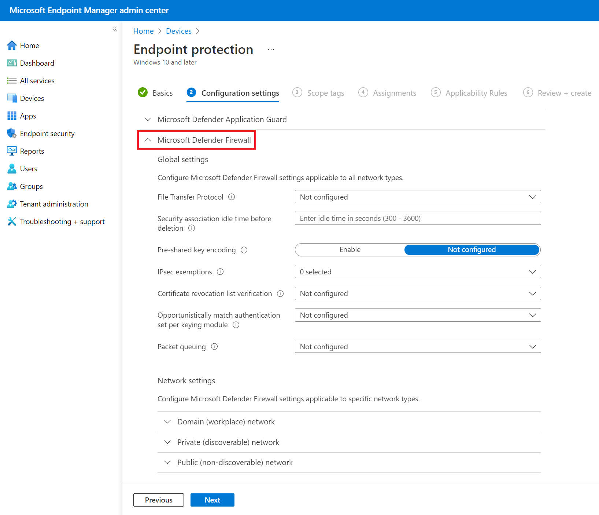

# Create Windows Firewall rules in Intune

**Applies to**
-   Windows 10

>[!IMPORTANT]
>This information relates to prereleased product which may be substantially modified before it's commercially released. Microsoft makes no warranties, express or implied, with respect to the information provided here.

To get started, open Device Configuration in Intune, then create a new profile. 
Choose Windows 10 as the platform, and Endpoint Protection as the profile type. 
Select Windows Defender Firewall.

>[!IMPORTANT]
>A single Endpoint Protection profile may contain up to a maximum of 150 firewall rules. If a client device requires more than 150 rules, then multiple profiles must be assigned to it.

## Firewall rule components

Following table has description for each field.

| Property | Type | Description |
|----------|------|-------------|
| DisplayName | String | The display name of the rule. Does not need to be unique. |
| Description | String | The description of the rule. |
| PackageFamilyName | String | The package family name of a Microsoft Store application that's affected by the firewall rule. |
| FilePath | String | The full file path of an app that's affected by the firewall rule. |
| FullyQualifiedBinaryName | String | The fully qualified binary name. |
| ServiceName | String | The name used in cases when a service, not an application, is sending or receiving traffic. |
| Protocol | Nullable Integer - default value is null which maps to All | 0-255 number representing the [IP protocol](https://www.wikipedia.org/wiki/List_of_IP_protocol_numbers) (TCP = 6, UDP = 17).  If not specified, the default is All. |
| LocalPortRanges | String array | List of local port ranges. For example, "100-120", "200", "300-320". If not specified, the default is All. |
| RemotePortRanges | String array | List of remote port ranges. For example, "100-120", "200", "300-320". If not specified, the default is All. |
| LocalAddressRanges | String array | List of local addresses covered by the rule. Valid tokens include: - "\*" indicates any local address. If present, this must be the only token included. - A subnet can be specified using either the subnet mask or network prefix notation. If neither a subnet mask not a network prefix is specified, the subnet mask defaults to 255.255.255.255. - A valid IPv6 address. - An IPv4 address range in the format of "start address - end address" with no spaces included. - An IPv6 address range in the format of "start address - end address" with no spaces included. Default is any address. |
| RemoteAddressRanges | String array | List of tokens specifying the remote addresses covered by the rule.Tokens are case insensitive. Valid tokens include: - "\*" indicates any remote address. If present, this must be the only token included. - "Defaultgateway" - "DHCP" - "DNS" - "WINS" - "Intranet" - "RmtIntranet" - "Internet" - "Ply2Renders" - "LocalSubnet" indicates any local address on the local subnet. This token is not case-sensitive. - A subnet can be specified using either the subnet mask or network prefix notation. If neither a subnet mask not a network prefix is specified, the subnet mask defaults to 255.255.255.255. - A valid IPv6 address. - An IPv4 address range in the format of "start address - end address" with no spaces included. - An IPv6 address range in the format of "start address - end address" with no spaces included. Default is any address. |
| ProfileTypes | WindowsFirewallNetworkProfileTypes | Specifies the profiles to which the rule belongs. If not specified, the default is All. |
| Action| StateManagementSetting | The action the rule enforces. If not specified, the default is Allowed. |
| TrafficDirection | WindowsFirewallRuleTrafficDirectionType | The traffic direction that the rule is enabled for. If not specified, the default is Out. |
| InterfaceTypes | WindowsFirewallRuleInterfaceTypes | The interface types of the rule. |
| EdgeTraversal | StateManagementSetting | Indicates whether edge traversal is enabled or disabled for this rule. The EdgeTraversal setting indicates that specific inbound traffic is allowed to tunnel through NATs and other edge devices using the Teredo tunneling technology. In order for this setting to work correctly, the application or service with the inbound firewall rule needs to support IPv6. The primary application of this setting allows listeners on the host to be globally addressable through a Teredo IPv6 address. New rules have the EdgeTraversal property disabled by default. |
| LocalUserAuthorizations | String | Specifies the list of authorized local users for the app container. This is a string in Security Descriptor Definition Language (SDDL) format. |

## Application
Control connections for an app or program. 
Apps and programs can be specified either file path, package family name, or Windows service short name. 

The file path of an app is its location on the client device. 
For example, C:\Windows\System\Notepad.exe. 
[Learn more](https://aka.ms/intunefirewallfilepathrule) 

Package family names can be retrieved by running the Get-AppxPackage command from PowerShell. 
[Learn more](https://aka.ms/intunefirewallPackageNameFromPowerShell) 

Windows service short names are used in cases when a service, not an application, is sending or receiving traffic. 
Default ia All. 

[Learn more](https://aka.ms/intunefirewallServiceNameRule)

## Protocol
Select the protocol for this port rule. Transport layer protocols—TCP and UDP—allow you to specify ports or port ranges. For custom protocols, enter a number between 0 and 255 representing the IP protocol. 

Default is Any. 

[Learn more](https://aka.ms/intunefirewallprotocolrule)

## Local ports
Comma separated list of ranges. For example, *100-120,200,300-320*. Default is All. 

[Learn more](https://aka.ms/intunefirewalllocalportrule)

## Remote ports
Comma separated list of ranges. For example, *100-120,200,300-320*. Default is All. 

[Learn more](https://aka.ms/intunefirewallremoteportrule)

## Local addresses
Comma separated list of local addresses covered by the rule. Valid tokens include:
- \* indicates any local address. If present, this must be the only token included. 
- A subnet can be specified using either the subnet mask or network prefix notation. If neither a subnet mask nor a network prefix is specified, the subnet mask default is  255.255.255.255. 
- A valid IPv6 address. 
- An IPv4 address range in the format of "start address - end address" with no spaces included. 
- An IPv6 address range in the format of "start address - end address" with no spaces included. Default is Any address. 

[Learn more](https://aka.ms/intunefirewalllocaladdressrule)

## Remote addresses
List of comma separated tokens specifying the remote addresses covered by the rule. Tokens are case insensitive. Valid tokens include:
- \* indicates any remote address. If present, this must be the only token included. 
- Defaultgateway 
- DHCP 
- DNS 
- WINS 
- Intranet (supported on Windows versions 1809+) 
- RmtIntranet (supported on Windows versions 1809+) 
- Internet (supported on Windows versions 1809+) 
- Ply2Renders (supported on Windows versions 1809+) 
- LocalSubnet indicates any local address on the local subnet. 
- A subnet can be specified using either the subnet mask or network prefix notation. If neither a subnet mask not a network prefix is specified, the subnet mask defaults to 255.255.255.255. 
- A valid IPv6 address. 
- An IPv4 address range in the format of "start address - end address" with no spaces included. 
- An IPv6 address range in the format of "start address - end address" with no spaces included. 

Default is Any address. 

[Learn more](https://aka.ms/intunefirewallremotaddressrule)

## Edge traversal (coming soon)
Indicates whether edge traversal is enabled or disabled for this rule. The EdgeTraversal setting indicates that specific inbound traffic is allowed to tunnel through NATs and other edge devices using the Teredo tunneling technology. In order for this setting to work correctly, the application or service with the inbound firewall rule needs to support IPv6. The primary application of this setting allows listeners on the host to be globally addressable through a Teredo IPv6 address. New rules have the EdgeTraversal property disabled by default. 

[Learn more](https://aka.ms/intunefirewalledgetraversal)

## Authorized users
Specifies the list of authorized local users for this rule. A list of authorized users cannot be specified if the rule being authored is targeting a Windows service. Default is all users. 

[Learn more](https://aka.ms/intunefirewallauthorizedusers)

## Configuring firewall rules programmatically

Coming soon.

