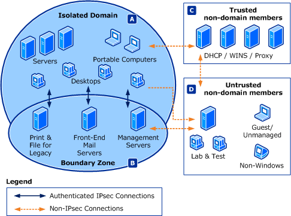

# Domain Isolation Policy Design

**Applies to**
-   Windows 10
-   Windows Server 2016

In the domain isolation policy design, you configure the devices on your network to accept only connections coming from devices that are authenticated as members of the same isolated domain.

This design typically begins with a network configured as described in the [Basic Firewall Policy Design](basic-firewall-policy-design.md) section. For this design, you then add connection security and IPsec rules to configure devices in the isolated domain to accept only network traffic from other devices that can authenticate as a member of the isolated domain. After implementing the new rules, your devices reject unsolicited network traffic from devices that are not members of the isolated domain.

The isolated domain might not be a single Active Directory domain. It can consist of all the domains in a forest, or domains in separate forests that have two-way trust relationships configured between them.

By using connection security rules based on IPsec, you provide a logical barrier between devices even if they are connected to the same physical network segment.

The design is shown in the following illustration, with the arrows that show the permitted communication paths.

Characteristics of this design, as shown in the diagram, include the following:

-   Isolated domain (area A) - Devices in the isolated domain receive unsolicited inbound traffic only from other members of the isolated domain or from devices referenced in authentication exemption rules. Devices in the isolated domain can send traffic to any device. This includes unauthenticated traffic to devices that are not in the isolated domain. Devices that cannot join an Active Directory domain, but that can use certificates for authentication, can be part of the isolated domain. For more info, see the [Certificate-based Isolation Policy Design](certificate-based-isolation-policy-design.md).

-   Boundary zone (area B) - Devices in the boundary zone are part of the isolated domain but are allowed to accept inbound connections from untrusted devices, such as clients on the Internet.

    Devices in the boundary zone request but do not require authentication to communicate. When a member of the isolated domain communicates with a boundary zone member the traffic is authenticated. When a device that is not part of the isolated domain communicates with a boundary zone member the traffic is not authenticated.

    Because boundary zone devices are exposed to network traffic from untrusted and potentially hostile devices, they must be carefully managed and secured. Put only the devices that must be accessed by external devices in this zone. Use firewall rules to ensure that network traffic is accepted only for services that you want exposed to non-domain member devices.

-   Trusted non-domain members (area C) - Devices on the network that are not domain members or that cannot use IPsec authentication are allowed to communicate by configuring authentication exemption rules. These rules enable devices in the isolated domain to accept inbound connections from these trusted non-domain member devices.

-   Untrusted non-domain members (area D) - Devices that are not managed by your organization and have an unknown security configuration must have access only to those devices required for your organization to correctly conduct its business. Domain isolation exists to put a logical barrier between these untrusted Devices and your organization's devices.

After implementing this design, your administrative team will have centralized management of the firewall and connection security rules applied to the devices in your organization.

>**Important:**  This design builds on the [Basic Firewall Policy Design](basic-firewall-policy-design.md), and in turn serves as the foundation for the [Server Isolation Policy Design](server-isolation-policy-design.md). If you plan to deploy all three, we recommend that you do the design work for all three together, and then deploy in the sequence presented.

This design can be applied to Devices that are part of an Active Directory forest. Active Directory is required to provide the centralized management and deployment of Group Policy objects that contain the connection security rules.

In order to expand the isolated domain to include Devices that cannot be part of an Active Directory domain, see the [Certificate-based Isolation Policy Design](certificate-based-isolation-policy-design.md).

For more info about this design:

-   This design coincides with the deployment goals to [Protect Devices from Unwanted Network Traffic](protect-devices-from-unwanted-network-traffic.md), [Restrict Access to Only Trusted Devices](restrict-access-to-only-trusted-devices.md), and optionally [Require Encryption When Accessing Sensitive Network Resources](require-encryption-when-accessing-sensitive-network-resources.md).

-   To learn more about this design, see the [Domain Isolation Policy Design Example](domain-isolation-policy-design-example.md).

-   Before completing the design, gather the info described in [Designing a Windows Defender Firewall with Advanced Security Strategy](designing-a-windows-firewall-with-advanced-security-strategy.md).

-   To help you make the decisions required in this design, see [Planning Domain Isolation Zones](planning-domain-isolation-zones.md) and [Planning Group Policy Deployment for Your Isolation Zones](planning-group-policy-deployment-for-your-isolation-zones.md).

-   For a list of tasks that you can use to deploy your domain isolation policy design, see [Checklist: Implementing a Domain Isolation Policy Design](checklist-implementing-a-domain-isolation-policy-design.md).

**Next:** [Server Isolation Policy Design](server-isolation-policy-design.md)
