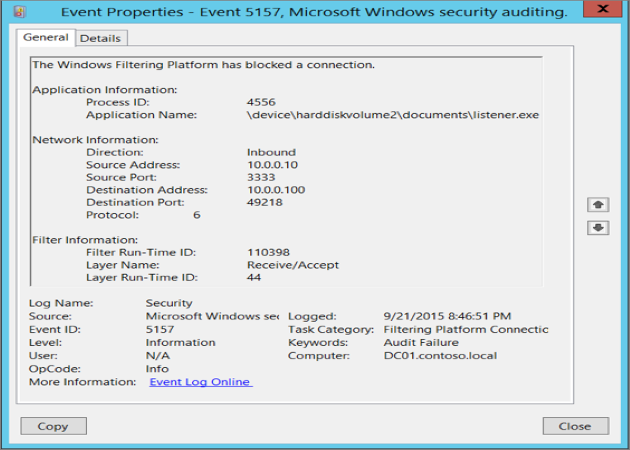
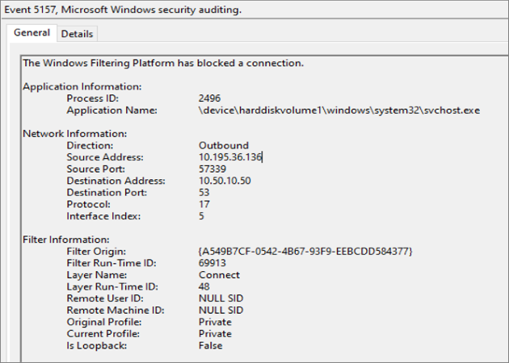
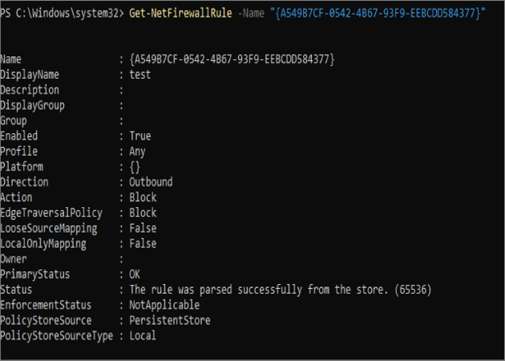
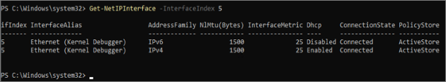
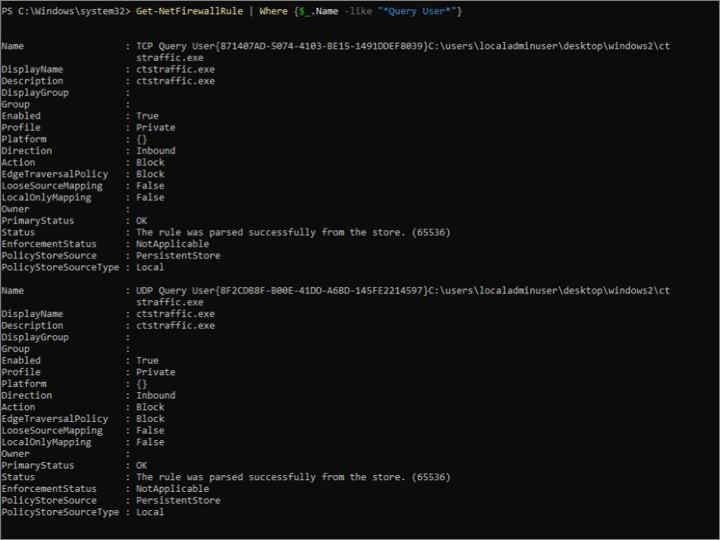

# Filter origin audit log improvements

Debugging packet drops is a continuous issue to Windows customers. In the past, customers had limited information about packet drops.

Typically, when investigating packet drop events, a customer would use the field `Filter Run-Time ID` from Windows Filtering Platform (WFP) audits 5157 or 5152. 



The filter ID uniquely identifies the filter that caused the packet drop. The filter ID can be searched in the WFP state dump output to trace back to the Firewall rule where the filter originated from. 

However, the filter ID is not a reliable source for tracing back to the filter or the rule, as the filter ID can change for many reasons despite the rule not changing at all. This makes the diagnosis process error-prone and difficult.

For customers to debug packet drop events correctly and efficiently, they would need more context about the blocking filter such as its origin.

The blocking filters can be categorized under these filter origins:

1. Firewall rules

2. Firewall default block filters

    a.	AppContainer loopback
    
    b.	Boottime default
    
    c.	Quarantine default
    
    d.	Query user default
    
    e.	Stealth
    
    f.	Universal Windows Platform (UWP) default
    
    g.	Windows Service Hardening (WSH) default

The next section describes the improvements made to audits 5157 and 5152, and how the above filter origins are used in these events. These improvements were added in Iron release.
 
 ## Improved firewall audit 
 
The two new fields added to the audit 5157 and 5152 events are `Filter Origin` and `Interface Index`.
 
The `Filter Origin` field helps identify the cause of the drop. Packet drops from firewall are explicitly dropped by default block filters created by the Windows Firewall service or a firewall rule that may be created by users, policies, services, apps, etc.

`Filter Origin` specifies either the rule ID (a unique identifier of a Firewall rule) or the name of one of the default block filters.

The `Interface Index` field specifies the network interface in which the packet was dropped. This field helps to identify which interface was quarantined, if the `Filter Origin` is a `Quarantine Default`.

To enable a specific audit event, run the corresponding command in an administrator command prompt:

|**Audit #**|**Enable command**|**Link**|
|:-----|:-----|:-----|
|**5157**|`Auditpol /set /category:"System" /SubCategory:"Filtering Platform Connection" /success:enable /failure:enable`|[5157(F): The Windows Filtering Platform has blocked a connection.](../auditing/event-5157.md)|
|**5152**|`Auditpol /set /category:"System" /SubCategory:"Filtering Platform Connection" /success:enable /failure:enable`|[5152(F): The Windows Filtering Platform blocked a packet.](../auditing/event-5152.md)|

## Example flow of debugging packet drops with filter origin 

As the audit surfaces `Filter Origin` and `Interface Index`, the network admin can determine the root cause of the network packet drop and the interface it happened on.



The next sections are divided by `Filter Origin` type, the value is either a rule name or the name of one of the default block filters. If the filter origin is one of the default block filters, skip to the section, **Firewall default block filters**. Otherwise, continue to the section **Firewall rules**.

## Firewall rules

Run the following PowerShell command to generate the rule information using `Filter Origin`. 

```Powershell
Get-NetFirewallRule -Name “<Filter Origin>”
Get-NetFirewallRule -Name " {A549B7CF-0542-4B67-93F9-EEBCDD584377} "
```



After identifying the rule that caused the drop, the network admin can now modify/disable the rule to allow the traffic they want through command prompt or using the Windows Defender UI. The network admin can find the rule in the UI with the rule’s `DisplayName`.

>[!NOTE]
> Firewall rules from Mobile Device Management (MDM) store cannot be searched using the Windows Defender UI. Additionally, the above method will not work when the `Filter Origin` is one of the default block filters, as they do not correspond to any firewall rules.

## Firewall default block filters

**AppContainer loopback**

Network drop events from the AppContainer loopback block filter origin occur when localhost loopback is not enabled properly for the Universal Windows Platform (UWP) app.

To enable localhost loopback in a local debugging environment, see [Communicating with localhost](/windows/iot-core/develop-your-app/loopback).

To enable localhost loopback for a published app that requires loopback access to communicate with another UWP or packaged win32 app, see [uap4:LoopbackAccessRules](/uwp/schemas/appxpackage/uapmanifestschema/element-uap4-loopbackaccessrules).

**Boottime default**

Network drop events from the boottime default block filter origin occur when the computer is booting up and the firewall service is not yet running. Services will need to create a boottime allow filter to allow the traffic. It should be noted that it is not possible to add boottime filters through firewall rules.

**Quarantine default**

Network drops from the quarantine default block filter occur when the interface is temporarily quarantined by Firewall service. The firewall service quarantines an interface when it detects a change on the network, and based on several other factors, the firewall service may put the interface in quarantine as a safeguard. When an interface is in quarantine, the quarantine default block filter will block any new non-loopback inbound connections. 

Run the following PowerShell command to generate more information about the interface:

```Powershell
Get-NetIPInterface –InterfaceIndex <Interface Index>
Get-NetIPInterface –InterfaceIndex 5
```



To learn more about the quarantine feature, see [Quarantine behavior](quarantine.md).

>[!NOTE]
> Quarantine-related packet drops are often transient and signify nothing more than a network change on the interface.

**Query user default**

Network packet drops from query user default block filters occur when there is no explicit rule created to allow an inbound connection for the packet. When an application binds to a socket but does not have a corresponding inbound rule to allow packets on that port, Windows generates a pop up for the user to allow or deny the app to receive packets on the available network categories. If the user clicks to deny the connection in this popup, subsequent inbound packets to the app will be dropped. To resolve the drops: 

1. Create an inbound firewall rule to allow the packet for this application. This will allow the packet to bypass any query user default block filters.

2. Delete any block query user rules that may have been auto generated by the firewall service.

To generate a list of all the query user block rules, you can run the following PowerShell command:

```Powershell
Get-NetFirewallRule | Where {$_.Name -like "*Query User*"}
```



The query user pop-up feature is enabled by default. 

To disable the query user pop-up, you can run the following in administrative command prompt:

```Console
Netsh set allprofiles inboundusernotification disable
```
Or in PowerShell:

```Powershell
Set-NetFirewallProfile -NotifyOnListen False
```

**Stealth**

Network drops from stealth filters are typically made to prevent port scanning.

To disable stealth-mode, see [Disable stealth mode in Windows](/troubleshoot/windows-server/networking/disable-stealth-mode).

**UWP default**

Network drops from Universal Windows Platform (UWP) default inbound/outbound block filters are often caused by the UWP app not being configured correctly (that is, the UWP app is missing the correct capability tokens or loopback is not enabled) or the private range is configured incorrectly. 

For more information on how to debug drops caused by UWP default block filters, see [Troubleshooting UWP App Connectivity Issues](./troubleshooting-uwp-firewall.md).

**WSH default**

Network drops from Windows Service Hardening (WSH) default filters indicate that there wasn’t an explicit Windows Service Hardening allow rule to allow network traffic for the protected service. The service owner will need to configure allow rules for the service if the block is not expected.