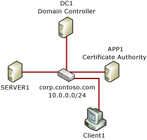

# Securing End-to-End IPsec connections by using IKEv2

**Applies to**
-   Windows 10
-   Windows Server 2016

IKEv2 offers the following:

-   Supports IPsec end-to-end transport mode connections

-   Provides interoperability for Windows with other operating systems that use IKEv2 for end-to-end security

-   Supports Suite B (RFC 4869) requirements

-   Coexists with existing policies that deploy AuthIP/IKEv1

-   Uses the Windows PowerShell interface exclusively for configuration. You cannot configure IKEv2 through the user interface.

-   Uses certificates for the authentication mechanism

You can use IKEv2 as a virtual private network (VPN) tunneling protocol that supports automatic VPN reconnection. IKEv2 allows the security association to remain unchanged despite changes in the underlying connection.

**In this document**

-   [Prerequisites](#prerequisites)

-   [Devices joined to a domain](#devices-joined-to-a-domain)

-   [Device not joined to a domain](#devices-not-joined-to-a-domain)

-   [Troubleshooting](#troubleshooting)

>**Note:**  This topic includes sample Windows PowerShell cmdlets. For more info, see [How to Run a Windows PowerShell Cmdlet](https://go.microsoft.com/fwlink/p/?linkid=230693).

## Prerequisites

These procedures assume that you already have a public key infrastructure (PKI) in place for device authentication.

## Devices joined to a domain

The following Windows PowerShell script establishes a connection security rule that uses IKEv2 for communication between two computers (CLIENT1 and SERVER1) that are joined to the corp.contoso.com domain as shown in Figure 1.



**Figure 1** The Contoso corporate network

This script does the following:

-   Creates a security group called **IPsec client and servers** and adds CLIENT1 and SERVER1 as members.

-   Creates a Group Policy Object (GPO) called **IPsecRequireInRequestOut** and links it to the corp.contoso.com domain.

-   Sets the permissions to the GPO so that they apply only to the computers in **IPsec client and servers** and not to **Authenticated Users**.

-   Indicates the certificate to use for authentication.

    >**Important:**  The certificate parameters that you specify for the certificate are case sensitive, so make sure that you type them exactly as specified in the certificate, and place the parameters in the exact order that you see in the following example. Failure to do so will result in connection errors.

-   Creates the IKEv2 connection security rule called **My IKEv2 Rule**.

**Windows PowerShell commands**

Type each cmdlet on a single line, even though they may appear to wrap across several lines because of formatting constraints.

``` syntax
# Create a Security Group for the computers that will get the policy
$pathname = (Get-ADDomain).distinguishedname
New-ADGroup -name "IPsec client and servers" -SamAccountName "IPsec client and servers" `
-GroupCategory security -GroupScope Global -path $pathname

# Add test computers to the Security Group
$computer = Get-ADComputer -LDAPFilter "(name=client1)"
Add-ADGroupMember -Identity "IPsec client and servers" -Members $computer
$computer = Get-ADComputer -LDAPFilter "(name=server1)"
Add-ADGroupMember -Identity "IPsec client and servers" -Members $computer

# Create and link the GPO to the domain
$gpo = New-gpo IPsecRequireInRequestOut
$gpo | new-gplink -target "dc=corp,dc=contoso,dc=com" -LinkEnabled Yes

# Set permissions to security group for the GPO
$gpo | Set-GPPermissions -TargetName "IPsec client and servers" -TargetType Group -PermissionLevel GpoApply -Replace
$gpo | Set-GPPermissions -TargetName "Authenticated Users" -TargetType Group -PermissionLevel None -Replace

#Set up the certificate for authentication
$gponame = "corp.contoso.com\IPsecRequireInRequestOut"
$certprop = New-NetIPsecAuthProposal -machine -cert -Authority "DC=com, DC=contoso, DC=corp, CN=corp-APP1-CA"
$myauth = New-NetIPsecPhase1AuthSet -DisplayName "IKEv2TestPhase1AuthSet" -proposal $certprop –PolicyStore GPO:$gponame

#Create the IKEv2 Connection Security rule
New-NetIPsecRule  -DisplayName "My IKEv2 Rule" -RemoteAddress any -Phase1AuthSet $myauth.InstanceID `
-InboundSecurity Require -OutboundSecurity Request -KeyModule IKEv2 -PolicyStore GPO:$gponame
```

## Devices not joined to a domain

Use a Windows PowerShell script similar to the following to create a local IPsec policy on the devices that you want to include in the secure connection.

>**Important:**  The certificate parameters that you specify for the certificate are case sensitive, so make sure that you type them exactly as specified in the certificate, and place the parameters in the exact order that you see in the following example. Failure to do so will result in connection errors.

**Windows PowerShell commands**

Type each cmdlet on a single line, even though they may appear to wrap across several lines because of formatting constraints.

``` syntax
#Set up the certificate
$certprop = New-NetIPsecAuthProposal -machine -cert -Authority "DC=com, DC=contoso, DC=corp, CN=corp-APP1-CA"
$myauth = New-NetIPsecPhase1AuthSet -DisplayName "IKEv2TestPhase1AuthSet" -proposal $certprop

#Create the IKEv2 Connection Security rule
New-NetIPsecRule  -DisplayName "My IKEv2 Rule" -RemoteAddress any -Phase1AuthSet $myauth.InstanceID `
-InboundSecurity Require -OutboundSecurity Request -KeyModule IKEv2
```

Make sure that you install the required certificates on the participating computers.

> **Note:**  
> -   For local devices, you can import the certificates manually if you have administrator access to the computer. For more info, see [Import or export certificates and private keys](https://windows.microsoft.com/windows-vista/Import-or-export-certificates-and-private-keys).
> -   You need a root certificate and a computer certificate on all devices that participate in the secure connection. Save the computer certificate in the **Personal/Certificates** folder.
> -   For remote devices, you can create a secure website to facilitate access to the script and certificates.

## Troubleshooting

Follow these procedures to verify and troubleshoot your IKEv2 IPsec connections:

**Use the Windows Defender Firewall with Advanced Security snap-in to verify that a connection security rule is enabled.**

1.  Open the Windows Defender Firewall with Advanced Security console.

2.  In the left pane of the Windows Defender Firewall with Advanced Security snap-in, click **Connection Security Rules**, and then verify that there is an enabled connection security rule.

3.  Expand **Monitoring**, and then click **Connection Security Rules** to verify that your IKEv2 rule is active for your currently active profile.

**Use Windows PowerShell cmdlets to display the security associations.**

1.  Open a Windows PowerShell command prompt.

2.  Type **get-NetIPsecQuickModeSA** to display the Quick Mode security associations.

3.  Type **get-NetIPsecMainModeSA** to display the Main Mode security associations.

**Use netsh to capture IPsec events.**

1.  Open an elevated command prompt.

2.  At the command prompt, type **netsh wfp capture start**.

3.  Reproduce the error event so that it can be captured.

4.  At the command prompt, type **netsh wfp capture stop**.

    A wfpdiag.cab file is created in the current folder.

5.  Open the cab file, and then extract the wfpdiag.xml file.

6.  Open the wfpdiag.xml file with your an XML viewer program or Notepad, and then examine the contents. There will be a lot of data in this file. One way to narrow down where to start looking is to search the last “errorFrequencyTable” at the end of the file. There might be many instances of this table, so make sure that you look at the last table in the file. For example, if you have a certificate problem, you might see the following entry in the last table at the end of the file:

    ``` syntax
    <item>
      <error>ERROR_IPSEC_IKE_NO_CERT</error>
      <frequency>32</frequency>
    </item>
    ```
    In this example, there are 32 instances of the **ERROR\_IPSEC\_IKE\_NO\_CERT** error. So now you can search for **ERROR\_IPSEC\_IKE\_NO\_CERT** to get more details regarding this error.

You might not find the exact answer for the issue, but you can find good hints. For example, you might find that there seems to be an issue with the certificates, so you can look at your certificates and the related cmdlets for possible issues.

## See also

-   [Windows Defender Firewall with Advanced Security](windows-firewall-with-advanced-security.md)

 

 


