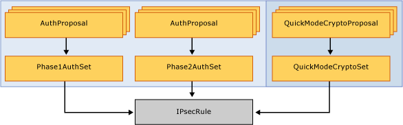

# Windows Defender Firewall with Advanced Security Administration with Windows PowerShell

**Applies to**
-   Windows 10
-   Windows Server 2016

The Windows Defender Firewall with Advanced Security Administration with Windows PowerShell Guide provides essential scriptlets for automating Windows Defender Firewall management. It is designed for IT pros, system administrators, IT managers, and others who use and need to automate Windows Defender Firewall management in Windows.

You can use Windows PowerShell to manage your firewall and IPsec deployments. This object-oriented scripting environment will make it easier for you to manage policies and monitor network conditions than was possible in netsh. Windows PowerShell allows network settings to be self-discoverable through the syntax and parameters in each of the cmdlets. This guide demonstrates how common tasks were performed in netsh and how you can use Windows PowerShell to accomplish them.

In future versions of Windows, Microsoft might remove the netsh functionality for Windows Defender Firewall. Microsoft recommends that you transition to Windows PowerShell if you currently use netsh to configure and manage Windows Defender Firewall.

Windows PowerShell and netsh command references are at the following locations.

-   [Netsh Commands for Windows Defender Firewall](https://technet.microsoft.com/library/cc771920)

## Scope

This guide does not teach you the fundamentals of Windows Defender Firewall, which can be found in [Windows Defender Firewall](windows-firewall-with-advanced-security.md). It does not teach the fundamentals of Windows PowerShell, and it assumes that you are familiar with the Windows PowerShell language and the basic concepts of Windows PowerShell. For more info about Windows PowerShell concepts and usage, see the reference topics in the [Additional resources](#additional-resources) section of this guide.

## Audience and user requirements

This guide is intended for IT pros, system administrators, and IT managers, and it assumes that you are familiar with Windows Defender Firewall, the Windows PowerShell language, and the basic concepts of Windows PowerShell.

## In this topic

| Section | Description |
| - | - |
| [Set profile global defaults](#bkmk-profileglobaldefaults) | Enable and control firewall behavior|
| [Deploy basic firewall rules](#deploy-basic-firewall-rules)| How to create, modify, and delete firewall rules|
| [Manage Remotely](#manage-remotely) | Remote management by using `-CimSession`|
| [Deploy basic IPsec rule settings](#deploy-basic-ipsec-rule-settings) | IPsec rules and associated parameters|
| [Deploy secure firewall rules with IPsec](#deploy-secure-firewall-rules-with-ipsec) | Domain and server isolation|
| [Additional resources](#additional-resources) | More information about Windows PowerShell|

## <a href="" id="bkmk-profileglobaldefaults"></a>Set profile global defaults

Global defaults set the device behavior in a per-profile basis. Windows Defender Firewall supports Domain, Private, and Public profiles.

### Enable Windows Defender Firewall with Advanced Security

Windows Defender Firewall drops traffic that does not correspond to allowed unsolicited traffic, or traffic that is sent in response to a request by the  device. If you find that the rules you create are not being enforced, you may need to enable Windows Defender Firewall. Here is how to do this on a local domain  device:

**Netsh**

``` syntax
netsh advfirewall set allprofiles state on
```

**Windows PowerShell**

``` syntax
Set-NetFirewallProfile -Profile Domain,Public,Private -Enabled True
```

### Control Windows Defender Firewall with Advanced Security behavior

The global default settings can be defined through the command-line interface. These modifications are also available through the Windows Defender Firewall with Advanced Security console.

The following scriptlets set the default inbound and outbound actions, specifies protected network connections, and allows notifications to be displayed to the user when a program is blocked from receiving inbound connections. It allows unicast response to multicast or broadcast network traffic, and it specifies logging settings for troubleshooting.

**Netsh**

``` syntax
netsh advfirewall set allprofiles firewallpolicy blockinbound,allowoutbound
netsh advfirewall set allprofiles settings inboundusernotification enable
netsh advfirewall set allprofiles settings unicastresponsetomulticast enable
netsh advfirewall set allprofiles logging filename %SystemRoot%\System32\LogFiles\Firewall\pfirewall.log
```

Windows PowerShell

``` syntax
Set-NetFirewallProfile -DefaultInboundAction Block -DefaultOutboundAction Allow –NotifyOnListen True -AllowUnicastResponseToMulticast True –LogFileName %SystemRoot%\System32\LogFiles\Firewall\pfirewall.log
```

### Disable Windows Defender Firewall with Advanced Security

Microsoft recommends that you do not disable Windows Defender Firewall because you lose other benefits provided by the service, such as the ability to use Internet Protocol security (IPsec) connection security rules, network protection from attacks that employ network fingerprinting, [Windows Service Hardening](https://go.microsoft.com/fwlink/?linkid=104976), and [boot time filters](https://blogs.technet.microsoft.com/networking/2009/03/24/stopping-the-windows-authenticating-firewall-service-and-the-boot-time-policy/).

Disabling Windows Defender Firewall with Advanced Security can also cause problems, including:

- Start menu can stop working
- Modern applications can fail to install or update
- Activation of Windows via phone fails
- Application or OS incompatibilities that depend on Windows Defender Firewall

Microsoft recommends disabling Windows Defender Firewall only when installing a third-party firewall, and resetting Windows Defender Firewall back to defaults when the third-party software is disabled or removed.

If disabling Windows Defender Firewall is required, do not disable it by stopping the Windows Defender Firewall service (in the **Services** snap-in, the display name is Windows Defender Firewall and the service name is MpsSvc).
Stopping the Windows Defender Firewall service is not supported by Microsoft.

Non-Microsoft firewall software can programmatically disable only the parts of Windows Defender Firewall that need to be disabled for compatibility.
You should not disable the firewall yourself for this purpose.

The proper method to disable the Windows Defender Firewall is to disable the Windows Defender Firewall Profiles and leave the service running.

Use the following procedure to turn the firewall off, or disable the Group Policy setting **Computer Configuration|Administrative Templates|Network|Network Connections|Windows Defender Firewall|Domain Prolfile|Windows Defender Firewall:Protect all network connections**.
For more information, see [Windows Defender Firewall with Advanced Security deployment guide](windows-firewall-with-advanced-security-deployment-guide.md).

The following example disables Windows Defender Firewall for all profiles.

```powershell
Set-NetFirewallProfile -Profile Domain,Public,Private -Enabled False
```

## Deploy basic firewall rules

This section provides scriptlet examples for creating, modifying, and deleting firewall rules.

### Create firewall rules

Adding a firewall rule in Windows PowerShell looks a lot like it did in Netsh, but the parameters and values are specified differently.

Here is an example of how to allow the Telnet application to listen on the network. This firewall rule is scoped to the local subnet by using a keyword instead of an IP address. Just like in Netsh, the rule is created on the local  device, and it becomes effective immediately.

**Netsh**

``` syntax
netsh advfirewall firewall add rule name="Allow Inbound Telnet" dir=in program= %SystemRoot%\System32\tlntsvr.exe remoteip=localsubnet action=allow
```

Windows PowerShell

``` syntax
New-NetFirewallRule -DisplayName “Allow Inbound Telnet” -Direction Inbound -Program %SystemRoot%\System32\tlntsvr.exe -RemoteAddress LocalSubnet -Action Allow
```

The following scriptlet shows how to add a basic firewall rule that blocks outbound traffic from a specific application and local port to a Group Policy Object (GPO) in Active Directory. In Windows PowerShell, the policy store is specified as a parameter within the **New-NetFirewall** cmdlet. In Netsh, you must first specify the GPO that the commands in a Netsh session should modify. The commands you enter are run against the contents of the GPO, and this remains in effect until the Netsh session is ended or until another set store command is executed.

Here, **domain.contoso.com** is the name of your Active Directory Domain Services (AD DS), and **gpo\_name** is the name of the GPO that you want to modify. Quotation marks are required if there are any spaces in the GPO name.

**Netsh**

``` syntax
netsh advfirewall set store gpo=domain.contoso.com\gpo_name
netsh advfirewall firewall add rule name="Block Outbound Telnet" dir=out program=%SystemRoot%\System32\telnet.exe protocol=tcp localport=23 action=block
```

Windows PowerShell

``` syntax
New-NetFirewallRule -DisplayName “Block Outbound Telnet” -Direction Outbound -Program %SystemRoot%\System32\tlntsvr.exe –Protocol TCP –LocalPort 23 -Action Block –PolicyStore domain.contoso.com\gpo_name
```

### GPO Caching

To reduce the burden on busy domain controllers, Windows PowerShell allows you to load a GPO to your local session, make all your changes in that session, and then save it back at all once.

The following performs the same actions as the previous example (by adding a Telnet rule to a GPO), but we do so leveraging GPO caching in PowerShell. Changing the GPO by loading it onto your local session and using the *-GPOSession* parameter are not supported in Netsh

Windows PowerShell

``` syntax
$gpo = Open-NetGPO –PolicyStore domain.contoso.com\gpo_name
New-NetFirewallRule -DisplayName “Block Outbound Telnet” -Direction Outbound -Program %SystemRoot%\System32\telnet.exe –Protocol TCP –LocalPort 23 -Action Block –GPOSession $gpo
Save-NetGPO –GPOSession $gpo
```

Note that this does not batch your individual changes, it loads and saves the entire GPO at once. So if any other changes are made by other administrators, or in a different Windows PowerShell window, saving the GPO overwrites those changes.

### Modify an existing firewall rule

When a rule is created, Netsh and Windows PowerShell allow you to change rule properties and influence, but the rule maintains its unique identifier (in Windows PowerShell this is specified with the *-Name* parameter).

For example, you could have a rule **Allow Web 80** that enables TCP port 80 for inbound unsolicited traffic. You can change the rule to match a different remote IP address of a Web server whose traffic will be allowed by specifying the human-readable, localized name of the rule.

**Netsh**

``` syntax
netsh advfirewall firewall set rule name="Allow Web 80" new remoteip=192.168.0.2
```

Windows PowerShell

``` syntax
Set-NetFirewallRule –DisplayName “Allow Web 80” -RemoteAddress 192.168.0.2
```

Netsh requires you to provide the name of the rule for it to be changed and we do not have an alternate way of getting the firewall rule. In Windows PowerShell, you can query for the rule using its known properties.

When you run `Get-NetFirewallRule`, you may notice that common conditions like addresses and ports do not appear. These conditions are represented in separate objects called Filters. As shown before, you can set all the conditions in New-NetFirewallRule and Set-NetFirewallRule. If you want to query for firewall rules based on these fields (ports, addresses, security, interfaces, services), you will need to get the filter objects themselves.

You can change the remote endpoint of the **Allow Web 80** rule (as done previously) using filter objects. Using Windows PowerShell you query by port using the port filter, then assuming additional rules exist affecting the local port, you build with further queries until your desired rule is retrieved.

In the following example, we assume the query returns a single firewall rule, which is then piped to the `Set-NetFirewallRule` cmdlet utilizing Windows PowerShell’s ability to pipeline inputs.

Windows PowerShell

``` syntax
Get-NetFirewallPortFilter | ?{$_.LocalPort -eq 80} | Get-NetFirewallRule | ?{ $_.Direction –eq “Inbound” -and $_.Action –eq “Allow”} | Set-NetFirewallRule -RemoteAddress 192.168.0.2
```

You can also query for rules using the wildcard character. The following example returns an array of firewall rules associated with a particular program. The elements of the array can be modified in subsequent `Set-NetFirewallRule` cmdlets.

Windows PowerShell

``` syntax
Get-NetFirewallApplicationFilter -Program "*svchost*" | Get-NetFirewallRule
```

Multiple rules in a group can be simultaneously modified when the associated group name is specified in a Set command. You can add firewall rules to specified management groups in order to manage multiple rules that share the same influences.

In the following example, we add both inbound and outbound Telnet firewall rules to the group **Telnet Management**. In Windows PowerShell, group membership is specified when the rules are first created so we re-create the previous example rules. Adding rules to a custom rule group is not possible in Netsh.

Windows PowerShell

``` syntax
New-NetFirewallRule -DisplayName “Allow Inbound Telnet” -Direction Inbound -Program %SystemRoot%\System32\tlntsvr.exe -RemoteAddress LocalSubnet -Action Allow –Group “Telnet Management”
New-NetFirewallRule -DisplayName “Block Outbound Telnet” -Direction Outbound -Program %SystemRoot%\System32\tlntsvr.exe -RemoteAddress LocalSubnet -Action Allow –Group “Telnet Management”
```

If the group is not specified at rule creation time, the rule can be added to the rule group using dot notation in Windows PowerShell. You cannot specify the group using `Set-NetFirewallRule` since the command allows querying by rule group.

Windows PowerShell

``` syntax
$rule = Get-NetFirewallRule -DisplayName “Allow Inbound Telnet”
$rule.Group = “Telnet Management”
$rule | Set-NetFirewallRule
```

Using the `Set` command, if the rule group name is specified, the group membership is not modified but rather all rules of the group receive the same modifications indicated by the given parameters.

The following scriptlet enables all rules in a predefined group containing remote management influencing firewall rules.

**Netsh**

``` syntax
netsh advfirewall firewall set rule group="Windows Defender Firewall remote management" new enable=yes
```

Windows PowerShell

``` syntax
Set-NetFirewallRule -DisplayGroup “Windows Defender Firewall Remote Management” –Enabled True
```

There is also a separate `Enable-NetFirewallRule` cmdlet for enabling rules by group or by other properties of the rule.

Windows PowerShell

``` syntax
Enable-NetFirewallRule -DisplayGroup “Windows Defender Firewall Remote Management” -Verbose
```

### Delete a firewall rule

Rule objects can be disabled so that they are no longer active. In Windows PowerShell, the **Disable-NetFirewallRule** cmdlet will leave the rule on the system, but put it in a disabled state so the rule no longer is applied and impacts traffic. A disabled firewall rule can be re-enabled by **Enable-NetFirewallRule**. This is different from the **Remove-NetFirewallRule**, which permanently removes the rule definition from the device.

The following cmdlet deletes the specified existing firewall rule from the local policy store.

**Netsh**

``` syntax
netsh advfirewall firewall delete rule name=“Allow Web 80”
```

Windows PowerShell

``` syntax
Remove-NetFirewallRule –DisplayName “Allow Web 80”
```

Like with other cmdlets, you can also query for rules to be removed. Here, all blocking firewall rules are deleted from the device.

Windows PowerShell

``` syntax
Remove-NetFirewallRule –Action Block
```

Note that it may be safer to query the rules with the **Get** command and save it in a variable, observe the rules to be affected, then pipe them to the **Remove** command, just as we did for the **Set** commands. The following example shows how you can view all the blocking firewall rules, and then delete the first four rules.

Windows PowerShell

``` syntax
$x = Get-NetFirewallRule –Action Block
$x
$x[0-3] | Remove-NetFirewallRule
```

## Manage remotely

Remote management using WinRM is enabled by default. The cmdlets that support the *CimSession* parameter use WinRM and can be managed remotely by default.

The following example returns all firewall rules of the persistent store on a device named **RemoteDevice**.

Windows PowerShell

``` syntax
Get-NetFirewallRule –CimSession RemoteDevice
```

We can perform any modifications or view rules on remote  devices by simply using the *–CimSession* parameter. Here we remove a specific firewall rule from a remote device.

Windows PowerShell

``` syntax
$RemoteSession = New-CimSession –ComputerName RemoteDevice
Remove-NetFirewallRule –DisplayName “AllowWeb80” –CimSession $RemoteSession -Confirm
```

## Deploy basic IPsec rule settings

An Internet Protocol security (IPsec) policy consists of rules that determine IPsec behavior. IPsec supports network-level peer authentication, data origin authentication, data integrity, data confidentiality (encryption), and replay protection.

Windows PowerShell can create powerful, complex IPsec policies like in Netsh and the Windows Defender Firewall with Advanced Security console. However, because Windows PowerShell is object-based rather than string token-based, configuration in Windows PowerShell offers greater control and flexibility.

In Netsh, the authentication and cryptographic sets were specified as a list of comma-separated tokens in a specific format. In Windows PowerShell, rather than using default settings, you first create your desired authentication or cryptographic proposal objects and bundle them into lists in your preferred order. Then, you create one or more IPsec rules that reference these sets. The benefit of this model is that programmatic access to the information in the rules is much easier. See the following sections for clarifying examples.



### Create IPsec rules

The following cmdlet creates basic IPsec transport mode rule in a Group Policy Object. An IPsec rule is simple to create; all that is required is the display name, and the remaining properties use default values. Inbound traffic is authenticated and integrity checked using the default quick mode and main mode settings. These default settings can be found in the console under Customize IPsec Defaults.

**Netsh**

``` syntax
netsh advfirewall set store gpo=domain.contoso.com\gpo_name
netsh advfirewall consec add rule name="Require Inbound Authentication" endpoint1=any endpoint2=any action=requireinrequestout
```

Windows PowerShell

``` syntax
New-NetIPsecRule -DisplayName “Require Inbound Authentication” -PolicyStore domain.contoso.com\gpo_name
```

### Add custom authentication methods to an IPsec rule

If you want to create a custom set of quick-mode proposals that includes both AH and ESP in an IPsec rule object, you create the associated objects separately and link their associations. For more information about authentication methods, see [Choosing the IPsec Protocol](https://technet.microsoft.com/library/cc757847(WS.10).aspx) .

You can then use the newly created custom quick-mode policies when you create IPsec rules. The cryptography set object is linked to an IPsec rule object.


In this example, we build on the previously created IPsec rule by specifying a custom quick-mode crypto set. The final IPsec rule requires outbound traffic to be authenticated by the specified cryptography method.

**Netsh**

``` syntax
netsh advfirewall set store gpo=domain.contoso.com\gpo_name
netsh advfirewall consec add rule name="Require Outbound Authentication" endpoint1=any endpoint2=any action=requireinrequestout qmsecmethods=ah:sha1+esp:sha1-3des
```

Windows PowerShell

``` syntax
$AHandESPQM = New-NetIPsecQuickModeCryptoProposal -Encapsulation AH,ESP –AHHash SHA1 -ESPHash SHA1 -Encryption DES3
$QMCryptoSet = New-NetIPsecQuickModeCryptoSet –DisplayName “ah:sha1+esp:sha1-des3” -Proposal $AHandESPQM –PolicyStore domain.contoso.com\gpo_name
New-NetIPsecRule -DisplayName “Require Inbound Authentication” -InboundSecurity Require -OutboundSecurity Request -QuickModeCryptoSet $QMCryptoSet.Name –PolicyStore domain.contoso.com\gpo_name
```

### IKEv2 IPsec transport rules

A corporate network may need to secure communications with another agency. But, you discover the agency runs non-Windows operating systems and requires the use of the Internet Key Exchange Version 2 (IKEv2) standard.

You can leverage IKEv2 capabilities in Windows Server 2012 by simply specifying IKEv2 as the key module in an IPsec rule. This can only be done using computer certificate authentication and cannot be used with phase 2 authentication.

Windows PowerShell

``` syntax
New-NetIPsecRule -DisplayName “Require Inbound Authentication” -InboundSecurity Require -OutboundSecurity Request –Phase1AuthSet MyCertAuthSet -KeyModule IKEv2 –RemoteAddress $nonWindowsGateway
```

For more info about IKEv2, including scenarios, see [Securing End-to-End IPsec Connections by Using IKEv2](securing-end-to-end-ipsec-connections-by-using-ikev2.md).

### Copy an IPsec rule from one policy to another

Firewall and IPsec rules with the same rule properties can be duplicated to simplify the task of re-creating them within different policy stores.

To copy the previously created rule from one policy store to another, the associated objects must be also be copied separately. Note that there is no need to copy associated firewall filters. You can query rules to be copied in the same way as other cmdlets.

Copying individual rules is a task that is not possible through the Netsh interface. Here is how you can accomplish it with Windows PowerShell.

Windows PowerShell

``` syntax
$Rule = Get-NetIPsecRule –DisplayName “Require Inbound Authentication”
$Rule | Copy-NetIPsecRule –NewPolicyStore domain.costoso.com\new_gpo_name
$Rule | Copy-NetPhase1AuthSet –NewPolicyStore domain.costoso.com\new_gpo_name
```

### Handling Windows PowerShell errors

To handle errors in your Windows PowerShell scripts, you can use the *–ErrorAction* parameter. This is especially useful with the **Remove** cmdlets. If you want to remove a particular rule, you will notice that it fails if the rule is not found. When removing rules, if the rule isn’t already there, it is generally acceptable to ignore that error. In this case, you can do the following to suppress any “rule not found” errors during the remove operation.

Windows PowerShell

``` syntax
Remove-NetFirewallRule –DisplayName “Contoso Messenger 98” –ErrorAction SilentlyContinue
```

Note that the use of wildcards can also suppress errors, but they could potentially match rules that you did not intend to remove. This can be a useful shortcut, but should only be used if you know there aren’t any extra rules that will be accidentally deleted. So the following cmdlet will also remove the rule, suppressing any “not found” errors.

Windows PowerShell

``` syntax
Remove-NetFirewallRule –DisplayName “Contoso Messenger 98*”
```

When using wildcards, if you want to double-check the set of rules that is matched, you can use the *–WhatIf* parameter.

Windows PowerShell

``` syntax
Remove-NetFirewallRule –DisplayName “Contoso Messenger 98*” –WhatIf
```

If you only want to delete some of the matched rules, you can use the *–Confirm* parameter to get a rule-by-rule confirmation prompt.

Windows PowerShell

``` syntax
Remove-NetFirewallRule –DisplayName “Contoso Messenger 98*” –Confirm
```

You can also just perform the whole operation, displaying the name of each rule as the operation is performed.

Windows PowerShell

``` syntax
Remove-NetFirewallRule –DisplayName “Contoso Messenger 98*” –Verbose
```

### Monitor

The following Windows PowerShell commands are useful in the update cycle of a deployment phase.

To allow you to view all the IPsec rules in a particular store, you can use the following commands. In Netsh, this command does not show rules where profile=domain,public or profile=domain,private. It only shows rules that have the single entry domain that is included in the rule. The following command examples will show the IPsec rules in all profiles.

**Netsh**

``` syntax
netsh advfirewall consec show rule name=all
```

Windows PowerShell

``` syntax
Show-NetIPsecRule –PolicyStore ActiveStore
```

You can monitor main mode security associations for information such as which peers are currently connected to the device and which protection suite is used to form the security associations.

Use the following cmdlet to view existing main mode rules and their security associations:

**Netsh**

``` syntax
netsh advfirewall monitor show mmsa all
```

Windows PowerShell

``` syntax
Get-NetIPsecMainModeSA
```

### Find the source GPO of a rule

To view the properties of a particular rule or group of rules, you query for the rule. When a query returns fields that are specified as **NotConfigured**, you can to determine which policy store a rule originates from.

For objects that come from a GPO (the *–PolicyStoreSourceType* parameter is specified as **GroupPolicy** in the **Show** command), if *–TracePolicyStore* is passed, the name of the GPO is found and returned in the **PolicyStoreSource** field.

Windows PowerShell

``` syntax
Get-NetIPsecRule –DisplayName “Require Inbound Authentication” –TracePolicyStore
```

It is important to note that the revealed sources do not contain a domain name.

### Deploy a basic domain isolation policy

IPsec can be used to isolate domain members from non-domain members. Domain isolation uses IPsec authentication to require that the domain-joined devices positively establish the identities of the communicating devices to improve security of an organization. One or more features of IPsec can be used to secure traffic with an IPsec rule object.

To implement domain isolation on your network, the devices in the domain receive IPsec rules that block unsolicited inbound network traffic that is not protected by IPsec. Here we create an IPsec rule that requires authentication by domain members. Through this, you can isolate domain-joined devices from devices that are not joined to a domain. In the following examples, Kerberos authentication is required for inbound traffic and requested for outbound traffic.

**Netsh**

``` syntax
netsh advfirewall set store gpo=domain.contoso.com\domain_isolation
netsh advfirewall consec add rule name=“Basic Domain Isolation Policy” profile=domain endpoint1=”any” endpoint2=”any” action=requireinrequestout auth1=”computerkerb”
```

Windows PowerShell

``` syntax
$kerbprop = New-NetIPsecAuthProposal –Machine –Kerberos
$Phase1AuthSet = New-NetIPsecPhase1AuthSet -DisplayName "Kerberos Auth Phase1" -Proposal $kerbprop –PolicyStore domain.contoso.com\domain_isolation
New-NetIPsecRule –DisplayName “Basic Domain Isolation Policy” –Profile Domain –Phase1AuthSet $Phase1AuthSet.Name –InboundSecurity Require –OutboundSecurity Request –PolicyStore domain.contoso.com\domain_isolation
```

### Configure IPsec tunnel mode

The following command creates an IPsec tunnel that routes traffic from a private network (192.168.0.0/16) through an interface on the local device (1.1.1.1) attached to a public network to a second device through its public interface (2.2.2.2) to another private network (192.157.0.0/16). All traffic through the tunnel is checked for integrity by using ESP/SHA1, and it is encrypted by using ESP/DES3.

**Netsh**

``` syntax
netsh advfirewall consec add rule name="Tunnel from 192.168.0.0/16 to 192.157.0.0/16" mode=tunnel endpoint1=192.168.0.0/16 endpoint2=192.157.0.0/16 localtunnelendpoint=1.1.1.1 remotetunnelendpoint=2.2.2.2 action=requireinrequireout qmsecmethods=esp:sha1-3des
```

Windows PowerShell

``` syntax
$QMProposal = New-NetIPsecQuickModeCryptoProposal -Encapsulation ESP -ESPHash SHA1 -Encryption DES3
$QMCryptoSet = New-NetIPsecQuickModeCryptoSet –DisplayName “esp:sha1-des3” -Proposal $QMProposal
New-NetIPSecRule -DisplayName “Tunnel from HQ to Dallas Branch” -Mode Tunnel -LocalAddress 192.168.0.0/16 -RemoteAddress 192.157.0.0/16 -LocalTunnelEndpoint 1.1.1.1 -RemoteTunnelEndpoint 2.2.2.2 -InboundSecurity Require -OutboundSecurity Require -QuickModeCryptoSet $QMCryptoSet.Name
```

## Deploy secure firewall rules with IPsec

In situations where only secure traffic can be allowed through the Windows Defender Firewall, a combination of manually configured firewall and IPsec rules are necessary. The firewall rules determine the level of security for allowed packets, and the underlying IPsec rules secure the traffic. The scenarios can be accomplished in Windows PowerShell and in Netsh, with many similarities in deployment.

### Create a secure firewall rule (allow if secure)

Configuring firewalls rule to allow connections if they are secure requires the corresponding traffic to be authenticated and integrity protected, and then optionally encrypted by IPsec.

The following example creates a firewall rule that requires traffic to be authenticated. The command permits inbound Telnet network traffic only if the connection from the remote device is authenticated by using a separate IPsec rule.

**Netsh**

``` syntax
netsh advfirewall firewall add rule name="Allow Authenticated Telnet" dir=in program=%SystemRoot%\System32\tlntsvr.exe security=authenticate action=allow
```

Windows PowerShell

``` syntax
New-NetFirewallRule -DisplayName “Allow Authenticated Telnet” -Direction Inbound -Program %SystemRoot%\System32\tlntsvr.exe -Authentication Required -Action Allow
```

The following command creates an IPsec rule that requires a first (computer) authentication and then attempts an optional second (user) authentication. Creating this rule secures and allows the traffic through the firewall rule requirements for the messenger program.

**Netsh**

``` syntax
netsh advfirewall consec add rule name="Authenticate Both Computer and User" endpoint1=any endpoint2=any action=requireinrequireout auth1=computerkerb,computerntlm auth2=userkerb,userntlm,anonymous
```

Windows PowerShell

``` syntax
$mkerbauthprop = New-NetIPsecAuthProposal -Machine –Kerberos
$mntlmauthprop = New-NetIPsecAuthProposal -Machine -NTLM
$P1Auth = New-NetIPsecPhase1AuthSet -DisplayName “Machine Auth” –Proposal $mkerbauthprop,$mntlmauthprop
$ukerbauthprop = New-NetIPsecAuthProposal -User -Kerberos
$unentlmauthprop = New-NetIPsecAuthProposal -User -NTLM
$anonyauthprop = New-NetIPsecAuthProposal -Anonymous
$P2Auth = New-NetIPsecPhase2AuthSet -DisplayName “User Auth” -Proposal $ukerbauthprop,$unentlmauthprop,$anonyauthprop
New-NetIPSecRule -DisplayName “Authenticate Both Computer and User” -InboundSecurity Require -OutboundSecurity Require -Phase1AuthSet $P1Auth.Name –Phase2AuthSet $P2Auth.Name
```

### Isolate a server by requiring encryption and group membership

To improve the security of the  devices in an organization, you can deploy domain isolation in which domain-members are restricted. They require authentication when communicating among each other and reject non-authenticated inbound connections. To improve the security of servers with sensitive data, this data must be protected by allowing access only to a subset of devices within the enterprise domain.

IPsec can provide this additional layer of protection by isolating the server. In server isolation, sensitive data access is restricted to users and devices with legitimate business need, and the data is additionally encrypted to prevent eavesdropping.

### Create a firewall rule that requires group membership and encryption

To deploy server isolation, we layer a firewall rule that restricts traffic to authorized users or devices on the IPsec rule that enforces authentication.

The following firewall rule allows Telnet traffic from user accounts that are members of a custom group called “Authorized to Access Server.” This access can additionally be restricted based on the  device, user, or both by specifying the restriction parameters.

A Security Descriptor Definition Language (SDDL) string is created by extending a user or group’s security identifier (SID). For more information about finding a group’s SID, see: [Finding the SID for a group account](https://technet.microsoft.com/library/cc753463(WS.10).aspx#bkmk_FINDSID).

Restricting access to a group allows administrations to extend strong authentication support through Windows Defender Firewall and/or IPsec policies.

The following example shows you how to create an SDDL string that represents security groups.

Windows PowerShell

``` syntax
$user = new-object System.Security.Principal.NTAccount (“corp.contoso.com\Administrators”)
$SIDofSecureUserGroup = $user.Translate([System.Security.Principal.SecurityIdentifier]).Value
$secureUserGroup = "D:(A;;CC;;;$SIDofSecureUserGroup)"
```

By using the previous scriptlet, you can also get the SDDL string for a secure computer group as shown here:

Windows PowerShell

``` syntax
$secureMachineGroup = "D:(A;;CC;;;$SIDofSecureMachineGroup)"
```

For more information about how to create security groups or how to determine the SDDL string, see [Working with SIDs](https://technet.microsoft.com/library/ff730940.aspx).

Telnet is an application that does not provide encryption. This application can send data, such as names and passwords, over the network. This data can be intercepted by malicious users. If an administrator would like to allow the use of Telnet, but protect the traffic, a firewall rule that requires IPsec encryption can be created. This is necessary so that the administrator can be certain that when this application is used, all of the traffic sent or received by this port is encrypted. If IPsec fails to authorize the connection, no traffic is allowed from this application.

In this example, we allow only authenticated and encrypted inbound Telnet traffic from a specified secure user group through the creation of the following firewall rule.

**Netsh**

``` syntax
netsh advfirewall set store gpo=domain.contoso.com\Server_Isolation
netsh advfirewall firewall add rule name=“Allow Encrypted Inbound Telnet to Group Members Only” program=%SystemRoot%\System32\tlntsvr.exe protocol=TCP dir=in action=allow localport=23 security=authenc rmtusrgrp ="D:(A;;CC;;; S-1-5-21-2329867823-2610410949-1491576313-1735)"
```

Windows PowerShell

``` syntax
New-NetFirewallRule -DisplayName "Allow Encrypted Inbound Telnet to Group Members Only" -Program %SystemRoot%\System32\tlntsvr.exe -Protocol TCP -Direction Inbound -Action Allow -LocalPort 23 -Authentication Required -Encryption Required –RemoteUser $secureUserGroup –PolicyStore domain.contoso.com\Server_Isolation
```

### Endpoint security enforcement

The previous example showed end to end security for a particular application. In situations where endpoint security is required for many applications, having a firewall rule per application can be cumbersome and difficult to manage. Authorization can override the per-rule basis and be done at the IPsec layer.

In this example, we set the global IPsec setting to only allow transport mode traffic to come from an authorized user group with the following cmdlet. Consult the previous examples for working with security groups.

Windows PowerShell

``` syntax
Set-NetFirewallSetting -RemoteMachineTransportAuthorizationList $secureMachineGroup
```

### Create firewall rules that allow IPsec-protected network traffic (authenticated bypass)

Authenticated bypass allows traffic from a specified trusted  device or user to override firewall block rules. This is helpful when an administrator wants to use scanning servers to monitor and update  devices without the need to use port-level exceptions. For more information, see [How to enable authenticated firewall bypass](https://technet.microsoft.com/library/cc753463(WS.10).aspx).

In this example, we assume that a blocking firewall rule exists. This example permits any network traffic on any port from any IP address to override the block rule, if the traffic is authenticated as originating from a  device or user account that is a member of the specified  device or user security group.

**Netsh**

``` syntax
netsh advfirewall set store gpo=domain.contoso.com\domain_isolation
netsh advfirewall firewall add rule name="Inbound Secure Bypass Rule" dir=in security=authenticate action="bypass" rmtcomputergrp="D:(A;;CC;;;S-1-5-21-2329867823-2610410949-1491576313-1114)" rmtusrgrp="D:(A;;CC;;; S-1-5-21-2329867823-2610410949-1491576313-1735)"
```

Windows PowerShell

``` syntax
New-NetFirewallRule –DisplayName “Inbound Secure Bypass Rule" –Direction Inbound –Authentication Required –OverrideBlockRules $true -RemoteMachine $secureMachineGroup –RemoteUser $secureUserGroup –PolicyStore domain.contoso.com\domain_isolation
```

## Additional resources


For more information about Windows PowerShell concepts, see the following topics.

-   [Windows PowerShell Getting Started Guide](https://go.microsoft.com/fwlink/p/?linkid=113440)

-   [Windows PowerShell User Guide](https://go.microsoft.com/fwlink/p/?linkid=113441)

-   [Windows PowerShell About Help Topics](https://go.microsoft.com/fwlink/p/?linkid=113206)

-   [about\_Functions](https://go.microsoft.com/fwlink/p/?linkid=113231)

-   [about\_Functions\_Advanced](https://go.microsoft.com/fwlink/p/?linkid=144511)

-   [about\_Execution\_Policies](https://go.microsoft.com/fwlink/p/?linkid=135170)

-   [about\_Foreach](https://go.microsoft.com/fwlink/p/?linkid=113229)

-   [about\_Objects](https://go.microsoft.com/fwlink/p/?linkid=113241)

-   [about\_Properties](https://go.microsoft.com/fwlink/p/?linkid=113249)

-   [about\_While](https://go.microsoft.com/fwlink/p/?linkid=113275)

-   [about\_Scripts](https://go.microsoft.com/fwlink/p/?linkid=144310)

-   [about\_Signing](https://go.microsoft.com/fwlink/p/?linkid=113268)

-   [about\_Throw](https://go.microsoft.com/fwlink/p/?linkid=145153)

-   [about\_PSSessions](https://go.microsoft.com/fwlink/p/?linkid=135181)

-   [about\_Modules](https://go.microsoft.com/fwlink/p/?linkid=144311)

-   [about\_Command\_Precedence](https://go.microsoft.com/fwlink/p/?linkid=113214)

 

 


