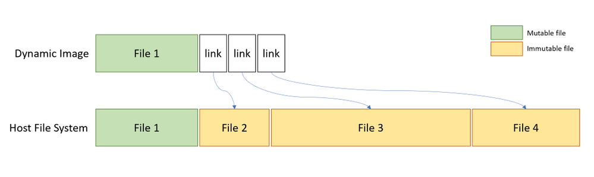
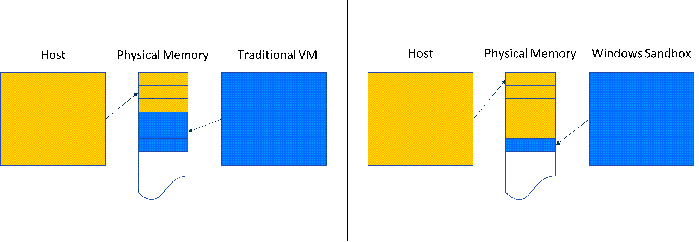
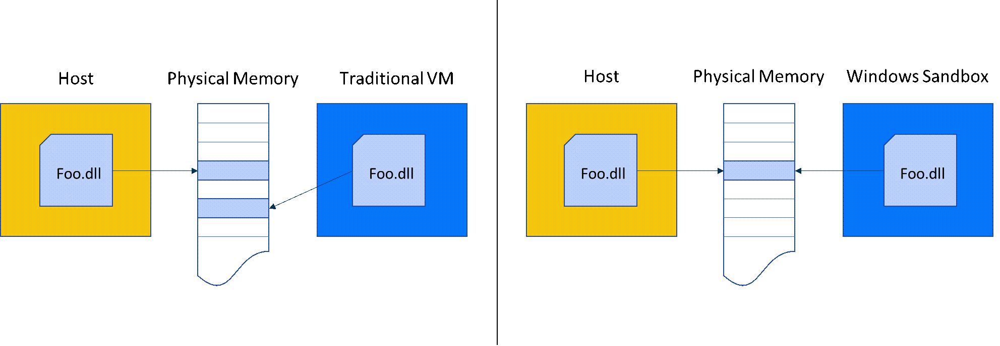
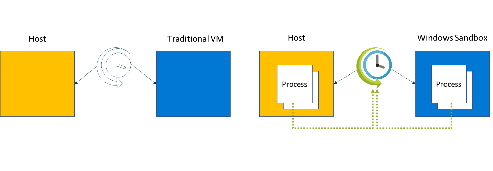
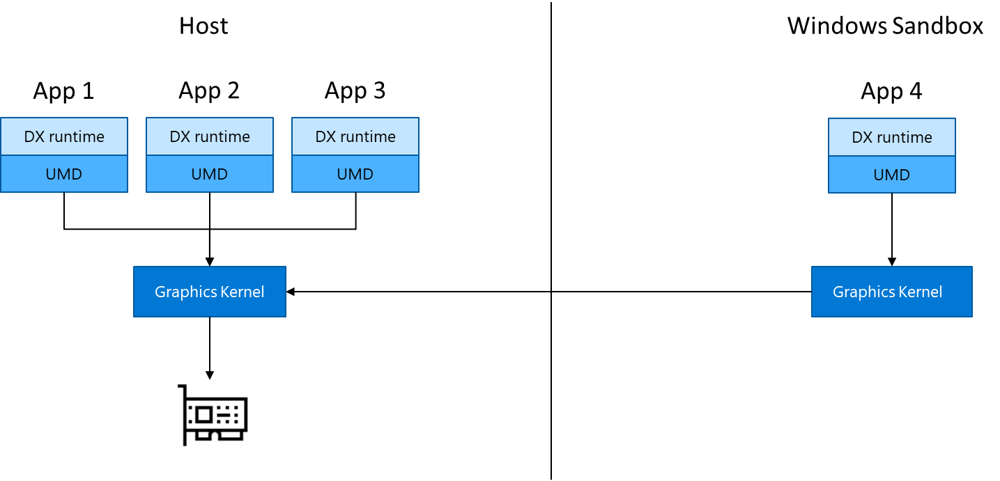

# Windows Sandbox architecture

This article describes the Windows Sandbox basics.

## Fundamentals

### Dynamically generated image

At its core, Windows Sandbox is a lightweight virtual machine, so it needs an operating system image to boot from. Instead of giving the sandbox a separate copy of Windows to boot from, our Dynamic Base Image technology lets us use the copy of Windows that's already installed on the host.

Most OS files are immutable and can be freely shared with Windows Sandbox. A small portion of the OS files are mutable and we can't be shared. Windows Sandbox contains pristine copies of these files. A complete Windows image can be constructed from a combination of the sharable immutable files on the host and the pristine copies of mutable files. By using this scheme, Windows Sandbox has a full Windows installation to boot from without needing to download or store an additional copy of Windows.
 
Before Windows Sandbox is installed, the dynamic base image is stored in a compressed 25-MB package. Once it's installed, the dynamic base package occupies about 500 MB of disk space.

### Memory management

For traditional virtual machines (VMs), a portion of host memory is dedicated for exclusive use by the VM.  If the host later comes under resource pressure, it can't use the memory that was dedicated to the VM.  Nor can it provide more memory, if available, to the VM. Windows Sandbox treats memory more like how memory is allocated to applications. All apps on the machine can request the amount of memory that they need. The amount that they get will be a function of what other apps are running and how much memory they need. And the amount of memory available for use by an application can change over time.
 
### Dynamic working set

When using a VM, the user is effectively partitioning their machine. If the host is under memory pressure, it can't use the memory already allocated to the VM. But applications in the sandbox are treated as equal to apps running on the host, so when apps in sandbox are under memory pressure, you can give more memory to the sandbox (and the same applies to the host). Guest physical pages provided are virtualized.

### Memory sharing

Because Windows Sandbox runs the same operating system image as the host, it has been enhanced to use the same physical memory pages as the host for operating system binaries via a technology referred to as "direct map." For example, when *ntdll.dll* is loaded into memory in the sandbox, it uses the same executable pages as those of the binary when loaded on the host. Memory sharing between the host and sandbox results in a smaller memory footprint when compared to traditional VMs without compromising valuable host secrets.

### Integrated kernel scheduler

With ordinary virtual machines, the Microsoft hypervisor controls the scheduling of the virtual processors running in the VMs. Windows Sandbox uses a new technology called "integrated scheduling," which allows the host scheduler to decide when the sandbox gets CPU cycles.

Windows Sandbox employs a unique scheduling policy that allows the virtual processors of the sandbox to be scheduled in the same way as threads would be scheduled for a process. High-priority tasks on the host can preempt less important work in the sandbox. The benefit of the integrated scheduler is that the host manages Windows Sandbox as a process rather than a virtual machine, which results in a much more responsive host, similar to Linux KVM.
 
The goal is to treat Windows Sandbox like an app but with the security guarantees of a virtual machine.
 
### Snapshot and clone

As we noted earlier, Windows Sandbox uses the Microsoft hypervisor. It essentially runs another copy of Windows that needs to be booted, and this can take some time. Rather than paying the full cost of booting the Windows Sandbox operating system every time Sandbox starts, two other technologies are utilized: *snapshot* and *clone.*
 
*Snapshot*  allows us to boot the Windows Sandbox environment once and preserve the memory, CPU, and device state to disk. Then we can restore the Sandbox environment from disk and put it in memory, rather than booting it when we need a new instance of Sandbox. By cloning the in-memory snapshot of Windows Sandbox, start time is significantly improved.
 
### WDDM GPU virtualization

Hardware-accelerated rendering is key to a smooth and responsive user experience, especially for graphics-intense or media-heavy uses. But virtual machines are isolated from their hosts and can't access advanced devices like GPUs. The role of graphics virtualization technologies is to bridge this gap and provide hardware acceleration in virtualized environments.
 
Microsoft is working with its graphics ecosystem partners to integrate modern graphics virtualization capabilities directly into DirectX and Windows Display Driver Model (WDDM), the driver model that's used for Windows.

At a high level, this form of graphics virtualization works as follows:

- Apps running in a Hyper-V VM use graphics APIs as normal.
- Graphics components in the VM, which have been enlightened to support virtualization, coordinate across the VM boundary with the host to execute graphics workloads.
- The host allocates and schedules graphics resources among apps in the VM alongside the apps that are running natively. Conceptually, they behave as one pool of graphics clients.

This process is illustrated here:

This enables the Windows Sandbox VM to benefit from hardware-accelerated rendering, with Windows dynamically allocating graphics resources where they're needed across the host and guest. The result is improved performance and responsiveness for apps running in Windows Sandbox, as well as improved battery life for graphics-heavy uses.

To take advantage of these benefits, a system with a compatible GPU and graphics drivers (WDDM 2.5 or newer) is required. Incompatible systems will render apps in Windows Sandbox with the Microsoft CPU-based rendering technology, Windows Advanced Rasterization Platform (WARP).
 
### Battery pass-through

Windows Sandbox is also aware of the host's battery state, which allows it to optimize power consumption. This is critical for a technology that's used on laptops, where battery life is often critical.

## Prerequites, installation, and basic use

### Prerequisites
 
- Windows 10 Pro or Enterprise build 18305 or later (*Windows Sandbox is currently not supported on Home SKUs*)
- AMD64 architecture
- Virtualization capabilities enabled in BIOS
- At least 4 GB of RAM (8 GB recommended)
- At least 1 GB of free disk space (SSD recommended)
- At least two CPU cores (four cores with hyperthreading recommended)

### Installation

1. Make sure your machine is using Windows 10 Pro or Enterprise build version 18305 or later.
2. Enable virtualization on the machine.

   - If you're using a physical machine, make sure virtualization capabilities are enabled in the BIOS.
   - If you're using a virtual machine, run the following PowerShell command to enable nested virtualization:  **Set -VMProcessor -VMName \<VMName> -ExposeVirtualizationExtensions $true**
1. Use the search bar on the task bar and type **Turn Windows Features on and off**. Select **Windows Sandbox** and then **OK**. Restart the computer if you're prompted.

   - If the **Windows Sandbox** option is unavailable, your computer doesn't meet the requirements to run Windows Sandbox. If you think this is incorrect, review the prerequisite list as well as steps 1 and 2.
1.   Locate and select **Windows Sandbox** on the Start menu to run it for the first time.

### Usage 
1. Copy an executable file (and any other files needed to run the application) from the host into the Windows Sandbox window.
2. Run the executable file or installer inside the sandbox.
3.  When you're finished experimenting, close the sandbox. A dialog box will state that all sandbox content will be discarded and permanently deleted. Select **ok**.
4. Confirm that your host machine doesn't exhibit any of the modifications that you made in Windows Sandbox.
