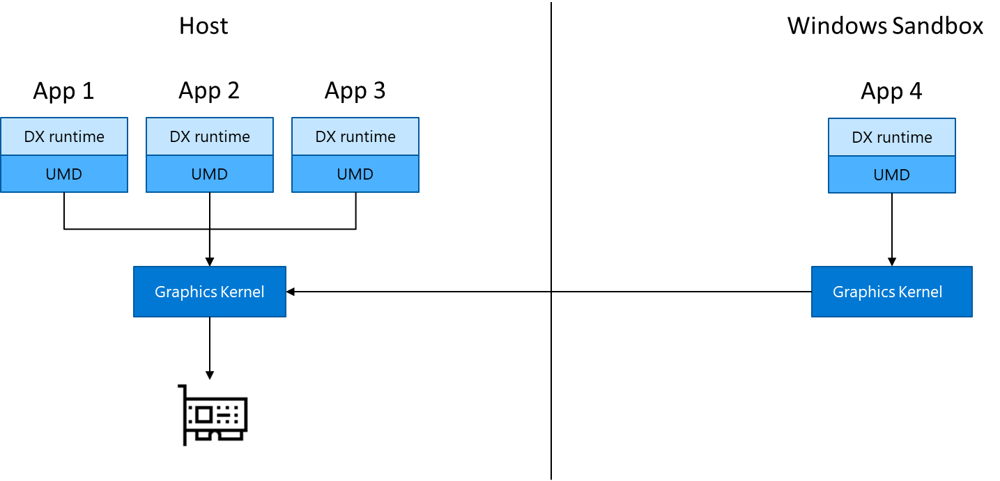

# Windows Sandbox architecture

Windows Sandbox benefits from new container technology in Windows to achieve a combination of security, density, and performance that's not available in traditional VMs.

## Dynamically generated image

Containers require an operating system image to boot from. Rather than providing a separate copy of Windows to boot from, Dynamic Base Image technology leverages the copy of Windows that's already installed on the host.

Most OS files are immutable and can be freely shared with Windows Sandbox. A small portion of the OS files are mutable and we can't be shared. But the container base image contains pristine copies of these files. A complete Windows image can be constructed from a combination of the sharable immutable files on the host and the pristine copies of the mutable files. By using this scheme, Windows Sandbox has a full Windows installation to boot from without needing to download or store an additional copy of Windows.
 
Before Windows Sandbox is installed, the dynamic base image package is stored as a compressed 30-MB package. Once it's installed, the dynamic base image occupies about 500 MB of disk space.

## Memory management

Traditional VMs apportion statically sized allocations of host memory. When resource needs change, classic VMs have limited mechanisms for adjusting their resource needs. On the other hand, containers collaborate with the host to dynamically determine how host resources are allocated. This is similar to how processes normally compete for memory on the host. If the host is under memory pressure, it can reclaim memory from the container much like it would with a process.

## Memory sharing

Because Windows Sandbox runs the same operating system image as the host, it has been enhanced to use the same physical memory pages as the host for operating system binaries via a technology referred to as "direct map." For example, when *ntdll.dll* is loaded into memory in the sandbox, it uses the same physical pages as those of the binary when loaded on the host. Memory sharing between the host and the sandbox results in a smaller memory footprint when compared to traditional VMs, without compromising valuable host secrets.

## Integrated kernel scheduler

With ordinary virtual machines, the Microsoft hypervisor controls the scheduling of the virtual processors running in the VMs. Windows Sandbox uses new technology called "integrated scheduling," which allows the host scheduler to decide when the sandbox gets CPU cycles.

Windows Sandbox employs a unique policy that allows the virtual processors of the Sandbox to be scheduled like host threads. Under this scheme, high-priority tasks on the host can preempt less important work in the Sandbox. This means that the most important work will be prioritized, whether it's on the host or in the container.
 
## WDDM GPU virtualization

Hardware accelerated rendering is key to a smooth and responsive user experience, especially for graphics-intensive use cases. Microsoft works with its graphics ecosystem partners to integrate modern graphics virtualization capabilities directly into DirectX and Windows Display Driver Model (WDDM), the driver model used by Windows.

This allows programs running inside the sandbox to compete for GPU resources with applications that are running on the host.

To take advantage of these benefits, a system with a compatible GPU and graphics drivers (WDDM 2.5 or newer) is required. Incompatible systems will render apps in Windows Sandbox with Microsoft's CPU-based rendering technology, Windows Advanced Rasterization Platform (WARP).
 
## Battery pass-through

Windows Sandbox is also aware of the host's battery state, which allows it to optimize power consumption. This is critical for a technology that's used on laptops, where battery life is often critical.
