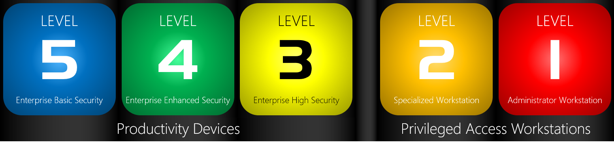

# Introducing the security configuration framework

**Applies to**  

-   Windows 10

Security configuration is complex. With thousands of group policies available in Windows, choosing the “best” setting is difficult. 
It’s not always obvious which permutations of policies are required to implement a complete scenario, and there are often unintended consequences of some security lockdowns.

Because of this, with each release of Windows, Microsoft publishes [Windows security baselines](https://docs.microsoft.com/windows/security/threat-protection/windows-security-baselines), an industry-standard configuration that is broadly known and well-tested. 
However, many organizations have discovered that this baseline sets a very high bar. 
While appropriate for organizations with very high security needs such as those persistently targeted by Advanced Persistent Threats, some organizations have found that the cost of navigating the potential compatibility impact of this configuration is prohibitively expensive given their risk appetite. 
They can’t justify the investment in that very high level of security with an ROI. 

As such, Microsoft is introducing a new taxonomy for security configurations for Windows 10. 
This new security configuration framework, which we call the SECCON framework (remember "WarGames"?), organizes devices into one of 5 distinct security configurations.

- [Level 5 Enterprise Security](level-5-enterprise-security.md) – We recommend this configuration as the minimum security configuration for an enterprise device. Recommendations for this level are generally straightforward and are designed to be deployable within 30 days.
- [Level 4 Enterprise High Security](level-4-enterprise-high-security.md) – We recommend this configuration for devices where users access sensitive or confidential information. Some of the controls may have an impact to app compat, and therefore will often go through an audit-configure-enforce workflow. Recommendations for this level are generally accessible to most organizations and are designed to be deployable within 90 days.
- [Level 3 Enterprise VIP Security](level-3-enterprise-vip-security.md) – We recommend this configuration for devices run by an organization with a larger or more sophisticated security team, or for specific users or groups who are at uniquely high risk (as one example, one organization identified users who handle data whose theft would directly and seriously impact their stock price). An organization likely to be targeted by well-funded and sophisticated adversaries should aspire to this configuration. Recommendations for this level can be complex (for example, removing local admin rights for some organizations can be a long project in and of itself) and can often go beyond 90 days.
- [Level 2 DevOps Workstation](level-2-enterprise-devops-security.md) – We recommend this configuration for developers and testers, who are an attractive target both for supply chain attacks and access to servers and systems containing high value data or where critical business functions could be disrupted. Level 2 guidance is coming soon!
- [Level 1 Administrator Workstation](level-1-enterprise-administrator-security.md) – Administrators (particularly of identity or security systems) present the highest risk to the organization, through data theft, data alteration, or service disruption. Level 1 guidance is coming soon!

The security configuration framework divides configuration into Productivity Devices and Privileged Access Workstations. This document will focus on Productivity Devices
(Levels 5, 4, and 3). 
Microsoft’s current guidance on [Privileged Access Workstations](http://aka.ms/privsec) are part of the [Securing Privileged Access roadmap](http://aka.ms/privsec).

Microsoft recommends reviewing and categorizing your devices, and then configuring them using the prescriptive guidance for that level. 
Level 5 should be considered the minimum baseline for an enterprise device, and Microsoft recommends increasing the protection based on both threat environment and risk appetite.

## Security control classification

The recommendations are grouped into three categories.

## Security control deployment methodologies

The way Microsoft recommends implementing these controls depends on the
auditability of the control–there are two primary methodologies.

 

