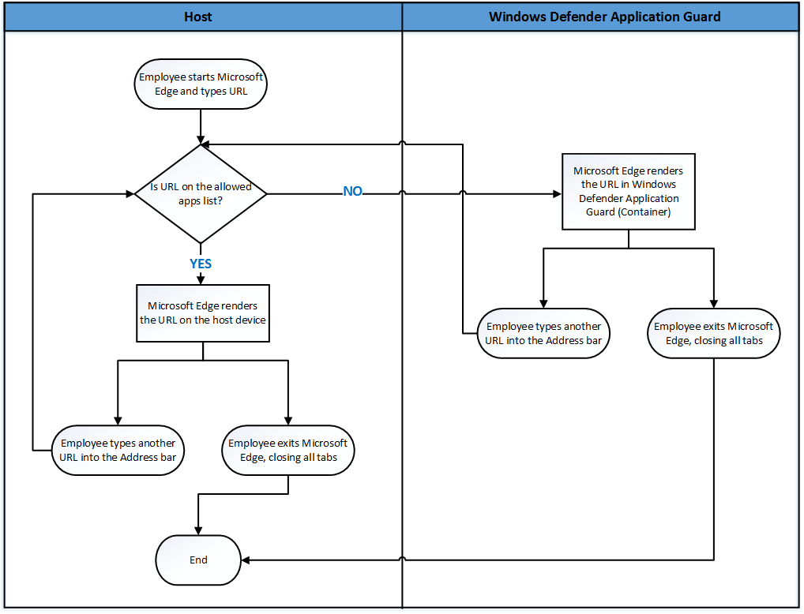

# Prepare and install Windows Defender Application Guard

**Applies to:**
- Windows 10 Enterprise edition, version 1709

## Prepare to install Windows Defender Application Guard 
Before you can install and use Windows Defender Application Guard, you must determine which way you intend to use it in your enterprise. You can use Application Guard in either **Standalone** or **Enterprise-managed** mode.

- **Standalone mode.** Employees can use hardware-isolated browsing sessions without any administrator or management policy configuration. In this mode, you must install Application Guard and then the employee must manually start Microsoft Edge in Application Guard while browsing untrusted sites. For an example of how this works, see the [Application Guard in standalone mode](test-scenarios-wd-app-guard.md) testing scenario.

- **Enterprise-managed mode.** You and your security department can define your corporate boundaries by explicitly adding trusted domains and by customizing the Application Guard experience to meet and enforce your needs on employee devices. Enterprise-managed mode also automatically redirects any browser requests to load non-enterprise domain(s) in the container.

The following diagram shows the flow between the host PC and the isolated container.


## Install Application Guard
Application Guard functionality is turned off by default. However, you can quickly install it on your employee’s devices through the Control Panel, PowerShell, or your mobile device management (MDM) solution.

**To install by using the Control Panel**
1. Open the **Control Panel**, click **Programs,** and then click **Turn Windows features on or off**.

    

2. Select the check box next to **Windows Defender Application Guard** and then click **OK**.

   Application Guard and its underlying dependencies are all installed.

**To install by using PowerShell**
1. Click the **Search** or **Cortana** icon in the Windows 10 taskbar and type **PowerShell**.
   
2. Right-click **Windows PowerShell**, and then click **Run as administrator**.

   Windows PowerShell opens with administrator credentials.

3. Type the following command:

    ```
    Enable-WindowsOptionalFeature -online -FeatureName Windows-Defender-ApplicationGuard
    ```
4. Restart the device.

   Application Guard and its underlying dependencies are all installed.

