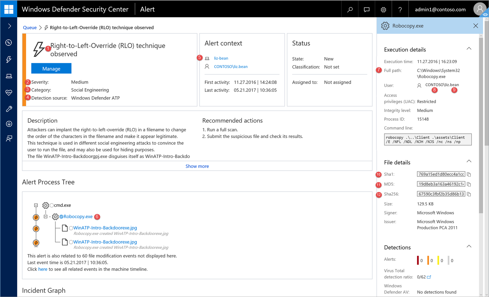
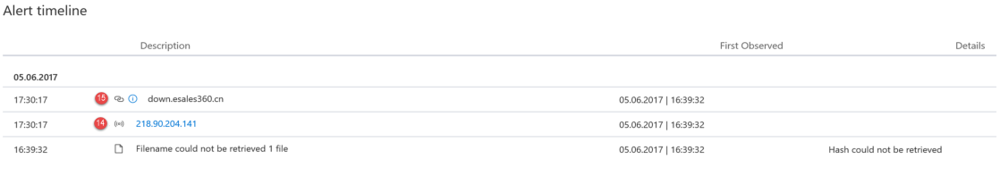
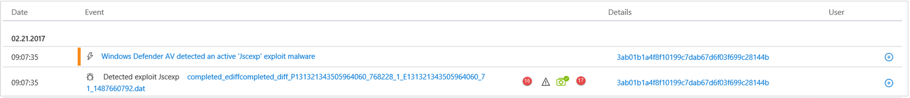
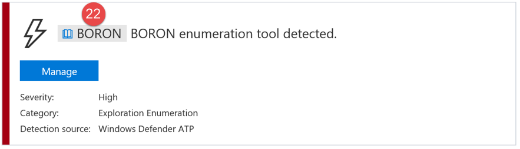

# Windows Defender ATP alert API fields

**Applies to:**

- Windows 10 Enterprise
- Windows 10 Education
- Windows 10 Pro
- Windows 10 Pro Education
- Windows Defender Advanced Threat Protection (Windows Defender ATP)

[!include[Prerelease information](prerelease.md)]

Understand what data fields are exposed as part of the alerts API and how they map to the Windows Defender ATP portal.

##	Alert API fields and portal mapping
The following table lists the available fields exposed in the alerts API payload. It shows examples for the populated values and a reference on how data is reflected on the portal.

The ArcSight field column contains the default mapping between the Windows Defender ATP fields and the built-in fields in ArcSight. You can download the mapping file from the portal when you enable the SIEM integration feature and you can modify it to match the  needs of your organization. For more information, see [Enable SIEM integration in Windows Defender ATP](enable-siem-integration-windows-defender-advanced-threat-protection.md).

Field numbers match the numbers in the images below.

<table style="table-layout:fixed;width:100%" >
  <tr>
    <th class>Portal label</th>
    <th class>SIEM field name</th>
    <th class>ArcSight field</th>
    <th class>Example value</th>
    <th class>Description</th>
    <th class></th>
  </tr>
  <tr>
    <td class>1</td>
    <td class>AlertTitle</td>
    <td class>name</td>
    <td class>A dll was unexpectedly loaded into a high integrity process without a UAC prompt</td>
    <td class>Value available for every alert.</td>
    <td class></td>
  </tr>
  <tr>
    <td class>2</td>
    <td class>Severity</td>
    <td class>deviceSeverity</td>
    <td class>Medium</td>
    <td class>Value available for every alert.</td>
    <td class></td>
  </tr>
  <tr>
    <td class>3</td>
    <td class>Category</td>
    <td class>deviceEventCategory</td>
    <td class>Privilege Escalation</td>
    <td class>Value available for every alert.</td>
    <td class></td>
  </tr>
  <tr>
    <td class>4</td>
    <td class>Source</td>
    <td class>sourceServiceName</td>
    <td class>WindowsDefenderATP</td>
    <td class>Windows Defender Antivirus or Windows Defender ATP. Value available for every alert.</td>
    <td class></td>
  </tr>
  <tr>
    <td class>5</td>
    <td class>MachineName</td>
    <td class>sourceHostName</td>
    <td class>liz-bean</td>
    <td class>Value available for every alert.</td>
    <td class></td>
  </tr>
  <tr>
    <td class>6</td>
    <td class>FileName</td>
    <td class>fileName</td>
    <td class>Robocopy.exe</td>
    <td class>Available for alerts associated with a file or process.</td>
    <td class></td>
  </tr>
  <tr>
    <td class>7</td>
    <td class>FilePath</td>
    <td class>filePath</td>
    <td class>C:\Windows\System32\Robocopy.exe</td>
    <td class>Available for alerts associated with a file or process. \</td>
    <td class></td>
  </tr>
  <tr>
    <td class>8</td>
    <td class>UserDomain</td>
    <td class>sourceNtDomain</td>
    <td class>contoso</td>
    <td class>The domain of the user context running the activity, available for Windows Defender ATP behavioral based alerts.</td>
    <td class></td>
  </tr>
  <tr>
    <td class>9</td>
    <td class>UserName</td>
    <td class>sourceUserName</td>
    <td class>liz-bean</td>
    <td class>The user context running the activity, available for Windows Defender ATP behavioral based alerts.</td>
    <td class></td>
  </tr>
  <tr>
    <td class>10</td>
    <td class>Sha1</td>
    <td class>fileHash</td>
    <td class>5b4b3985339529be3151d331395f667e1d5b7f35</td>
    <td class>Available for alerts associated with a file or process.</td>
    <td class></td>
  </tr>
  <tr>
    <td class>11</td>
    <td class>Md5</td>
    <td class>deviceCustomString5</td>
    <td class>55394b85cb5edddff551f6f3faa9d8eb</td>
    <td class>Available for Windows Defender AV alerts.</td>
    <td class></td>
  </tr>
  <tr>
    <td class>12</td>
    <td class>Sha256</td>
    <td class>deviceCustomString6</td>
    <td class>9987474deb9f457ece2a9533a08ec173a0986fa3aa6ac355eeba5b622e4a43f5</td>
    <td class>Available for Windows Defender AV alerts.</td>
    <td class></td>
  </tr>
  <tr>
    <td class>13</td>
    <td class>ThreatName</td>
    <td class>eviceCustomString1</td>
    <td class>Trojan:Win32/Skeeyah.A!bit</td>
    <td class>Available for Windows Defender AV alerts.</td>
    <td class></td>
  </tr>
  <tr>
    <td class>14</td>
    <td class>IpAddress</td>
    <td class>sourceAddress</td>
    <td class>218.90.204.141</td>
    <td class>Available for alerts associated to network events. For example, 'Communication to a malicious network destination'.</td>
    <td class></td>
  </tr>
  <tr>
    <td class>15</td>
    <td class>Url</td>
    <td class>requestUrl</td>
    <td class>down.esales360.cn</td>
    <td class>Availabe for alerts associated to network events. For example, 'Communication to a malicious network destination'.</td>
    <td class></td>
  </tr>
  <tr>
    <td class>16</td>
    <td class>RemediationIsSuccess</td>
    <td class>deviceCustomNumber2</td>
    <td class>TRUE</td>
    <td class>Available for Windows Defender AV alerts. ArcSight value is 1 when TRUE and 0 when FALSE.</td>
    <td class></td>
  </tr>
  <tr>
    <td class>17</td>
    <td class>WasExecutingWhileDetected</td>
    <td class>deviceCustomNumber1</td>
    <td class>FALSE</td>
    <td class>Available for Windows Defender AV alerts. ArcSight value is 1 when TRUE and 0 when FALSE.</td>
    <td class></td>
  </tr>
  <tr>
    <td class>18</td>
    <td class>AlertId</td>
    <td class>externalId</td>
    <td class>636210704265059241_673569822</td>
    <td class>Value available for every alert.</td>
    <td class></td>
  </tr>
  <tr>
    <td class>19</td>
    <td class>LinkToWDATP</td>
    <td class>flexString1</td>
    <td class>`https://securitycenter.windows.com/alert/636210704265059241_673569822`</td>
    <td class>Value available for every alert.</td>
    <td class></td>
  </tr>
  <tr>
    <td class>20</td>
    <td class>AlertTime</td>
    <td class>deviceReceiptTime</td>
    <td class>2017-05-07T01:56:59.3191352Z</td>
    <td class>The time the activity relevant to the alert occurred. Value available for every alert.</td>
    <td class></td>
  </tr>
  <tr>
    <td class>21</td>
    <td class>MachineDomain</td>
    <td class>sourceDnsDomain</td>
    <td class>contoso.com</td>
    <td class>Domain name not relevant for AAD joined machines. Value available for every alert.</td>
    <td class></td>
  </tr>
  <tr>
    <td class>22</td>
    <td class>Actor</td>
    <td class>deviceCustomString4</td>
    <td class></td>
    <td class>Available for alerts related to a known actor group.</td>
    <td class></td>
  </tr>
  <tr>
    <td class>21+5</td>
    <td class>ComputerDnsName</td>
    <td class>No mapping</td>
    <td class>liz-bean.contoso.com</td>
    <td class>The machine fully qualified domain name. Value available for every alert.</td>
    <td class></td>
  </tr>
  <tr>
    <td class></td>
    <td class>LogOnUsers</td>
    <td class>sourceUserId</td>
    <td class>contoso\liz-bean; contoso\jay-hardee</td>
    <td class>The domain and user of the interactive logon user/s at the time of the event. Note: For machines on Windows 10 version 1607, the domain information will not be available.</td>
    <td class></td>
  </tr>
  <tr>
    <td class>Internal field</td>
    <td class>LastProcessedTimeUtc</td>
    <td class>No mapping</td>
    <td class>2017-05-07T01:56:58.9936648Z</td>
    <td class>Time when event arrived at the backend. This field can be used when setting the request parameter for the range of time that alerts are retrieved.</td>
    <td class></td>
  </tr>
  <tr>
    <td class></td>
    <td class>Not part of the schema</td>
    <td class>deviceVendor</td>
    <td class></td>
    <td class>Static value in the ArcSight mapping - 'Microsoft'.</td>
    <td class></td>
  </tr>
  <tr>
    <td class></td>
    <td class>Not part of the schema</td>
    <td class>deviceProduct</td>
    <td class></td>
    <td class>Static value in the ArcSight mapping - 'Windows Defender ATP'.</td>
    <td class></td>
  </tr>
  <tr>
    <td class></td>
    <td class>Not part of the schema</td>
    <td class>deviceVersion</td>
    <td class></td>
    <td class>Static value in the ArcSight mapping - '2.0', used to identify the mapping versions.</td>
    <td class></td>
  </tr>
</table>

## Related topics
- [Enable SIEM integration in Windows Defender ATP](enable-siem-integration-windows-defender-advanced-threat-protection.md)
- [Configure Splunk to pull Windows Defender ATP alerts](configure-splunk-windows-defender-advanced-threat-protection.md)
- [Configure ArcSight to pull Windows Defender ATP alerts](configure-arcsight-windows-defender-advanced-threat-protection.md)
- [Pull Windows Defender ATP alerts using REST API](pull-alerts-using-rest-api-windows-defender-advanced-threat-protection.md)
- [Troubleshoot SIEM tool integration issues](troubleshoot-siem-windows-defender-advanced-threat-protection.md)
