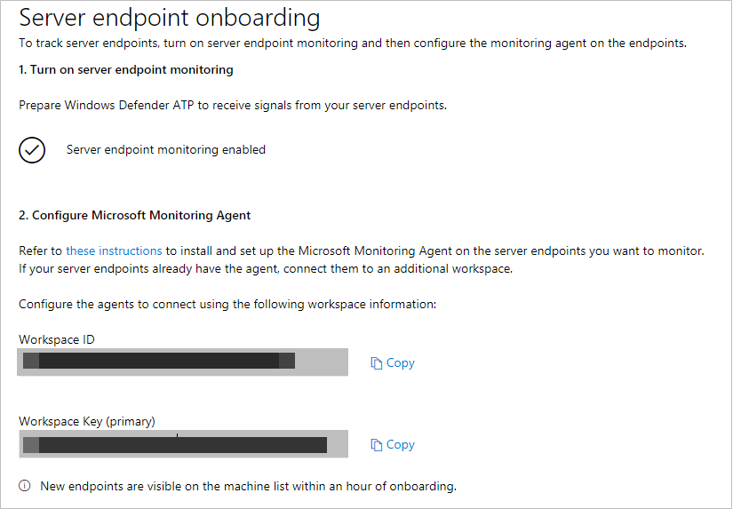

# Configure Windows Defender ATP server endpoints

**Applies to:**

- Windows Server 2012 R2
- Windows Server 2016
- Windows Defender Advanced Threat Protection (Windows Defender ATP)

[!include[Prerelease information](prerelease.md)]

>Want to experience Windows Defender ATP? [Sign up for a free trial.](https://www.microsoft.com/en-us/WindowsForBusiness/windows-atp?ocid=docs-wdatp-configserver-abovefoldlink)

Windows Defender ATP extends support to also include the Windows Server operating system, providing advanced attack detection and investigation capabilities, seamlessly through the Windows Defender Security Center console.

Windows Defender ATP supports the onboarding of the following servers:
- Windows Server 2012 R2
- Windows Server 2016

## Onboard server endpoints

To onboard your servers to Windows Defender ATP, you’ll need to:

- Turn on server monitoring from the Windows Defender Security Center portal.
- If you're already leveraging System Center Operations Manager (SCOM) or Operations Management Suite (OMS), simply attach the Microsoft Monitoring Agent (MMA) to report to your Windows Defender ATP workspace through [Multi Homing support](https://blogs.technet.microsoft.com/msoms/2016/05/26/oms-log-analytics-agent-multi-homing-support/). Otherwise, install and configure MMA to report sensor data to Windows Defender ATP as instructed below.

>[!TIP]
> After onboarding the endpoint, you can choose to run a detection test to verify that an endpoint is properly onboarded to the service. For more information, see [Run a detection test on a newly onboarded Windows Defender ATP endpoint](run-detection-test-windows-defender-advanced-threat-protection.md).

### Turn on Server monitoring from the Windows Defender Security Center portal

1. In the navigation pane, select **Endpoint management** > **Servers**. 

2. Click **Turn on server monitoring** and confirm that you'd like to proceed with the environment set up. When the set up completes, the **Workspace ID** and **Workspace key** fields are populated with unique values. You'll need to use these values to configure the MMA agent.

    

### Install and configure Microsoft Monitoring Agent (MMA) to report sensor data to Windows Defender ATP 

1.	Download the agent setup file: [Windows 64-bit agent](https://go.microsoft.com/fwlink/?LinkId=828603).

2.	Using the Workspace ID and Workspace key provided in the previous procedure, choose any of the following installation methods to install the agent on the server:
    - [Manually install the agent using setup](https://docs.microsoft.com/en-us/azure/log-analytics/log-analytics-windows-agents#install-the-agent-using-setup)  
    On the **Agent Setup Options** page, choose **Connect the agent to Azure Log Analytics (OMS)**.
    - [Install the agent using the command line](https://docs.microsoft.com/en-us/azure/log-analytics/log-analytics-windows-agents#install-the-agent-using-the-command-line) and [configure the agent using a script](https://docs.microsoft.com/en-us/azure/log-analytics/log-analytics-windows-agents#add-a-workspace-using-a-script). 

3.	You'll need to configure proxy settings for the Microsoft Monitoring Agent. For more information, see [Configure proxy settings](https://docs.microsoft.com/en-us/azure/log-analytics/log-analytics-windows-agents#configure-proxy-settings).

Once completed, you should see onboarded servers in the portal within an hour.

### Configure server endpoint proxy and Internet connectivity settings 
- Each Windows server must be able to connect to the Internet using HTTPS. This connection can be direct, using a proxy, or through the [OMS Gateway](https://docs.microsoft.com/en-us/azure/log-analytics/log-analytics-oms-gateway).
- If a proxy or firewall is blocking all traffic by default and allowing only specific domains through or HTTPS scanning (SSL inspection) is enabled, make sure that the following URLs are white-listed to permit communication with Windows Defender ATP service:

|    Agent Resource    |    Ports    |
|------------------------------------|-------------|
|    *.oms.opinsights.azure.com    |    443    |
|    *.blob.core.windows.net    |    443    |
|    *.azure-automation.net    |    443    |
|    *.ods.opinsights.azure.com    |    443    |
|    winatp-gw-cus.microsoft.com     |    443    |
|    winatp-gw-eus.microsoft.com    |    443    |
|    winatp-gw-neu.microsoft.com    |    443    |
|    winatp-gw-weu.microsoft.com    |    443    |

### Offboard server endpoints 
To offboard the server, you can uninstall the MMA agent from the server or detach it from reporting to your Windows Defender ATP workspace. After offboarding the agent, the server will no longer send sensor data to Windows Defender ATP.
For more information, see [To disable an agent](https://docs.microsoft.com/en-us/azure/log-analytics/log-analytics-windows-agents#to-disable-an-agent).

>[!NOTE]
>Offboarding causes the server to stop sending sensor data to the portal but data from the server, including reference to any alerts it has had will be retained for up to 6 months.

## Related topics
- [Configure Windows Defender ATP client endpoints](configure-endpoints-windows-defender-advanced-threat-protection.md)
- [Configure non-Windows endpoints](configure-endpoints-non-windows-windows-defender-advanced-threat-protection.md)
- [Configure proxy and Internet connectivity settings](configure-proxy-internet-windows-defender-advanced-threat-protection.md)
- [Run a detection test on a newly onboarded Windows Defender ATP endpoint](run-detection-test-windows-defender-advanced-threat-protection.md)
- [Troubleshooting Windows Defender Advanced Threat Protection onboarding issues](troubleshoot-onboarding-windows-defender-advanced-threat-protection.md)
