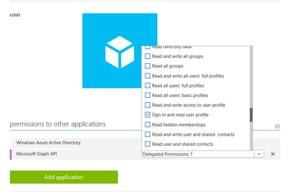

# Manage Windows Defender ATP alerts using application program interface (APIs)

**Applies to:**

- Windows 10 Enterprise
- Windows 10 Education
- Windows 10 Pro
- Windows 10 Pro Education
- Windows Defender Advanced Threat Protection (Windows Defender ATP)

Windows Defender ATP supports the OAuth 2.0 protocol. Using the OAuth 2.0 Authentication flow, you can use programmatic APIs to take response actions and leverage the rich host-based collected information to enrich signals from other sources through the Microsoft Security Graph. For more information, see OAuth 2.0 Authorization Code Flow.

In general, you’ll need to take the following steps to use the APIs:
-	Create an app
-	Fetch a token
-	Run queries on the graph API

### Before you begin
Before using the APIs, you’ll need to create an app that you’ll use to authenticate against the graph. You’ll need to create a native app to use for the adhoc queries. 

## Create an app

1.	Log on to [Azure](https://manage.windowsazure.com).

2.	Navigate to **Active Directory**. 

3.	Select the tenant you want to register this app in - you can have several tenants. You are advised to have at least one separate development or test tenant in addition to a production tenant. 

4.	Go to the **Applications** tab and click **Add**.

5.	Select **Add an application my organization is developing**.

    

6.	Provide a name for the application and select **Native client application**.

    

7.	Provide the redirect URI.

      

8.	Click **Configure**, then at the end of the page click **Add application**.

9.	Select **Microsoft Graph API**.

10.	Choose **Sign in and read user profile** from the Delegated Permissions dropdown.

    

## Get an access token
1.	Get the Client ID from the application you created.

2. Use the **Client ID**. For example:
    ```
    private const string authority = "https://login.microsoftonline.com/common/oauth2/v2.0/authorize";
    private const string resourceId = "https://graph.microsoft.com";
    private const string clientId = "{YOUR CLIENT ID/APP ID HERE}";
    private const string redirect = "https://localhost"; 
    HttpClient client = new HttpClient();
    AuthenticationContext auth = new AuthenticationContext(authority);
    var token = auth.AcquireTokenAsync(resourceId, clientId, new Uri(redirect), new PlatformParameters(PromptBehavior.Auto)).Result;
    client.DefaultRequestHeaders.Authorization = new AuthenticationHeaderValue(token.AccessTokenType, token.AccessToken);
    ```

## Query the graph
Once the bearer token is retrieved, you can easily invoke the graph APIs. For example:

```
client.DefaultRequestHeaders.Accept.Add(new MediaTypeWithQualityHeaderValue("application/json")); 
// sample endpoint
string ep = @"https://graph.microsoft.com/{VERSION}/alerts?$top=5";
HttpResponseMessage response = client.GetAsync(ep).Result;
string resp = response.Content.ReadAsStringAsync().Result;
Console.WriteLine($"response for: {ep} \r\n {resp}");
```
## Supported APIs

| Entity | Action | Description | Functions | Route |
|---------|---------------|--------------------------------------------------------------------------|--------------------------------------------|-------------------------------------------|
| Actor | Get | Retrieves an actor report from the CMS. | $top, $select, $count | /actor/{id} |
|  | GetAlerts | Retrieves all alerts related to a given actor. | $expand, $top, $select, $count | /actor/{id}/alerts |
| Alerts | Get | Retrieves top recent alerts | $top, $select, $count, $skip, $expand | /alerts |
|  | Get | Retrieves an alert by its ID | $top, $select, $count, $expand | /alerts/{id} |
|  | GetMachines | Retrieves all machines related to a specific alert | $top, $select, $count | /alerts/{id}/machines |
|  | GetFiles | Retrieves all files related to a specific alert | $top, $select, $count | /alerts/{id}/files |
|  | GetActor | Retrieves the actor related to the specific alert | $top, $select, $count | /alerts/{id}/actor |
|  | GetDomains | Retrieves all domains related to a specific alert | $top, $select, $count | /alerts/{id}/domains |
|  | GetIPs | Retrieves all IPs related to a specific alert | $top, $select, $count | /alerts/{id}/ips |
| Machine | Get | Retrieves a collection of recently seen machines | $top, $select, $count, $skip | /machines |
|  | Get | Retrieves a machine entity by ID | $top, $select, $count | /machines/{id} |
|  | GetAlerts | Retrieves a collection of alerts related to a given machine ID | $top, $select, $count, $expand | /machines/{id}/alerts |
|  | GetLogOnUsers | Retrieves a collection of logged on users related to a given machine ID | $top, $select, $count | /machines/{id}/logonusers |
|  | Find | Find a machine entity around a specific timestamp by FQDN or internal IP | $top, $select, $count, $expand(logonusers) | /machines/find(key={id},timestamp={time}) |
| User | Get | Retrieve a User entity by key (user name or domain\user) | $top, $select, $count | /users/{id} |
|  | GetAlerts | Retrieves a collection of alerts related to a given user ID | $top, $select, $count, $expand | /users/{id}/alerts |
|  | GetMachines | Retrieves a collection of machines related to a given user ID | $top, $select, $count | /users/{id}/machines |
| Domain | Get | Retrieves a domain entity | $top, $select, $count | /domains/{id} |
|  | GetAlerts | Retrieves a collection of alerts related to a given domain address | $top, $select, $count, $expand | /domains/{id}/alerts |
|  | GetMachines | Retrieves a collection of machines related to a given domain address | $top, $select, $count | /domains/{id}/machines |
|  | Stats | Retrieves the prevalence for the given domain |  | /domains/{id}/stats |
| IP | Get | Retrieves an IP entity | $top, $select, $count | /ips/{id} |
|  | GetAlerts | Retrieves a collection of alerts related to a given IP address | $top, $select, $count, $expand | /ips/{id}/alerts |
|  | GetMachines | Retrieves a collection of machines related to a given IP address | $top, $select, $count | /ips/{id}/machines |
|  | Stats | Retrieves the prevalence for the given IP |  | /ips/{id}/stats |
| File | Get | Retrieves a file by identifier(Sha1, Sha256, MD5) | $top, $select, $count | /files/{id} |
|  | GetAlerts | Retrieves a collection of alerts related to a given file hash | $top, $select, $count, $expand | /files/{id}/alerts |
|  | GetMachines | Retrieves a collection of machines related to a given file hash | $top, $select, $count | /files{id}/machines |
|  | Stats | Retrieves the prevalence for the given file |  | /files/{id}/machines |

### Example queries
After creating the application, you can run the following queries.

Fetching the top 20 alerts with machine information:
```
private const string authority = "https://login.microsoftonline.com/common/oauth2/v2.0/authorize";
private const string resourceId = "https://graph.microsoft.com";
private const string clientId = "{YOUR CLIENT ID/APP ID HERE}";
private const string redirect = "https://localhost";
HttpClient client = new HttpClient();
AuthenticationContext auth = new AuthenticationContext(authority);
var token = auth.AcquireTokenAsync(resourceId, clientId, new Uri(redirect), new PlatformParameters(PromptBehavior.Auto)).Result;
client.DefaultRequestHeaders.Authorization = new AuthenticationHeaderValue(token.AccessTokenType, token.AccessToken);
var ep = $"{resourceId}/{apiVersion}/alerts?$top=20&$expand=machine"; // the query itself in yellow
HttpResponseMessage response = client.GetAsync(ep).Result;
string resp = response.Content.ReadAsStringAsync().Result;
Console.WriteLine($"response for: {ep} \r\n {resp}");
``` 

Response:
```
{
    "@odata.context": "https://graph.microsoft-ppe.com/testwdatp/$metadata#Alerts",
    "@odata.count": 20,
    "@odata.nextLink": "https://graph.microsoft-ppe.com/testwdatp/alerts?$top=20&$expand=machine&$skip=20",
    "value": [
        {
            "id": "636341278149188342_1960231459",
            "severity": "Medium",
            "status": "New",
            "description": "A process has injected code into another process using process hollowing technique, indicating suspicious code being run in the target process memory. Injection is often used to hide malicious code execution within a trusted process. \nAs a result, the target process may exhibit abnormal behaviors such as opening a listening port or connecting to a command and control server.",
            "recommendedAction": "1. Investigate the machine's timeline for any other indicators around the time of this alert \n2. Validate contextual information about the relevant components such as file prevalence, other machines it was observed on etc. \n3. Contact the machine's user to verify whether they received an email with a suspicious attachment or link around the time of the alert.\n4. Run a full malware scan on the machine, this may reveal additional related components. \n5. Consider submitting the relevant file(s) for deep analysis for detailed behavioral information. \n6. If initial investigation confirms suspicions, contact your incident response team for forensic analysis.",
            "alertCreationTime": "2017-06-27T02:36:53.7841015Z",
            "category": "Installation",
            "title": "Process hollowing detected",
            "threatFamilyName": null,
            "detectionSource": null,
            "classification": null,
            "determination": null,
            "assignedTo": null,
            "resolvedTime": null,
            "lastEventTime": "2017-06-29T10:11:54.2872094Z",
            "firstEventTime": "2017-06-27T02:30:23.9320988Z",
            "machine": {
                "id": "67e5ef2c2eab150cc8638e21dba19c1b0a41ad0b",
                "computerDnsName": null,
                "firstSeen": "0001-01-01T00:00:00Z",
                "isOnline": false,
                "osPlatform": null,
                "osVersion": null,
                "systemProductName": null,
                "lastIpAddress": null,
                "lastExternalIpAddress": null,
                "agentVersion": null,
                "osBuild": null,
                "healthStatus": "Active",
                "isAadJoined": null
            }
        },
}….

```
Related topics
- Create and build Power BI reports 