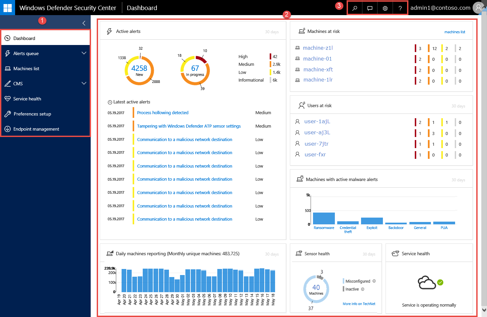

# Windows Defender Advanced Threat Protection portal overview

**Applies to:**

- Windows 10 Enterprise
- Windows 10 Education
- Windows 10 Pro
- Windows 10 Pro Education
- Windows Defender Advanced Threat Protection (Windows Defender ATP)

>Want to experience Windows Defender ATP? [Sign up for a free trial.](https://www.microsoft.com/en-us/WindowsForBusiness/windows-atp?ocid=docs-wdatp-portaloverview-abovefoldlink) 

Enterprise security teams can use the Windows Defender ATP portal to monitor and assist in responding to alerts of potential advanced persistent threat (APT) activity or data breaches.

You can use the [Windows Defender ATP portal](https://securitycenter.windows.com/) to:
- View, sort, and triage alerts from your endpoints
- Search for more information on observed indicators such as files and IP Addresses
- Change Windows Defender ATP settings, including time zone and review licensing information.

## Windows Defender ATP portal
When you open the portal, you’ll see the main areas of the application:

 

- (1) Navigation pane
- (2) Main portal
- (3) Search, Feedback, Settings, Help and support

> [!NOTE]
> Malware related detections will only appear if your endpoints are using [Windows Defender Antivirus](https://technet.microsoft.com/library/mt622091(v=vs.85).aspx) as the default real-time protection antimalware product.

You can navigate through the portal using the menu options available in all sections. Refer to the following table for a description of each section.

Area | Description
:---|:---
(1) Navigation pane | Use the navigation pane to move between the **Dashboards**, **Alerts queue**, **Machines list**, **Service health**, **Preferences setup**, and **Endpoint management**.
**Dashboards**	| Enables you to view the Security operations or the Security analytics dashboard.
**Alerts queue** | Enables you to view separate queues of new, in progress, resolved alerts, alerts assigned to you, and suppression rules.
**Machines list** | Displays the list of machines that are onboarded to Windows Defender ATP, some information about them, and the corresponding number of alerts.
**Service health** | Provides information on the current status of the Window Defender ATP service. You'll be able to verify that the service health is healthy or if there are current issues.
**Preferences setup** |	Shows the settings you selected during onboarding and lets you update your industry preferences and retention policy period. You can also set other configuration settings such as email notifications, activate the preview experience, enable or turn off advanced features, SIEM integration, threat intel API, build Power BI reports, and set baselines for the Security analytics dashboard.
**Endpoint management** |	Provides access to endpoints such as clients and servers. Allows you to download the onboarding configuration package for endpoints. It also provides access to endpoint offboarding.
(2) Main portal| Main area where you will see the different views such as the Dashboards, Alerts queue, and Machines list.
(3) Search bar, Feedback, Settings, Help and support | **Search** - Provides access to the search bar where you can search for file, IP, machine, URL, and user. Displays the Search box: the drop-down list allows you to select the entity type and then enter the search query text.    **Feedback** - Access the feedback button to provide comments about the portal.   **Settings** - Gives you access to the configuration settings where you can set time zones and view license information.   **Help and support** - Gives you access to the Windows Defender ATP guide, Microsoft support, and Premier support.

## Windows Defender ATP icons
The following table provides information on the icons used all throughout the portal:

Icon | Description
:---|:---
| Windows Defender ATP logo
| Alert – Indication of an activity correlated with advanced attacks.
| Detection – Indication of a malware threat detection.
| Active threat – Threats actively executing at the time of detection.
| Remediated – Threat removed from the machine.
| Not remediated – Threat not removed from the machine.
| Indicates events that triggered an alert in the **Alert process tree**.
| Machine icon
| Windows Defender Antivirus events
| Windows Defender Application Guard events
| Windows Defender Device Guard events
| Windows Defender Exploit Guard events
| Windows Defender SmartScreen events
| Windows Firewall events
| Response action
| Process events
| Network events
| File  events
| Registry events
| Load DLL events
| Other events
| Access token modification
| File creation
| Signer
| File path
| Command line
| Unsigned file
| Process tree
| Memory allocation
| Process injection
| Powershell command run

## Related topic
[Use the Windows Defender Advanced Threat Protection portal](use-windows-defender-advanced-threat-protection.md)