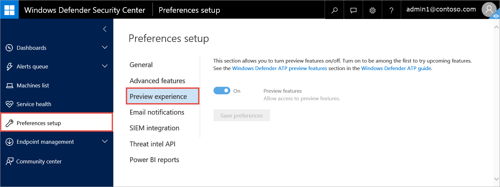

# Turn on the preview experience in Windows Defender ATP

**Applies to:**

- Windows 10 Enterprise
- Windows 10 Education
- Windows 10 Pro
- Windows 10 Pro Education
- Windows Defender Advanced Threat Protection (Windows Defender ATP)

>Want to experience Windows Defender ATP? [Sign up for a free trial.](https://www.microsoft.com/en-us/WindowsForBusiness/windows-atp?ocid=docs-wdatp-previewsettings-abovefoldlink)

Turn on the preview experience setting to be among the first to try upcoming features.

1. In the navigation pane, select **Preferences setup** > **Preview experience**.

    

2. Toggle the setting between **On** and **Off** and select **Save preferences**.

## Related topics
- [Update general settings in Windows Defender ATP](general-settings-windows-defender-advanced-threat-protection.md)
- [Turn on advanced features in Windows Defender ATP](advanced-features-windows-defender-advanced-threat-protection.md)
- [Configure email notifications in Windows Defender ATP](configure-email-notifications-windows-defender-advanced-threat-protection.md)
- [Enable SIEM integration in Windows Defender ATP](enable-siem-integration-windows-defender-advanced-threat-protection.md)
- [Enable the custom threat intelligence API in Windows Defender ATP](enable-custom-ti-windows-defender-advanced-threat-protection.md)
- [Create and build Power BI reports](powerbi-reports-windows-defender-advanced-threat-protection.md)
