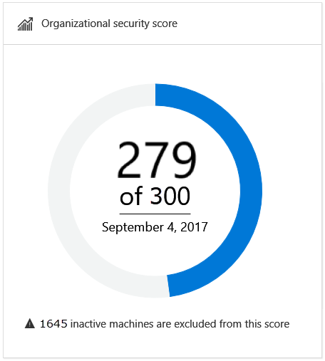
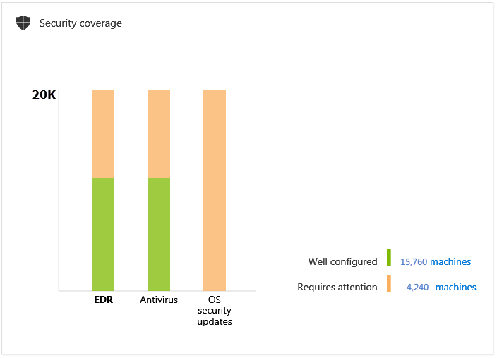
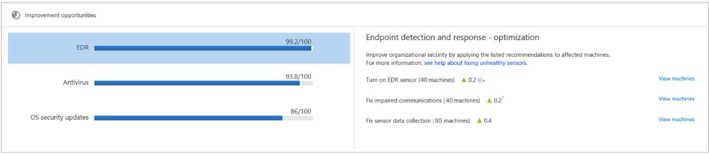

# View the Windows Defender Advanced Threat Protection Security analytics dashboard

**Applies to:**

- Windows 10 Enterprise
- Windows 10 Education
- Windows 10 Pro
- Windows 10 Pro Education
- Windows Defender Advanced Threat Protection (Windows Defender ATP)

[!include[Prerelease information](prerelease.md)]

The Security Analytics dashboard expands your visibility into the overall security posture of your organization. From this dashboard, you'll be able to quickly assess the security posture of your organization, see machines that require attention, as well as recommendations for actions to further reduce the attack surface in your organization - all in one place. From there you can take action based on the recommended configuration baselines.

The **Security analytics dashboard** displays a snapshot of:
- Organizational security score
- Security coverage
- Improvement opportunities

## Organizational security score
The organization security score is reflective of the average score of all the Windows Defender security controls that are configured according to the recommended baseline. You can improve this score by taking the steps in configuring each of the security controls in the optimal settings.

Each Windows Defender security control from the **Security coverage** tile contributes 100 points to the organizational security score.

The denominator is reflective of the organizational score potential and calculated by multiplying the number of supported security controls (Security coverage pillars) by the maximum points that each pillar contributes (maximum of 100 points for each pillar). 

In the example image, the total points from the **Improvement opportunities** tile add up to 279 points for the three pillars from the **Security coverage** tile.

## Security coverage
The security coverage tile shows a bar graph where each bar represents a Windows Defender security control. Each bar contributes 100 points to the overall organizational security score. It also represents the various Windows 10 security components with an indicator of the total number of machines that are well configured and those that require attention. Hovering on top of the individual bars will show exact numbers for each category.

## Improvement opportunities 
Improve your organizational security score by taking the recommended improvement actions listed on this tile. The goal is to reduce the gap between the perfect score and the current score for each control.

Click on each control to see the recommended optimizations.

The numbers beside the green triangle icon on each recommended action represents the number of points you can gain by taking the action.  When added together, the total number makes up the numerator in the fraction for each segment in the Improvement opportunities tile.

Recommendations that do not display a green action are informational only and no action is required. 

Clicking **View machines** in a specific recommendation opens up the **Machines list** with filters applied to show only the list of machines where the the recommendation is applicable. You can export the list in Excel to create a target collection and apply relevant policies using a management solution of your choice. 

The following image shows an example list of machines where the EDR sensor is not turned on.

### Endpoint detection and response (EDR) optimization
This tile provides a specific list of actions you can take on Windows Defender ATP to improve how endpoints provide sensor data to the Windows Defender ATP service.

You can take the following actions to increase the overall security score of your organization:
- Turn on sensor
- Fix sensor data collection
- Fix impaired communications

For more  information, see [Fix unhealthy sensors](fix-unhealhty-sensors-windows-defender-advanced-threat-protection.md). 

### Windows Defender Antivirus optimization
This tile provides a list of specific list of actions you can implement on endpoints with Windows Defender Antivirus to improve the security in your organization. Each action shows the exact number of endpoints where you can apply the action on.

You can take the following actions to increase the overall security score of your organization:

>[!NOTE]
> For the Windows Defender Antivirus properties to show,  you'll need to ensure that the Windows Defender Antivirus Cloud-based protection is properly configured on the endpoint. 

- Fix antivirus reporting
  - This recommendation is displayed when the Windows Defender Antivirus is not properly configured to report its health state. For more information on fixing the reporting, see [Configure and validate network connections](../windows-defender-antivirus/configure-network-connections-windows-defender-antivirus.md).
- Turn on antivirus
- Update antivirus definitions
- Turn on cloud-based protection
- Turn on real-time protection
- Turn on PUA protection

For more information, see [Configure Windows Defender Antivirus](../windows-defender-antivirus/configure-windows-defender-antivirus-features.md).

### OS security updates optimization
This tile shows you the exact number of machines that require the latest security updates. It also shows machines that are running on the latest Windows Insider preview build and serves as a reminder to ensure that users should run the latest builds.
 
You can take the following actions to increase the overall security score of your organization:
- Install the latest security updates

For more information on, see [Windows Update Troubleshooter](https://support.microsoft.com/en-us/help/4027322/windows-windows-update-troubleshooter).

## Related topics
- [View the Windows Defender Advanced Threat Protection Security operations dashboard](dashboard-windows-defender-advanced-threat-protection.md)
- [View and organize the Windows Defender Advanced Threat Protection Alerts queue ](alerts-queue-windows-defender-advanced-threat-protection.md)
- [Investigate Windows Defender Advanced Threat Protection alerts](investigate-alerts-windows-defender-advanced-threat-protection.md)
- [Investigate a file associated with a Windows Defender ATP alert](investigate-files-windows-defender-advanced-threat-protection.md)
- [Investigate an IP address associated with a Windows Defender ATP alert](investigate-ip-windows-defender-advanced-threat-protection.md)
- [Investigate a domain associated with a Windows Defender ATP alert](investigate-domain-windows-defender-advanced-threat-protection.md)
- [View and organize the Windows Defender ATP Machines list](machines-view-overview-windows-defender-advanced-threat-protection.md)
- [Investigate machines in the Windows Defender ATP Machines list](investigate-machines-windows-defender-advanced-threat-protection.md)
- [Investigate a user account in Windows Defender ATP ](investigate-user-windows-defender-advanced-threat-protection.md)
- [Manage Windows Defender Advanced Threat Protection alerts](manage-alerts-windows-defender-advanced-threat-protection.md)
- [Take response actions in Windows Defender ATP](response-actions-windows-defender-advanced-threat-protection.md)

