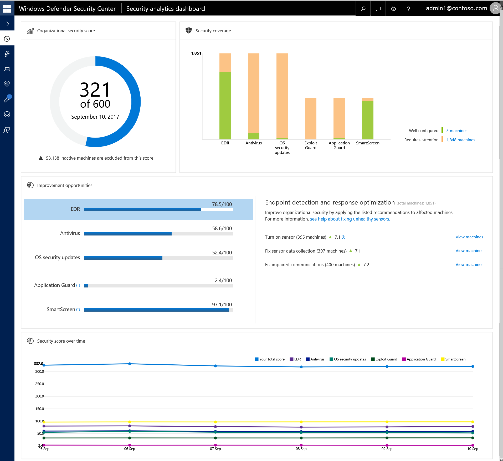
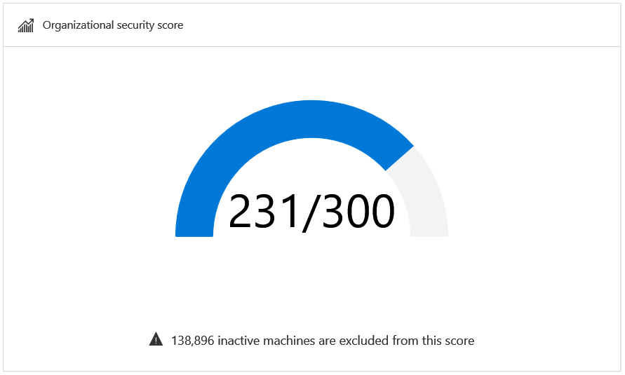
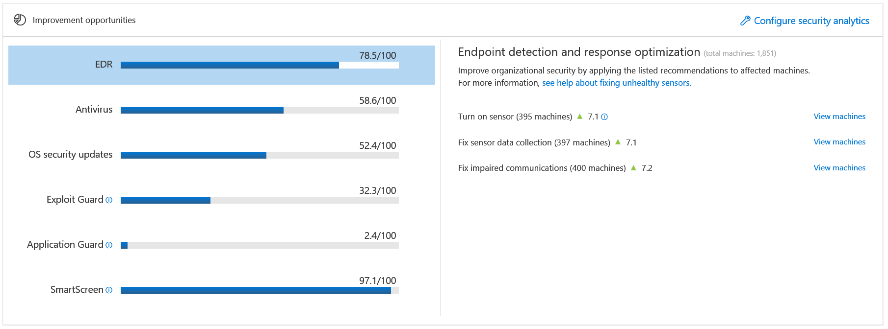
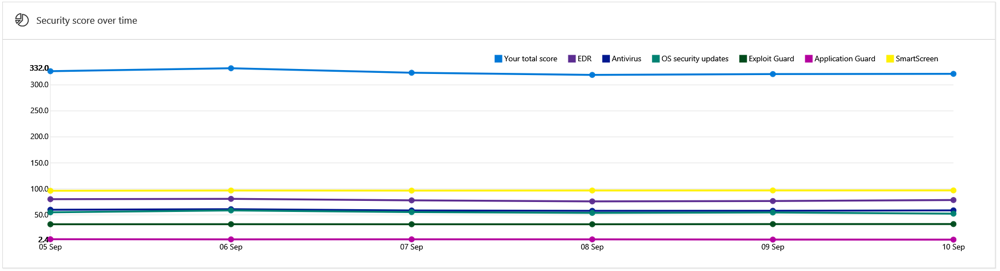

# View the Windows Defender Advanced Threat Protection Security analytics dashboard

**Applies to:**

- Windows 10 Enterprise
- Windows 10 Education
- Windows 10 Pro
- Windows 10 Pro Education
- Windows Defender Advanced Threat Protection (Windows Defender ATP)

>Want to experience Windows Defender ATP? [Sign up for a free trial.](https://www.microsoft.com/en-us/WindowsForBusiness/windows-atp?ocid=docs-wdatp-sadashboard-abovefoldlink) 

The Security Analytics dashboard expands your visibility into the overall security posture of your organization. From this dashboard, you'll be able to quickly assess the security posture of your organization, see machines that require attention, as well as recommendations for actions to further reduce the attack surface in your organization - all in one place. From there you can take action based on the recommended configuration baselines.

>[!IMPORTANT]
> This feature is available for machines on Windows 10, version  1703 or later. 

The **Security analytics dashboard** displays a snapshot of:
- Organizational security score
- Security coverage
- Improvement opportunities
- Security score over time

## Organizational security score
The organization security score is reflective of the average score of all the Windows Defender security controls that are configured according to the recommended baseline. You can improve this score by taking the steps in configuring each of the security controls in the optimal settings.

Each Windows Defender security control from the **Security coverage** tile contributes 100 points to the organizational security score. 

The denominator is reflective of the organizational score potential and calculated by multiplying the number of supported security controls (Security coverage pillars) by the maximum points that each pillar contributes (maximum of 100 points for each pillar). 

In the example image, the total points from the **Improvement opportunities** tile add up to 321 points for the six pillars from the **Security coverage** tile.

You can set the baselines for calculating the score of Windows Defender security controls on the Security Analytics dashboard through the **Preferences settings**. For more information, see [Enable Security Analytics security controls](enable-security-analytics-windows-defender-advanced-threat-protection.md).

## Security coverage
The security coverage tile shows a bar graph where each bar represents a Windows Defender security control. Each bar reflects the number of machines that are well configured and those that require **any kind of attention** for each security control. Hovering on top of the individual bars will show exact numbers for each category. Machines that are green are well configured, while machines that are orange require some level of attention. 

## Improvement opportunities 
Improve your organizational security score by taking the recommended improvement actions listed on this tile. The goal is to reduce the gap between the perfect score and the current score for each control.

Click on each control to see the recommended optimizations.

The numbers beside the green triangle icon on each recommended action represents the number of points you can gain by taking the action.  When added together, the total number makes up the numerator in the fraction for each segment in the Improvement opportunities tile.

>[!IMPORTANT]
>Recommendations that do not display a green triangle icon are informational only and no action is required. 

Clicking **View machines** in a specific recommendation opens up the **Machines list** with filters applied to show only the list of machines where the the recommendation is applicable. You can export the list in Excel to create a target collection and apply relevant policies using a management solution of your choice. 

The following image shows an example list of machines where the EDR sensor is not turned on.

## Security score over time
You can track the progression of your organizational security posture over time using this tile. It displays the overall and individual control scores in a historical trend line enabling you to see how taking the recommended actions increase your overall security posture.

You can click on specific date points to see the total score for that security control is on a particular date.

### Endpoint detection and response (EDR) optimization
For an endpoint to be considered "well configured", it must comply to a minimum baseline configuration setting. This tile shows you a specific list of actions you must apply on endpoints so that the minimum baseline configuration setting for your Endpoint detection and response tool.

#### Minimum baseline configuration setting for EDR:
- Windows Defender ATP sensor is on
- Data collection is working correctly
- Communication to Windows Defender ATP service is not impaired

#### Minimum baseline configuration setting for EDR:
You can take the following actions to increase the overall security score of your organization:
- Turn on sensor
- Fix sensor data collection
- Fix impaired communications

For more  information, see [Fix unhealthy sensors](fix-unhealhty-sensors-windows-defender-advanced-threat-protection.md). 

### Windows Defender Antivirus (Windows Defender AV) optimization
For an endpoint to be considered "well configured", it must comply to a minimum baseline configuration setting. This tile shows you a specific list of actions you must apply on endpoints so that the minimum baseline configuration setting for Windows Defender AV is fulfilled.

#### Minimum baseline configuration setting for Windows Defender AV:
Endpoints are considered "well configured" for Windows Defender AV if the following requirements are met:

- Windows Defender AV is reporting correctly
- Windows Defender AV is turned on
- Signature definitions are up to date
- Real-time protection is on
- Potentially Unwanted Application (PUA) protection is enabled

##### Recommended actions:
You can take the following actions to increase the overall security score of your organization:

>[!NOTE]
> For the Windows Defender Antivirus properties to show,  you'll need to ensure that the Windows Defender Antivirus Cloud-based protection is properly configured on the endpoint. 

- Fix antivirus reporting
  - This recommendation is displayed when the Windows Defender Antivirus is not properly configured to report its health state. For more information on fixing the reporting, see [Configure and validate network connections](../windows-defender-antivirus/configure-network-connections-windows-defender-antivirus.md).
- Turn on antivirus
- Update antivirus definitions
- Turn on real-time protection
- Turn on PUA protection

For more information, see [Configure Windows Defender Antivirus](../windows-defender-antivirus/configure-windows-defender-antivirus-features.md).

### OS security updates optimization
This tile shows you the exact number of machines that require the latest security updates. It also shows machines that are running on the latest Windows Insider preview build and serves as a reminder to ensure that users should run the latest builds.
 
You can take the following actions to increase the overall security score of your organization:
- Install the latest security updates
- Fix sensor data collection
  - The Windows Defender ATP service relies on sensor data collection to determine the security state of a machine. The service will not be able to determine the security state of machines that are not reporting sensor data properly. Therefore, it's important to ensure that sensor data collection is working properly. For more information, see [Fix unhealthy sensors](fix-unhealhty-sensors-windows-defender-advanced-threat-protection.md).

For more information, see [Windows Update Troubleshooter](https://support.microsoft.com/en-us/help/4027322/windows-windows-update-troubleshooter).

### Windows Defender Exploit Guard (Windows Defender EG) optimization
For an endpoint to be considered "well configured", it must comply to a minimum baseline configuration setting. This tile shows you a specific list of actions you must apply on endpoints so that the minimum baseline configuration setting for Windows Defender EG is fulfilled. When endpoints are configured according to the baseline you'll be able to see Windows Defender EG events on the Windows Defender ATP Machine timeline. 

#### Minimum baseline configuration setting for Windows Defender EG:
Endpoints are considered "well configured" for Windows Defender EG if the following requirements are met:

- System level protection settings are configured correctly
- Attack Surface Reduction rules are configured correctly
- Controlled Folder Access setting is configured correctly

##### System level protection:
The following system level configuration settings must be set to **On or Force On**:

1.	Control Flow Guard 
2.	Data Execution Prevention (DEP)
3.	Randomize memory allocations (Bottom-up ASLR)
4.	Validate exception chains (SEHOP)
5.	Validate heap integrity

>[!NOTE]
>The setting **Force randomization for images (Mandatory ASLR)** is currently excluded from the baseline.
>Consider configuring **Force randomization for images (Mandatory ASLR)** to **On or Force On** for better protection.

##### Attack Surface Reduction (ASR) rules:
The following ASR rules must be configured to **Block mode**:

Rule description | GUIDs 
-|-
Block executable content from email client and webmail | BE9BA2D9-53EA-4CDC-84E5-9B1EEEE46550
Block Office applications from creating child processes | D4F940AB-401B-4EFC-AADC-AD5F3C50688A
Block Office applications from creating executable content  | 3B576869-A4EC-4529-8536-B80A7769E899
Impede JavaScript and VBScript to launch executables | D3E037E1-3EB8-44C8-A917-57927947596D
Block execution of potentially obfuscated scripts  | 5BEB7EFE-FD9A-4556-801D-275E5FFC04CC
Block Win32 imports from Macro code in Office | 92E97FA1-2EDF-4476-BDD6-9DD0B4DDDC7B

>[!NOTE]
>The setting **Block Office applications from injecting into other processes** with GUID 75668C1F-73B5-4CF0-BB93-3ECF5CB7CC84 is excluded from the baseline.
>Consider enabling this rule in **Audit** or **Block mode** for better protection.

##### Controlled Folder Access
The Controlled Folder Access setting must be configured to **Audit mode** or **Enabled**.

>[!NOTE]
> Audit mode, allows you to see audit events in the Windows Defender ATP Machine timeline however it does not block suspicious applications.
>Consider enabling Controlled Folder Access for better protection.

##### Recommended actions:
You can take the following actions to increase the overall security score of your organization:
- Turn on all system-level Exploit Protection settings
- Set all ASR rules to enabled or audit mode
- Turn on Controlled Folder Access
- Turn on Windows Defender Antivirus on compatible machines

For more information, see [Windows Defender Exploit Guard](../windows-defender-exploit-guard/windows-defender-exploit-guard.md).

### Windows Defender Application Guard (Windows Defender AG) optimization
For an endpoint to be considered "well configured", it must comply to a minimum baseline configuration setting. This tile shows you a specific list of actions you must apply on endpoints so that the minimum baseline configuration setting for Windows Defender AG is fulfilled. When endpoints are configured according to the baseline you'll be able to see Windows Defender AG events on the Windows Defender ATP Machine timeline. 

#### Minimum baseline configuration setting for Windows Defender AG:
Endpoints are considered "well configured" for Windows Defender AG if the following requirements are met:

- Hardware and software prerequisites are met
- Windows Defender AG is turned on compatible machines
- Managed mode is turned on

##### Recommended actions:
You can take the following actions to increase the overall security score of your organization:
- Ensure hardware and software prerequisites are met
    
    >[!NOTE]
    >This improvement item does not contribute to the security score in itself because it's not a prerequisite for Windows Defender AG. It gives an indication of a potential reason why Windows Defender AG is not turned on.

- Turn on  Windows Defender AG on compatible machines
- Turn on managed mode

For more information, see [Windows Defender Application Guard overview](../windows-defender-application-guard/wd-app-guard-overview.md).

### Windows Defender SmartScreen optimization
For an endpoint to be considered "well configured", it must comply to a minimum baseline configuration setting. This tile shows you a specific list of actions you must apply on endpoints so that the minimum baseline configuration setting for Windows Defender SmartScreen is fulfilled.

#### Minimum baseline configuration setting for Windows Defender SmartScreen:
The following settings must be configured with the following settings:
- Check apps and files: **Warn** or **Block** 
- SmartScreen for Microsoft Edge: **Warn** or **Block**
- SmartScreen for Microsoft store apps: **Warn** or **Off**

You can take the following actions to increase the overall security score of your organization:
- Set **Check app and files** to **Warn** or **Block**
- Set **SmartScreen for Microsoft Edge** to **Warn** or **Block**
- Set **SmartScreen for Microsoft store apps** to **Warn** or **Off**

For more information, see [Windows Defender SmartScreen](../windows-defender-smartscreen/windows-defender-smartscreen-overview.md).

>Want to experience Windows Defender ATP? [Sign up for a free trial.](https://www.microsoft.com/en-us/WindowsForBusiness/windows-atp?ocid=docs-wdatp-sadashboard-belowfoldlink) 

## Related topics
- [Enable Security Analytics security controls](enable-security-analytics-windows-defender-advanced-threat-protection.md)
- [View the Security operations dashboard](dashboard-windows-defender-advanced-threat-protection.md)
- [View and organize the Windows Defender Advanced Threat Protection Alerts queue ](alerts-queue-windows-defender-advanced-threat-protection.md)
- [Investigate Windows Defender Advanced Threat Protection alerts](investigate-alerts-windows-defender-advanced-threat-protection.md)
- [Investigate a file associated with a Windows Defender ATP alert](investigate-files-windows-defender-advanced-threat-protection.md)
- [Investigate an IP address associated with a Windows Defender ATP alert](investigate-ip-windows-defender-advanced-threat-protection.md)
- [Investigate a domain associated with a Windows Defender ATP alert](investigate-domain-windows-defender-advanced-threat-protection.md)
- [View and organize the Windows Defender ATP Machines list](machines-view-overview-windows-defender-advanced-threat-protection.md)
- [Investigate machines in the Windows Defender ATP Machines list](investigate-machines-windows-defender-advanced-threat-protection.md)
- [Investigate a user account in Windows Defender ATP ](investigate-user-windows-defender-advanced-threat-protection.md)
- [Manage Windows Defender Advanced Threat Protection alerts](manage-alerts-windows-defender-advanced-threat-protection.md)
- [Take response actions in Windows Defender ATP](response-actions-windows-defender-advanced-threat-protection.md)

