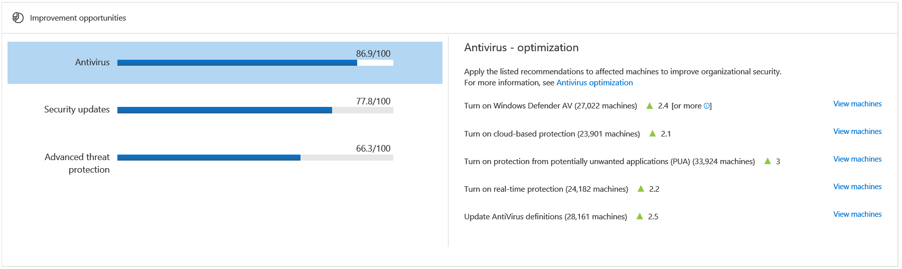

# View the Security Analytics dashboard

**Applies to:**

- Windows 10 Enterprise
- Windows 10 Education
- Windows 10 Pro
- Windows 10 Pro Education
- Windows Defender Advanced Threat Protection (Windows Defender ATP)

The Security Analytics dashboard provides valuable information about the overall security posture of your organization. From this dashboard, you'll gain visibility across a wide spectrum of security controls from the various tiles. You'll be able to quickly assess where attention is required, identify specific areas where you can improve the overall security score of your organization, and take action based on the recommended optimal configuration settings.

The **Security Analytics Dashboard** displays a snapshot of:
- Organizational security score
- Security coverage
- Improvement opportunities
- Antivirus - optimization

## Organizational security score
The organization security score is reflective of the average score of all the Windows Defender security control properties that are configured according to the recommended baseline. You can improve this score by taking the steps in configuring each of the security controls in the optimal settings.

## Security coverage
The security coverage tile shows a bar graph where each bar represents a Windows Defender security control. Each bars represents the various products with an indicator of the total number of machines that are well configured and those that require attention. 

## Improvement opportunities 
Improve your organizational security score by taking the recommended improvement actions listed on this tile. This tile provides percentage values for each security control. The percentage values are ????? [EVALD / RAN I NEED SOME HELP HERE. I DON'T REALLY UNDERSTAND THE WHOLE PERCENTAGE THING. CAN YOU PROVIDE IN LAYMAN TERMS PLEASE.]

Click on each segment to see the recommended optimizations.

### Antivirus optimization
This tile provides a specific list of actions you can take on Windows Defender Antivirus to improve the security on your organization. Each action shows the exact number of endpoints where you can apply the action on.  For more information, see [Optimize Windows Defender Antivirus](https://go.microsoft.com/fwlink/p/?linkid=851288).

### Security updates optimization
This tile shows you the exact number of machines that require the latest security updates. 

[EVALD / RAN - I'M NOT SURE IT'S WORTH MAKING A STAND ALONE TOPIC FOR THIS. THERE IS ONLY ONE LINE.]

### Advanced threat protection
This tile provides a specific list of actions you can take on Windows Defender ATP. For more information, see [Fix unhealthy sensors](fix-unhealhty-sensors-windows-defender-advanced-threat-protection.md).
