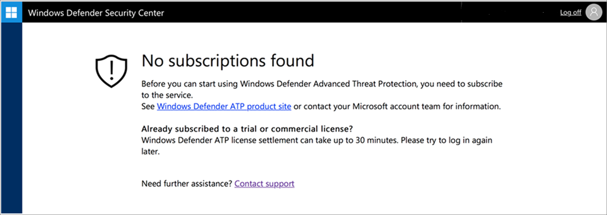
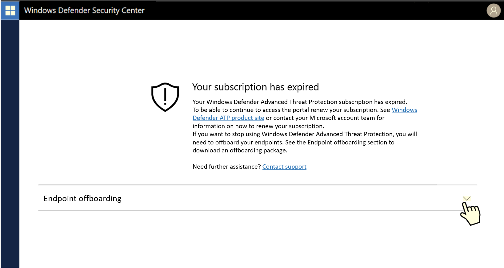
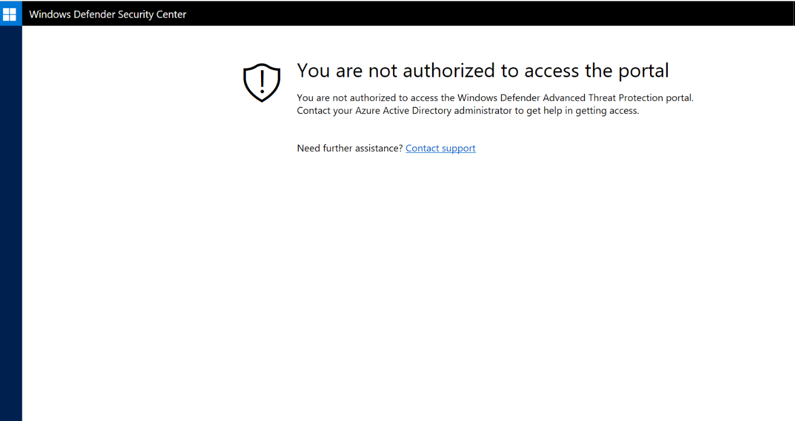

## Troubleshooting onboarding and error messages

**Applies to:**

- Windows 10 Enterprise
- Windows 10 Education
- Windows 10 Pro
- Windows 10 Pro Education
- Windows Defender Advanced Threat Protection (Windows Defender ATP)

[!include[Prerelease information](prerelease.md)]

You might need to troubleshoot the Windows Defender ATP onboarding process if you encounter issues.
This page provides detailed steps to troubleshoot onboarding issues that might occur when setting up your Windows Defender ATP service.

If you receive an error message, the Windows Defender ATP portal will provide detailed explanation on what the issue is and relevant links.

## No subscriptions found

If while accessing the Windows Defender ATP portal you get a “No subscriptions found” message, it means the Azure Active Directory for the user, used to login to the portal, does not have a Windows Defender ATP license. 

Potential reasons:
- Windows E5 and Office E5 license may be being confused. These are not the same.
- The license was purchased but not provisioned to this Microsoft Azure Active Directory instance. 
    - It could be a license provisioning issue. 
    - It could be you inadvertantly provisioned the license to a different Microsoft Azure Active Directory than the one used for authentication into the service. 

For both cases you should contact Microsoft support.

> [!NOTE]
> For some of the **Purchase > Provision** flows there is a provisioning latency of up to 30 minutes.

## Your subscription has expired

If while accessing the Windows Defender ATP portal you get a "Your subscription has expired" message, your online service subscription has expired. Windows Defender ATP subscription, like any other online service subscription, has an expiration date. You can choose to renew or extend the license at any point in time. However, should you decide to not renew the license, when accessing the portal after the expiration date a “Your subscription has expired“ message will be presented with an option to download the endpoint offboarding package.

> [!NOTE]
> For security reasons, the package used to offboard endpoints will expire 30 days after the date it was downloaded. Expired offboarding packages sent to an endpoint will be rejected. When downloading an offboarding package you will be notified of the packages expiry date and it will also be included in the package name.

## You are not authorized to access the portal

If you receive a "You are not authorized to access the portal", please be aware that Windows Defender ATP is a security monitoring, incident investigation & response product, and as such, access to it is restricted and controlled by the user.
**Assigning user access to the Windows Defender ATP portal** details are available at the [TechNet](https://technet.microsoft.com/en-us/itpro/windows/keep-secure/assign-portal-access-windows-defender-advanced-threat-protection) site.

## Related topics
- [Validating licensing provisioning and completing setup for Windows Defender ATP](licensing-windows-defender-advanced-threat-protection.md)