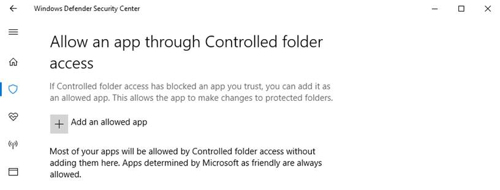

# Customize Controlled folder access


**Applies to:**

- Windows 10, version 1709


**Audience**

- Enterprise security administrators


**Manageability available with**

- Windows Defender Security Center app
- Group Policy
- PowerShell
- Configuration service providers for mobile device management


Controlled folder access helps you protect valuable data from malicious apps and threats, such as ransomware. It is part of [Windows Defender Exploit Guard](windows-defender-exploit-guard.md).

This topic describes how to customize the following settings of the Controlled folder access feature with the Windows Defender Security Center app, Group Policy, PowerShell, and mobile device management (MDM) configuration service providers (CSPs):

- [Add additional folders to be protected](#protect-additional-folders)
- [Add apps that should be allowed to access protected folders](#allow-specifc-apps-to-make-changes-to-controlled-folders)

>[!WARNING]
>Controlled folder access is a new technology that monitors apps for activities that may be malicious. Sometimes it might block a legitimate app from making legitimate changes to your files.
>
>This may impact your organization's productivity, so you may want to consider running the feature in [audit mode](audit-windows-defender-exploit-guard.md) to fully assess the feature's impact.


 ## Protect additional folders

Controlled folder access applies to a number of system folders and default locations, including folders such as Documents, Pictures, Movies, and Desktop.

You can add additional folders to be protected, but you cannot remove the default folders in the default list.

Adding other folders to Controlled folder access can be useful, for example, if you don't store files in the default Windows libraries or you've changed the location of the libraries away from the defaults.

You can also enter network shares and mapped drives, but environment variables and wildcards are not supported. 

You can use the Windows Defender Security Center app or Group Policy to add and remove additional protected folders.

### Use the Windows Defender Security Center app to protect additional folders

1. Open the Windows Defender Security Center by clicking the shield icon in the task bar or searching the start menu for **Defender**.

2. Click the **Virus & threat protection** tile (or the shield icon on the left menu bar) and then the **Virus & threat protection settings** label:

    
    
3.	Under the **Controlled folder access** section, click **Protected folders**

4. Click **Add a protected folder** and follow the prompts to add apps.

    

 
### Use Group Policy to protect additional folders

1.  On your Group Policy management machine, open the [Group Policy Management Console](https://technet.microsoft.com/library/cc731212.aspx), right-click the Group Policy Object you want to configure and click **Edit**.

3.  In the **Group Policy Management Editor** go to **Computer configuration**.

4.  Click **Policies** then **Administrative templates**.

5.  Expand the tree to **Windows components > Windows Defender Antivirus > Windows Defender Exploit Guard > Controlled folder access**.

6. Double-click the **Configured protected folders** setting and set the option to **Enabled**. Click **Show** and enter each folder.

> [!IMPORTANT]
> Environment variables and wildcards are not supported. 


### Use PowerShell to protect additional folders

1. Type **powershell** in the Start menu, right click **Windows PowerShell** and click **Run as administrator**
2. Enter the following cmdlet:

    ```PowerShell
    Add-MpPreference -ControlledFolderAccessProtectedFolders "<the folder to be protected>"
    ```


Continue to use `Add-MpPreference -ControlledFolderAccessProtectedFolders` to add more folders to the list. Folders added using this cmdlet will appear in the Windows Defender Security Center app.


>[!IMPORTANT]
>Use `Add-MpPreference` to append or add apps to the list. Using the `Set-MpPreference` cmdlet will overwrite the existing list. 

### Use MDM CSPs to protect additional folders

Use the [./Vendor/MSFT/Policy/Config/Defender/GuardedFoldersList](https://docs.microsoft.com/en-us/windows/client-management/mdm/policy-csp-defender#defender-guardedfolderslist) configuration service provider (CSP) to allow apps to make changes to protected folders. 


 ## Allow specifc apps to make changes to controlled folders

You can specify if certain apps should always be considered safe and given write access to files in protected folders. Allowing apps can be useful if you're finding a particular app that you know and trust is being blocked by the Controlled folder access feature. 

>[!IMPORTANT]
>By default, Windows adds apps that it considers friendly to the allowed list - apps added automatically by Windows are not recorded in the list shown in the Windows Defender Security Center app or by using the associated PowerShell cmdlets.
>You shouldn't need to add most apps. Only add apps if they are being blocked and you can verify their trustworthiness.


You can use the Windows Defender Security Center app or Group Policy to add and remove apps that should be allowed to access protected folders.

When you add an app, you have to specify the app's location. Only the app in that location will be permitted access to the protected folders - if the app (with the same name) is located in a different location, then it will not be added to the whitelist and may be blocked by Controlled folder access.

### Use the Windows Defender Security app to whitelist specific apps

1. Open the Windows Defender Security Center by clicking the shield icon in the task bar or searching the start menu for **Defender**.

2. Click the **Virus & threat protection** tile (or the shield icon on the left menu bar) and then the **Virus & threat protection settings** label:

    
    
3.	Under the **Controlled folder access** section, click **Allow an app through Controlled folder access**

4. Click **Add an allowed app** and follow the prompts to add apps.

    

### Use Group Policy to whitelist specific apps

1.  On your Group Policy management machine, open the [Group Policy Management Console](https://technet.microsoft.com/library/cc731212.aspx), right-click the Group Policy Object you want to configure and click **Edit**.

3.  In the **Group Policy Management Editor** go to **Computer configuration**.

4.  Click **Policies** then **Administrative templates**.

5.  Expand the tree to **Windows components > Windows Defender Antivirus > Windows Defender Exploit Guard > Controlled folder access**.

6. Double-click the **Configure allowed applications** setting and set the option to **Enabled**. Click **Show** and enter each app.


### Use PowerShell to whitelist specific apps

1. Type **powershell** in the Start menu, right click **Windows PowerShell** and click **Run as administrator**
2. Enter the following cmdlet:

    ```PowerShell
    Add-MpPreference -ControlledFolderAccessAllowedApplications "<the app that should be whitelisted, including the path>"
    ```

    For example, to add the executable *test.exe*, located in the folder *C:\apps*, the cmdlet would be as follows:

    ```PowerShell
    Add-MpPreference -ControlledFolderAccessAllowedApplications "c:\apps\test.exe"
    ```

Continue to use `Add-MpPreference -ControlledFolderAccessAllowedApplications` to add more apps to the list. Apps added using this cmdlet will appear in the Windows Defender Security Center app.


>[!IMPORTANT]
>Use `Add-MpPreference` to append or add apps to the list. Using the `Set-MpPreference` cmdlet will overwrite the existing list. 


### Use MDM CSPs to whitelist specific apps

Use the [./Vendor/MSFT/Policy/Config/Defender/GuardedFoldersAllowedApplications](https://docs.microsoft.com/en-us/windows/client-management/mdm/policy-csp-defender#defender-guardedfoldersallowedapplications) configuration service provider (CSP) to allow apps to make changes to protected folders. 

## Customize the notification

See the [Windows Defender Security Center](../windows-defender-security-center/windows-defender-security-center.md#customize-notifications-from-the-windows-defender-security-center) topic for more information about customizing the notification when a rule is triggered and blocks an app or file.

## Related topics
- [Protect important folders with Controlled folder access](controlled-folders-exploit-guard.md)
- [Enable Controlled folder access](enable-controlled-folders-exploit-guard.md) 
- [Evaluate Windows Defender Exploit Guard](evaluate-windows-defender-exploit-guard.md)